# Catalog — дизайн (фаза 2)

**Дата:** 2026-09-17
**Статус:** черновик на ревью (гейт качества 1 по `../chor-app-docs/development-process.md`)
**Входные данные:**
- `CATALOG_RESEARCH.md` — факты о текущем коде (ссылки «CR§…»);
- `chor-app-docs/decisions/0010-public-book-library.md` — решения по каталогу (ссылки «ADR10§…»);
- `chor-app-docs/decisions/0009-repertoire-folders-attachments-themes.md` — как каталог используют Community;
- `chor-app-docs/decisions/0008-modular-monolith-boundaries.md` — границы модулей;
- `../people/PEOPLE_DESIGN.md` — принятые соглашения API и ошибок (ссылки «PD§…»);
- `../repertoire/REPERTOIRE_DESIGN.md` — правила номера песни (ссылки «RD§…»).

Диаграммы в формате Mermaid.

**Имя.** Код и ADR используют рабочее имя Library (`LibraryModule`, `LibraryBook`, …), документы лежат
в `docs/feature/catalog/`. Окончательные имена — OQ-1.

---

## 1. Цель

Дать системе один общий каталог печатных книг: серии, книги, песни и основные темы. Каталог ведёт
superadmin, в том числе загрузкой файлов CSV / Excel / JSON. Любой зарегистрированный пользователь
читает каталог. Модуль Repertoire (отдельная фича, ADR 0009) подключает книги каталога к Community
и читает их актуальное содержимое через экспортируемый порт.

**Предусловия:** нет. Каталог не зависит от People, Community Access и Repertoire. Из Identity нужен
только `JwtAuthGuard` (CR§5).

## 2. Требования

### 2.1 Функциональные

| ID | Требование |
|---|---|
| FR-1 | Аутентифицированный пользователь видит серии и книги каталога; фильтры: серия, подстрока в названии; архивные скрыты по умолчанию |
| FR-2 | Пользователь открывает книгу и видит её песни (номер, название, автор, аранжировщик, темы); архивные песни скрыты по умолчанию |
| FR-3 | Пользователь видит список тем каталога |
| FR-4 | Пользователь находит песню по паре «книга + номер» или «серия + номер»; в ответе есть книга и том |
| FR-5 | Superadmin загружает файл CSV, XLSX или JSON с одной или несколькими книгами и получает предпросмотр изменений без записи в БД |
| FR-6 | Superadmin применяет загрузку; применяется ровно предпросмотренный план; архивация используемых элементов требует подтверждения |
| FR-7 | Superadmin создаёт, переименовывает, архивирует и восстанавливает серию |
| FR-8 | Superadmin создаёт, изменяет (название, серия, том), архивирует и восстанавливает книгу |
| FR-9 | Superadmin создаёт, изменяет (номер, название, автор, аранжировщик), архивирует и восстанавливает песню и заменяет её темы |
| FR-10 | Superadmin создаёт, переименовывает, архивирует и восстанавливает тему каталога |
| FR-11 | Перед архивацией используемой книги, песни или темы superadmin получает число использований и должен подтвердить действие |
| FR-12 | Другие модули читают книги, песни и темы каталога через экспортируемый порт `LibraryReader` |
| FR-13 | Разработчик скриптом конвертирует встроенный каталог legacy в файл формата загрузки |

### 2.2 Нефункциональные

| ID | Требование |
|---|---|
| NFR-1 | Данные каталога глобальные: ни одна таблица каталога не содержит `communityId` |
| NFR-2 | Слои DDD по ADR 0002; границы модулей по ADR 0008; новые модули добавлены в ESLint `moduleBoundaries` (CR§6) |
| NFR-3 | Миграции только добавляют объекты (деплой применяет их при работающем старом контейнере, CR§7) |
| NFR-4 | Ошибки с машиночитаемым `code`, формат PD§8.4 |
| NFR-5 | Масштаб: до 200 книг, 30 000 песен, 1 000 тем. Файл ≤ 5 МБ, ≤ 20 000 строк. Предпросмотр и применение файла на 1 000 песен ≤ 5 с на сервере |
| NFR-6 | Применение загрузки атомарно: весь план или ничего |
| NFR-7 | `id` песен, книг и тем стабильны: загрузка и редактирование никогда не пересоздают существующие записи |
| NFR-8 | Новые зависимости не нарушают гейт `npm audit --audit-level=high --omit=dev` (CR§2.1) |
| NFR-9 | Ни один элемент каталога не удаляется физически |

### 2.3 Входные решения (ADR 0010, ADR 0009)

- Каталог глобальный, живая связь с Community, изменения видны всем сразу (ADR10 TL;DR).
- Модули `LibraryModule` и `LibraryAdminModule`; Repertoire читает каталог только через порт (ADR10§1).
- Модель MVP: серия, книга, песня, тема, связь песня–тема; без статуса публикации, `publishedAt`, изданий (ADR10§2).
- Гибридная нумерация через `numberScopeId = seriesId ?? libraryBookId`, без диапазонов томов (ADR10§3).
- Загрузка разбирается один раз, повторная загрузка обновляет по номеру, пропавшие номера архивируются, сначала предпросмотр (ADR10§4).
- Используемый элемент архивируется только с подтверждением, ответ 409 `LIBRARY_ITEM_IN_USE` (ADR10§5).
- Чтение — любой аутентифицированный пользователь; запись — `/admin/library/...` с guard-заглушкой `SuperAdminGuard` (ADR10§6).
- Встроенный каталог прототипа: серия «Bücher» из 4 томов, 30 тем; Mappe прототипа в каталог не входит (ADR10§7, ADR 0009 Q8).

### 2.4 Вне рамок

`Folder`, `BookAttachment`, кастомные темы, `SongLookup`, `LibraryUsageQuery` (всё — Repertoire, ADR 0009);
capability Superadmin (роль, профиль, настоящий guard); клиентский UI; уведомления Community об изменениях;
экспорт каталога в файл; хранение исходных загруженных файлов; история изменений каталога; пагинация.

---

## 3. C4 — уровень 1: контекст системы

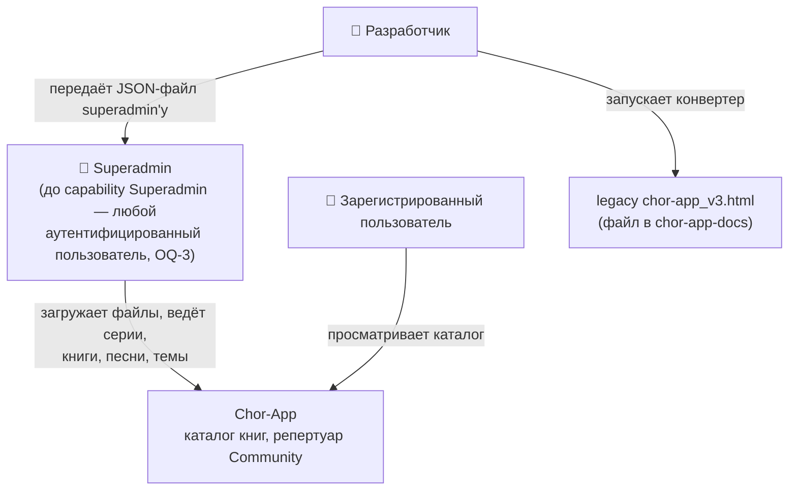

Внешних систем каталог не добавляет. Файлы приходят только через HTTP-загрузку.

## 4. C4 — уровень 2: контейнеры

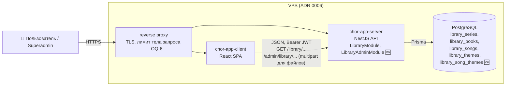

Новых контейнеров, томов и переменных окружения нет. Загруженный файл живёт только в памяти запроса.

## 5. C4 — уровень 3: компоненты API

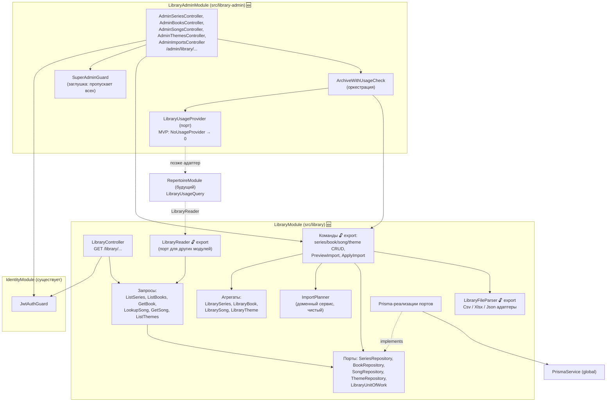

**Правила зависимостей:**
- `LibraryModule` импортирует только `IdentityModule` (ради `JwtAuthGuard`). О Community и Repertoire не знает.
- `LibraryModule` экспортирует через barrel `src/library/index.ts`: `LibraryReader` (токен + типы), use cases
  команд, `LibraryFileParser`. Больше ничего.
- `LibraryAdminModule` импортирует `IdentityModule` и `LibraryModule`. Интерфейсный слой админки живёт здесь,
  доменная логика — в `LibraryModule`.
- Предупреждение об использовании: `LibraryAdminModule` объявляет порт `LibraryUsageProvider`. Пока Repertoire нет,
  регистрируется `NoUsageProvider` (всегда 0). Когда Repertoire экспортирует `LibraryUsageQuery` (ADR10§5),
  `LibraryAdminModule` импортирует `RepertoireModule` и подменяет провайдер адаптером. Циклов нет:
  Library ← Repertoire ← LibraryAdmin.
- `SuperAdminGuard` находится в `LibraryAdminModule`; capability Superadmin позже заменит его реализацию или перенесёт guard к себе.

### 5.1 Раскладка файлов

```
src/library/
  index.ts                                   // barrel: LibraryModule, LIBRARY_READER, типы, команды, парсер
  library.module.ts
  domain/
    entities/library-series.entity.ts, library-book.entity.ts, library-song.entity.ts, library-theme.entity.ts
    value-objects/library-title.ts, song-number.ts, song-title.ts, optional-text.ts, theme-name.ts, volume.ts
    services/import-planner.ts, import-plan.ts
    errors/library.errors.ts
    ports/series-repository.port.ts, book-repository.port.ts, song-repository.port.ts,
          theme-repository.port.ts, library-unit-of-work.port.ts, library-file-parser.port.ts
  application/
    views/*.view.ts
    reader/library-reader.ts                 // реализация LibraryReader поверх запросов
    queries/*.query.ts (6)
    use-cases/series/*.use-case.ts (4), books/*.use-case.ts (4), songs/*.use-case.ts (5),
              themes/*.use-case.ts (4), imports/preview-import.use-case.ts, apply-import.use-case.ts
  infrastructure/
    prisma/prisma-*.repository.ts, prisma-library-unit-of-work.ts
    parsing/csv-library-file-parser.ts, xlsx-library-file-parser.ts, json-library-file-parser.ts,
            library-file-parser-registry.ts
  interface/
    controllers/library.controller.ts
    dto/*.dto.ts
    http/library-error-mapper.ts             // доменная ошибка → HttpException с code

src/library-admin/
  library-admin.module.ts
  application/
    ports/library-usage-provider.port.ts
    archive-with-usage-check.ts
  infrastructure/no-usage-provider.ts
  interface/
    controllers/admin-series.controller.ts, admin-books.controller.ts, admin-songs.controller.ts,
                admin-themes.controller.ts, admin-imports.controller.ts
    guards/super-admin.guard.ts
    dto/*.dto.ts

scripts/convert-legacy-catalog.ts           // FR-13, запускается через ts-node, в образ не входит как код
prisma/schema.prisma                         ✏️ + модели каталога, миграция library
src/app.module.ts                            ✏️ + LibraryModule, LibraryAdminModule
eslint.config.mjs                            ✏️ + library, library-admin в moduleBoundaries
package.json                                 ✏️ + парсер CSV, парсер XLSX (D5), @types/multer
```

---

## 6. Доменная модель

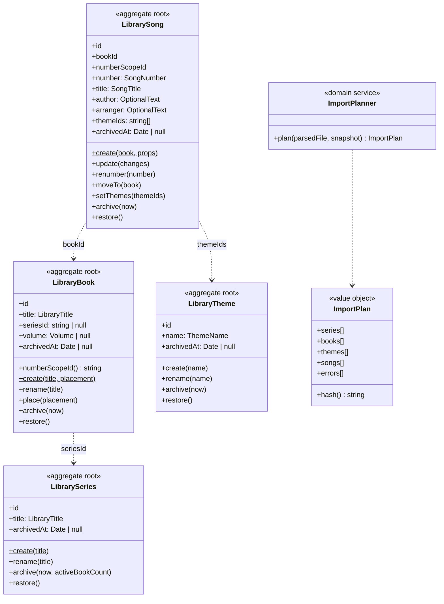

### 6.1 Value objects

| VO | Правила |
|---|---|
| `LibraryTitle` (серия, книга) | trim; последовательности пробелов → один пробел; длина 1–100; `key` = нижний регистр |
| `SongNumber` | как RD§7.1: trim, без внутренних пробелов, `key` нижний регистр, формат `^[0-9]{1,6}[a-z]{0,3}$` (OQ-2 Repertoire), `sortKey` — число с ведущими нулями до 8 знаков + суффикс; целое из файла приводится к строке |
| `SongTitle` | trim; длина 1–200 |
| `OptionalText` (author, arranger) | trim; пусто → `null`; длина ≤ 200 |
| `ThemeName` | trim; последовательности пробелов → один пробел; длина 1–100; `key` = нижний регистр; запятая допустима («Evangelisation, Zuruf», CR§10); символ `|` запрещён (D6) |
| `Volume` | целое 1–99 |
| `BookPlacement` | `{ seriesId, volume }` — оба заданы или оба `null` |

### 6.2 Инварианты

| Правило | Где |
|---|---|
| Название серии уникально в каталоге (по `key`), включая архивные | use case + unique-индекс |
| Название книги уникально в каталоге (по `key`), включая архивные | use case + unique-индекс |
| У книги серия и том заданы вместе или не заданы | `BookPlacement` → `BookPlacementInvalidError` |
| Том уникален внутри серии, включая архивные книги | use case + unique-индекс `(seriesId, volume)` |
| Книгу нельзя поместить в архивную серию | use case → `SeriesArchivedError` |
| `numberScopeId` песни = `seriesId` книги, если книга в серии, иначе `bookId`; клиент его не задаёт | `LibrarySong.create` / `moveTo`, `PlaceBookUseCase` |
| Номер уникален в `numberScopeId` (по `key`), включая архивные | use case + unique-индекс `(numberScopeId, numberKey)` |
| Перенос книги в серию / из серии / в другую серию пересчитывает `numberScopeId` всех её песен; при конфликте номеров ничего не меняется | `PlaceBookUseCase` в транзакции → `NumberScopeConflictError` со списком номеров |
| Изменение номера песни сохраняет её `id` (ADR10 Q6) | `LibrarySong.renumber` |
| Песню нельзя создать в архивной книге | use case → `BookArchivedError` |
| Архивную песню, книгу, серию, тему нельзя изменять, кроме `restore` | агрегаты → `…ArchivedError` |
| Назначаемые песне темы существуют и активны | use case → `ThemeNotFoundError` / `ThemeArchivedError` |
| Архивная тема остаётся у песен, к которым привязана; новые привязки запрещены | use case |
| Серию можно архивировать, только если все её книги архивны | `LibrarySeries.archive` → `SeriesHasActiveBooksError` |
| Архивация книги не архивирует её песни; архивная книга скрыта в списках, её песни доступны по `id` | чтение |
| Архивация и восстановление идемпотентны | агрегаты |
| Физического удаления нет (NFR-9) | нет методов и эндпоинтов; FK `onDelete: Restrict` |

---

## 7. Формат файла загрузки

### 7.1 Логическая структура

Все три формата разбираются в одну структуру:

```ts
interface ParsedLibraryFile {
  books: ParsedBook[];
}
interface ParsedBook {
  title: string;
  series: string | null;
  volume: number | null;
  songs: ParsedSong[];
  source: SourceRef;          // первая строка / JSON-путь книги
}
interface ParsedSong {
  number: string;
  title: string;
  author: string | null;
  arranger: string | null;
  themes: string[];
  source: SourceRef;          // { row } для CSV/XLSX, { path } для JSON
}
```

Один файл может содержать несколько книг (как встроенный каталог: 4 тома). Книги, которых нет в файле, не затрагиваются.

### 7.2 CSV

- Кодировка UTF-8, BOM допускается. Разделитель `,` или `;` определяется по строке заголовка (D7).
- Экранирование по RFC 4180: поле с разделителем, кавычкой или переводом строки берётся в двойные кавычки (238 названий legacy содержат запятую, CR§10).
- Первая строка — заголовок, имена колонок без учёта регистра и порядка:

| Колонка | Обязательна | Значение |
|---|---|---|
| `book` | да | название книги |
| `number` | да | номер песни |
| `title` | да | название песни |
| `series` | нет | название серии; пусто — книга без серии |
| `volume` | нет | том в серии; обязателен, если `series` заполнена |
| `author` | нет | автор |
| `arranger` | нет | аранжировщик |
| `themes` | нет | темы через `|` (`Gebet|Hochzeit`) |

- Одна строка — одна песня. Полностью пустые строки пропускаются. Неизвестные колонки → ошибка `COLUMN_UNKNOWN` (защита от опечаток в заголовке).
- `series` и `volume` должны совпадать во всех строках одной книги.

Пример:

```csv
series;volume;book;number;title;themes
Bücher;1;Buch 1;1;O großer Gott;Lob und Dank
Bücher;4;Buch 4;613;Der Herr segne dich;Gebet|Hochzeit
;;Singt dem Herrn;1;"Halleluja, lobet Gott";Lob und Dank
```

### 7.3 Excel (XLSX)

- Только `.xlsx`; `.xls` не поддерживается.
- Читается первый лист. Структура колонок и правила — как в CSV (7.2); номера строк в ошибках — номера строк листа.
- Значения ячеек берутся как текст; для формул — сохранённое значение, формулы не вычисляются; числовой номер `22` → `"22"`.
- Объединённые ячейки, несколько листов, стили игнорируются.

### 7.4 JSON

```json
{
  "format": "chor-app-library/v1",
  "books": [
    {
      "title": "Buch 1",
      "series": "Bücher",
      "volume": 1,
      "songs": [
        { "number": "1", "title": "O großer Gott", "author": null, "arranger": null, "themes": ["Lob und Dank"] }
      ]
    }
  ]
}
```

- `format` обязателен и равен `chor-app-library/v1`.
- `number` — строка или целое. Неизвестные поля → ошибка `FIELD_UNKNOWN`.
- Этот же формат выдаёт конвертер legacy (7.7).

### 7.5 Проверки файла

Файл больше 5 МБ отклоняется до разбора: 413 `FILE_TOO_LARGE`. Остальное файл целиком разбирается и проверяется
до построения плана. При любой ошибке ответ 400 `LIBRARY_FILE_INVALID` со списком всех найденных ошибок (до 200),
ничего не записывается.

| `code` ошибки | Условие |
|---|---|
| `FILE_TYPE_UNSUPPORTED` | расширение не `.csv`, `.xlsx`, `.json` |
| `FILE_UNREADABLE` | неверная кодировка, повреждённый XLSX, невалидный JSON |
| `TOO_MANY_ROWS` | > 20 000 песен |
| `FORMAT_VERSION_UNSUPPORTED` | JSON без `format` или с другим значением |
| `COLUMN_MISSING` / `COLUMN_UNKNOWN` / `FIELD_UNKNOWN` | структура заголовка / JSON |
| `VALUE_REQUIRED` | пустые `book`, `number`, `title` |
| `VALUE_INVALID` | нарушение правил VO (6.1) — длина, формат номера, том, `|` в теме |
| `BOOK_PLACEMENT_INCONSISTENT` | у строк одной книги разные `series` / `volume` или том без серии |
| `DUPLICATE_NUMBER` | один номер дважды в одном `numberScope` внутри файла |
| `DUPLICATE_VOLUME` | две книги файла с одной серией и одним томом |

Каждая ошибка: `{ code, message, row? , column?, path? }`.

### 7.6 Построение плана (`ImportPlanner`)

Вход: `ParsedLibraryFile` и снимок текущего каталога — все серии, все книги, все темы, песни всех книг, чьи
`numberScope` затронуты файлом (книги файла и все книги их старых и новых серий). Выход: `ImportPlan`.

| Элемент | Правило сопоставления | Действия |
|---|---|---|
| Серия | по `key` названия | нет → `create`; архивная → `restore`; иначе без изменений (регистр названия не меняется, D8) |
| Книга | по `key` названия | нет → `create`; архивная → `restore`; другая серия/том → `place`; иначе без изменений |
| Тема | по `key` имени | нет → `create`; архивная → `restore` |
| Песня | по `(numberScopeId книги после применения, numberKey)` | нет → `create`; есть → `update` изменённых полей (название, автор, аранжировщик, темы), `restore` архивной, `move`, если песня была в другой книге той же серии и **та книга тоже есть в файле** |
| Песня книги из файла, номера которой нет в файле | — | `archive` |

Дополнительные правила:
- Темы песни из файла **полностью заменяют** её темы.
- Совпадение номера в серии с песней книги, которой **нет** в файле → ошибка плана `NUMBER_SCOPE_CONFLICT` (неявно забирать песни из книг вне файла нельзя).
- Перенос книги в серию, где номера уже заняты другими книгами вне файла → `NUMBER_SCOPE_CONFLICT`.
- Том занят книгой вне файла → `VOLUME_TAKEN`.
- Ошибки плана возвращаются так же, как ошибки файла (400 `LIBRARY_FILE_INVALID`).
- План детерминирован: элементы отсортированы (книги по названию, песни по `sortKey`), `hash()` = SHA-256 канонического JSON плана, включая `id` существующих записей и новые значения полей.

### 7.7 Конвертер legacy (FR-13)

`scripts/convert-legacy-catalog.ts <путь к chor-app_v3.html> <выходной .json>`:
- извлекает JSON из `<script id="song-data">` (CR§10);
- выдаёт формат 7.4: четыре книги `Buch 1`…`Buch 4`, серия `Bücher`, тома 1–4, номера строками, темы из `themen`;
- не переносит `mappe`, `thema_buch_original`, `quellen`, `meta`;
- проверяет инварианты CR§10 (727 песен, 30 тем, все темы песен в списке) и падает при расхождении.

Скрипт — инструмент разработчика; результат не коммитится в сервер и загружается обычным `POST /admin/library/imports/...`.

---

## 8. Модель данных

### 8.1 Prisma

```prisma
model LibrarySeries {
  id         String    @id @default(uuid())
  title      String
  titleKey   String    @unique
  archivedAt DateTime?
  createdAt  DateTime  @default(now())
  updatedAt  DateTime  @updatedAt

  books LibraryBook[]

  @@map("library_series")
}

model LibraryBook {
  id         String    @id @default(uuid())
  title      String
  titleKey   String    @unique
  volume     Int?
  archivedAt DateTime?
  createdAt  DateTime  @default(now())
  updatedAt  DateTime  @updatedAt

  seriesId String?
  series   LibrarySeries? @relation(fields: [seriesId], references: [id], onDelete: Restrict)
  songs    LibrarySong[]

  @@unique([seriesId, volume])
  @@map("library_books")
}

model LibrarySong {
  id            String    @id @default(uuid())
  numberScopeId String
  number        String
  numberKey     String
  sortKey       String
  title         String
  author        String?
  arranger      String?
  archivedAt    DateTime?
  createdAt     DateTime  @default(now())
  updatedAt     DateTime  @updatedAt

  bookId String
  book   LibraryBook        @relation(fields: [bookId], references: [id], onDelete: Restrict)
  themes LibrarySongTheme[]

  @@unique([numberScopeId, numberKey])
  @@index([bookId, archivedAt, sortKey])
  @@map("library_songs")
}

model LibraryTheme {
  id         String    @id @default(uuid())
  name       String
  nameKey    String    @unique
  archivedAt DateTime?
  createdAt  DateTime  @default(now())
  updatedAt  DateTime  @updatedAt

  songs LibrarySongTheme[]

  @@map("library_themes")
}

model LibrarySongTheme {
  songId  String
  themeId String
  song    LibrarySong  @relation(fields: [songId], references: [id], onDelete: Restrict)
  theme   LibraryTheme @relation(fields: [themeId], references: [id], onDelete: Restrict)

  @@id([songId, themeId])
  @@index([themeId])
  @@map("library_song_themes")
}
```

- `numberScopeId` не имеет FK: это `id` серии или книги. Согласованность обеспечивает домен (6.2).
- `(seriesId, volume)` с `NULL` не конфликтует в Postgres — книги без серии не ограничены.
- `onDelete: Restrict` — удаление запрещено и на уровне БД (NFR-9).

### 8.2 ER

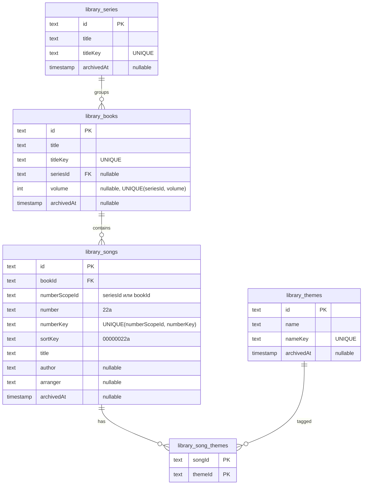

### 8.3 Миграции

| # | Миграция | Содержимое |
|---|---|---|
| 1 | `library` | таблицы `library_series`, `library_books`, `library_songs`, `library_themes`, `library_song_themes`, индексы, FK |

Только `CREATE`. Enum не добавляются. Данные миграция не вставляет.

---

## 9. HTTP API

Все маршруты требуют `Authorization: Bearer <JWT>` (ADR 0004). Ошибки — формат PD§8.4.
Контроллеры `/admin/library` дополнительно под `SuperAdminGuard` (заглушка, D3).

### 9.1 Чтение — `/library`

| Метод | Путь | Доступ | Параметры | Успех |
|---|---|---|---|---|
| GET | `/library/series` | аутентифицирован | `includeArchived?` | 200 `SeriesView[]`, сортировка по названию |
| GET | `/library/books` | аутентифицирован | `seriesId?`, `q?` (подстрока названия, 1–100), `includeArchived?` | 200 `BookSummaryView[]`, сортировка: книги серии по серии и тому, затем по названию |
| GET | `/library/books/:bookId` | аутентифицирован | `includeArchivedSongs?` | 200 `BookView` (в т. ч. архивная книга) |
| GET | `/library/songs/lookup` | аутентифицирован | `number` + ровно одно из `bookId`, `seriesId` | 200 `SongView` / 404 |
| GET | `/library/songs/:songId` | аутентифицирован | — | 200 `SongView` (в т. ч. архивная) |
| GET | `/library/themes` | аутентифицирован | `includeArchived?` | 200 `ThemeView[]`, сортировка по имени |

`/songs/lookup` объявляется до `/songs/:songId`. Сортировка названий — `localeCompare(…, 'de')` в приложении.

```json
// SeriesView
{ "id": "…", "title": "Bücher", "archived": false,
  "books": [{ "id": "…", "title": "Buch 1", "volume": 1, "archived": false }] }

// BookSummaryView
{ "id": "…", "title": "Buch 2", "series": { "id": "…", "title": "Bücher" }, "volume": 2,
  "songCount": 194, "archived": false }

// BookView
{ "id": "…", "title": "Buch 2", "series": { "id": "…", "title": "Bücher" }, "volume": 2, "archived": false,
  "songs": [ { "id": "…", "number": "164", "title": "…", "author": null, "arranger": null,
               "themes": [{ "id": "…", "name": "Lob und Dank", "archived": false }], "archived": false } ] }

// SongView
{ "id": "…", "number": "200", "title": "Laut rühmet Jesu Herrlichkeit!", "author": null, "arranger": null,
  "book": { "id": "…", "title": "Buch 2", "volume": 2, "archived": false },
  "series": { "id": "…", "title": "Bücher" },
  "themes": [{ "id": "…", "name": "…", "archived": false }], "archived": false }

// ThemeView
{ "id": "…", "name": "Evangelisation, Zuruf", "archived": false, "songCount": 12 }
```

### 9.2 Загрузка — `/admin/library/imports`

| Метод | Путь | Тело (`multipart/form-data`) | Успех |
|---|---|---|---|
| POST | `/admin/library/imports/preview` | `file` | 200 `ImportPreviewView` |
| POST | `/admin/library/imports/apply` | `file`, `planHash`, `confirmInUse?` (`true`/`false`) | 200 `ImportResultView` |

- `apply` заново разбирает файл и строит план в транзакции. Если `hash()` не равен `planHash` → 409 `LIBRARY_IMPORT_PLAN_CHANGED` (каталог или файл изменились после предпросмотра).
- Если план архивирует используемые элементы и `confirmInUse` не `true` → 409 `LIBRARY_ITEM_IN_USE`.

```json
// ImportPreviewView
{
  "planHash": "sha256:…",
  "format": "CSV",
  "summary": {
    "series": { "create": 1, "restore": 0 },
    "books":  { "create": 4, "place": 0, "restore": 0, "unchanged": 0 },
    "themes": { "create": 30, "restore": 0 },
    "songs":  { "create": 727, "update": 0, "move": 0, "restore": 0, "archive": 0, "unchanged": 0 }
  },
  "books": [
    { "title": "Buch 1", "action": "CREATE", "series": "Bücher", "volume": 1,
      "songs": { "create": ["1", "2", "…"], "update": [{ "number": "5", "fields": ["title", "themes"] }],
                 "move": [], "restore": [], "archive": [] } }
  ],
  "themes": { "create": ["Abendmahl", "…"], "restore": [] },
  "inUse": [{ "type": "SONG", "id": "…", "label": "Buch 1 · 5", "communities": 3, "references": 11 }],
  "requiresConfirmation": false
}

// ImportResultView
{ "planHash": "sha256:…", "summary": { … как в предпросмотре … } }
```

В MVP `inUse` всегда пуст (`NoUsageProvider`), поле и логика подтверждения уже работают.

### 9.3 Редактирование — `/admin/library`

| Метод | Путь | Тело / параметры | Успех |
|---|---|---|---|
| POST | `/admin/library/series` | `{ title }` | 201 `SeriesView` |
| PATCH | `/admin/library/series/:seriesId` | `{ title }` | 200 |
| POST | `/admin/library/series/:seriesId/archive` | — | 200 |
| POST | `/admin/library/series/:seriesId/restore` | — | 200 |
| POST | `/admin/library/books` | `{ title, seriesId?, volume? }` | 201 `BookSummaryView` |
| PATCH | `/admin/library/books/:bookId` | `{ title?, seriesId?, volume? }` (минимум одно; `seriesId: null` убирает из серии вместе с томом) | 200 |
| POST | `/admin/library/books/:bookId/archive` | query `confirmInUse?` | 200 |
| POST | `/admin/library/books/:bookId/restore` | — | 200 |
| POST | `/admin/library/books/:bookId/songs` | `{ number, title, author?, arranger?, themeIds? }` | 201 `SongView` |
| PATCH | `/admin/library/songs/:songId` | `{ number?, title?, author?, arranger? }` (минимум одно; `null` очищает author/arranger) | 200 |
| PUT | `/admin/library/songs/:songId/themes` | `{ themeIds: string[] }` — полная замена | 200 |
| POST | `/admin/library/songs/:songId/archive` | query `confirmInUse?` | 200 |
| POST | `/admin/library/songs/:songId/restore` | — | 200 |
| POST | `/admin/library/themes` | `{ name }` | 201 `ThemeView` |
| PATCH | `/admin/library/themes/:themeId` | `{ name }` | 200 |
| POST | `/admin/library/themes/:themeId/archive` | query `confirmInUse?` | 200 |
| POST | `/admin/library/themes/:themeId/restore` | — | 200 |

Серия проверку использования не делает: архивировать можно только серию без активных книг (6.2), а книги проходят свою проверку.

### 9.4 Ошибки

Маппинг доменных ошибок — функция `toLibraryHttpException(error)` в `interface/http/` каждого модуля
(PD§8.4: без глобального filter; одна функция вместо `try/catch` в каждом методе удерживает `complexity ≤ 10`, CR§6).

| Ситуация | HTTP | `code` | Доп. поля |
|---|---|---|---|
| Нет/невалиден JWT | 401 | — | — |
| DTO не прошёл валидацию | 400 | — | `message[]` |
| Ошибки файла или плана | 400 | `LIBRARY_FILE_INVALID` | `errors[]` (7.5, 7.6) |
| Файл > 5 МБ | 413 | `FILE_TOO_LARGE` | `maxBytes` |
| Неверный формат номера / VO в JSON-запросе | 400 | `LIBRARY_VALUE_INVALID` | `field` |
| Серия и том не вместе | 400 | `LIBRARY_BOOK_PLACEMENT_INVALID` | — |
| `lookup` без ровно одного из `bookId`/`seriesId` | 400 | `LIBRARY_LOOKUP_SCOPE_INVALID` | — |
| Серия / книга / песня / тема не найдена | 404 | `LIBRARY_SERIES_NOT_FOUND` / `LIBRARY_BOOK_NOT_FOUND` / `LIBRARY_SONG_NOT_FOUND` / `LIBRARY_THEME_NOT_FOUND` | `id` |
| Название серии / книги занято | 409 | `LIBRARY_SERIES_TITLE_TAKEN` / `LIBRARY_BOOK_TITLE_TAKEN` | `existingId`, `existingArchived` |
| Том занят | 409 | `LIBRARY_VOLUME_TAKEN` | `existingBookId` |
| Номер занят в области нумерации | 409 | `LIBRARY_SONG_NUMBER_TAKEN` | `existingSongId`, `existingBookId`, `existingArchived` |
| Перенос книги даёт дубли номеров | 409 | `LIBRARY_NUMBER_SCOPE_CONFLICT` | `numbers[]` |
| Имя темы занято | 409 | `LIBRARY_THEME_NAME_TAKEN` | `existingThemeId`, `existingArchived` |
| Изменение архивного элемента / привязка архивной темы / песня в архивной книге / книга в архивной серии | 409 | `LIBRARY_ITEM_ARCHIVED` | `type`, `id` |
| Архивация серии с активными книгами | 409 | `LIBRARY_SERIES_HAS_ACTIVE_BOOKS` | `bookIds[]` |
| Архивация используемого элемента без подтверждения | 409 | `LIBRARY_ITEM_IN_USE` | `usage: { communities, references }` |
| План изменился между предпросмотром и применением | 409 | `LIBRARY_IMPORT_PLAN_CHANGED` | `planHash` (новый) |
| Параллельная загрузка / редактирование заблокированы | 409 | `LIBRARY_BUSY` | — |

### 9.5 Экспортируемый порт `LibraryReader` (FR-12)

```ts
export const LIBRARY_READER = Symbol('LIBRARY_READER');

export interface LibraryReader {
  findBooks(ids: string[]): Promise<LibraryBookRef[]>;                 // включая архивные
  findSongsByBookIds(bookIds: string[], options: { includeArchived: boolean }): Promise<LibrarySongRef[]>;
  findSongs(ids: string[]): Promise<LibrarySongRef[]>;                 // включая архивные
  lookupSong(query: { bookId?: string; seriesId?: string; number: string }): Promise<LibrarySongRef | null>;
  findThemes(ids: string[]): Promise<LibraryThemeRef[]>;               // включая архивные
  listThemes(options: { includeArchived: boolean }): Promise<LibraryThemeRef[]>;
}
```

`*Ref` — простые неизменяемые объекты (id, поля, `archived`, у песни — `bookId`, `seriesId`, `volume`,
`themes: { id, name, nameKey, archived }[]`). Доменные классы наружу не выходят (ADR 0008).

---

## 10. DFD — потоки данных

### 10.1 Уровень 0

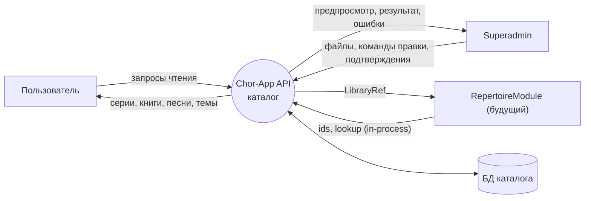

### 10.2 Уровень 1 — загрузка файла

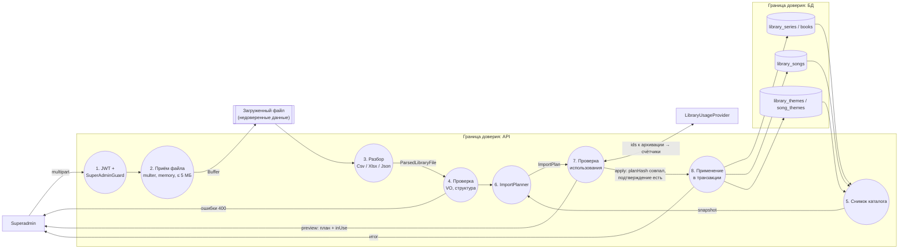

**Ключевые свойства:**
- Файл не пишется на диск и не хранится; после ответа буфер освобождается (D4).
- Из файла в БД попадают только значения, прошедшие VO; `id` и `numberScopeId` из файла не читаются.
- `apply` не доверяет предпросмотру: план строится заново, клиент передаёт только `planHash`.

---

## 11. Sequence-диаграммы

### 11.1 Предпросмотр загрузки

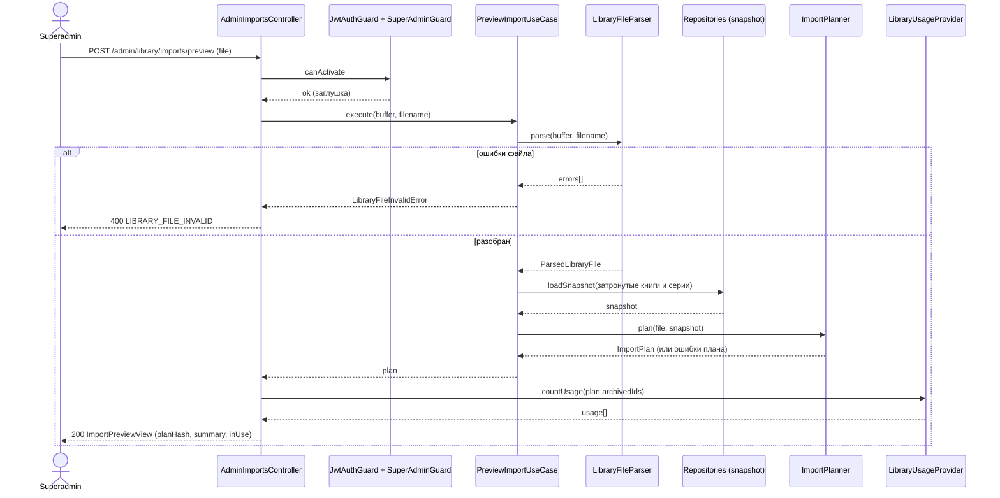

Проверку использования вызывает слой `LibraryAdminModule` (контроллер через `ArchiveWithUsageCheck`),
потому что `LibraryModule` не знает об использовании (5, правила зависимостей).

### 11.2 Применение загрузки

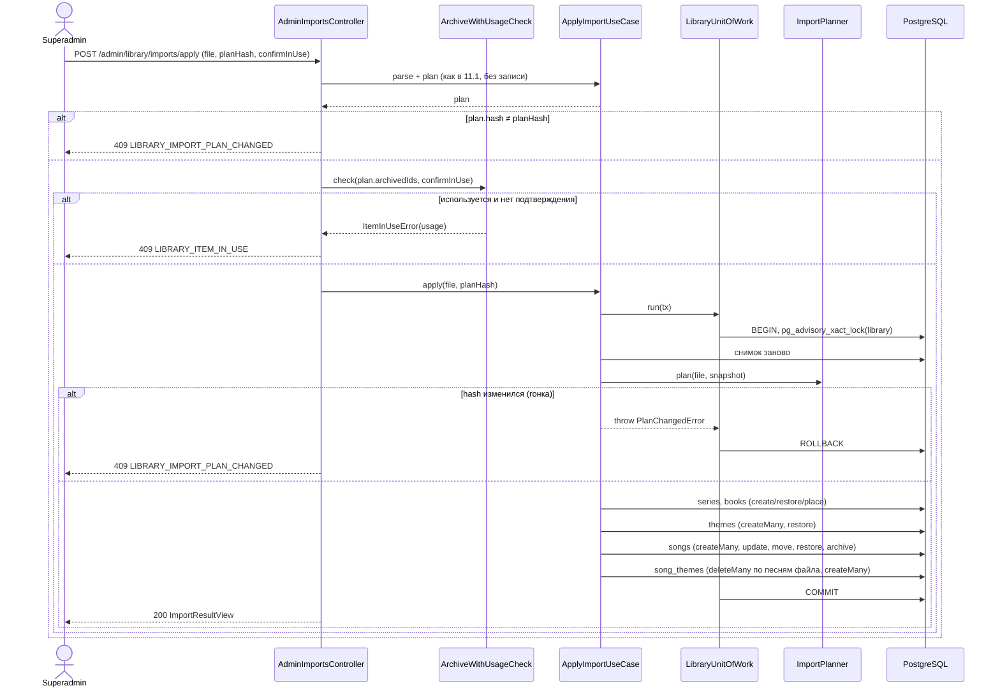

- Перед `createMany` песен книги, меняющие область нумерации, сначала обновляют `numberScopeId` существующих песен; порядок операций исключает временное нарушение unique-индекса (8.1), кроме случая перестановки номеров между песнями — он даёт ошибку плана `NUMBER_SCOPE_CONFLICT` (D10).
- Таймаут интерактивной транзакции Prisma задаётся явно (60 с), значение по умолчанию (5 с) не подходит для NFR-5.

### 11.3 Архивация книги с предупреждением

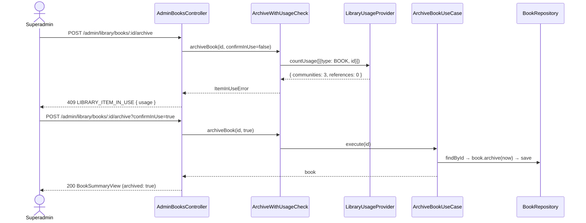

### 11.4 Поиск песни по серии и номеру

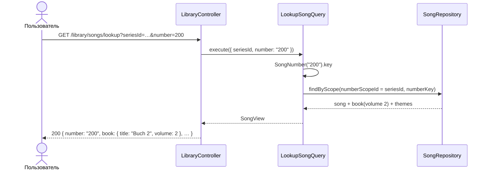

Для книги без серии `numberScopeId = bookId`; для книги в серии поиск по `bookId` проверяет ещё и `song.bookId = bookId`.

### 11.5 Перенос книги в серию

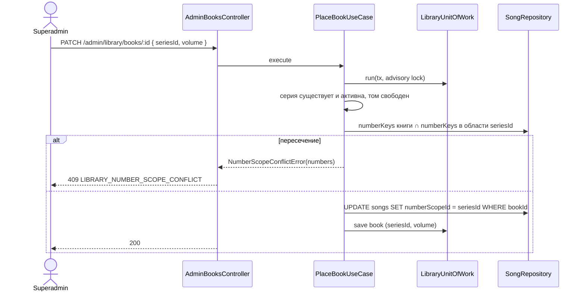

---

## 12. Сквозные аспекты

### 12.1 Матрица доступа

| Действие | Без JWT | Аутентифицированный пользователь | Superadmin |
|---|---|---|---|
| `GET /library/...` | 401 | ✅ | ✅ |
| `/admin/library/...` сейчас (заглушка) | 401 | ✅ (принятый риск, OQ-3) | ✅ |
| `/admin/library/...` после capability Superadmin | 401 | 403 | ✅ |
| `LibraryReader` (in-process) | — | — | вызывается только кодом других модулей |

### 12.2 Безопасность

| Угроза | Мера |
|---|---|
| Любой пользователь меняет каталог всех Community | принятый риск до capability Superadmin (ADR10 Consequences); маршруты изолированы префиксом `/admin/library` и одним guard'ом, который заменяется целиком; решение о JWT и выкатке в прод — OQ-3 |
| Большой файл / исчерпание памяти | multer `memoryStorage`, `limits: { fileSize: 5 МБ, files: 1, fields: 5 }`; лимит 20 000 строк до построения плана |
| XLSX-«zip bomb» | перед разбором проверяется число строк первого листа по мере чтения; при превышении лимита разбор прерывается `TOO_MANY_ROWS` |
| Формулы и макросы Excel | формулы не вычисляются, используются только сохранённые значения; `.xlsm`, `.xls` отклоняются |
| Prototype pollution / лишние поля в JSON | `JSON.parse` + явная проверка схемы; неизвестные поля — ошибка `FIELD_UNKNOWN`; объекты копируются в `ParsedLibraryFile` по известным ключам |
| Инъекция путей | файл не пишется на диск, имя файла используется только для определения расширения |
| SQL-инъекции | Prisma с параметрами; raw-запросы только `SET LOCAL lock_timeout` и `pg_advisory_xact_lock` с константами, без пользовательских данных |
| Mass assignment | `ValidationPipe({ whitelist: true })`; DTO не содержат `id`, `numberScopeId`, `archivedAt` |
| CSV-инъекция при открытии в Excel | не применимо: экспорта каталога нет (2.4) |
| Уязвимые зависимости разбора | выбор библиотек в плане с проверкой `npm audit` (D5, NFR-8) |
| Логи | содержимое файлов не логируется; логируются размер, формат, итоговые счётчики |

### 12.3 Согласованность и конкуренция

- Все записи каталога (загрузка и правки) берут `pg_advisory_xact_lock` с одним ключом: изменения каталога идут строго последовательно. Ожидание блокировки ограничено `lock_timeout` (5 с) → 409 `LIBRARY_BUSY`.
- Уникальность гарантируют unique-индексы; предпроверки в use case дают понятные ошибки; `P2002` маппится в те же ошибки.
- `planHash` гарантирует, что применяется предпросмотренный план; повторное применение того же файла даёт план без изменений (идемпотентно).
- Правки одного элемента двумя superadmin'ами — last write wins (внутри последовательной блокировки).
- Чтение не блокируется; читатель видит состояние до или после транзакции целиком.
- Community читают каталог вживую (ADR10 TL;DR); кэшей нет, поэтому рассинхронизации нет.

### 12.4 Производительность

- Список книг: ≤ 200 строк + `COUNT` песен группировкой по `bookId`.
- Книга с песнями: индекс `(bookId, archivedAt, sortKey)` + темы одним запросом по `songId IN (…)`.
- `lookup`: unique-индекс `(numberScopeId, numberKey)`.
- Снимок для плана: только затронутые книги и серии (для встроенного каталога ≈ 730 песен); план — в памяти, O(n).
- Запись: `createMany` для новых песен, тем и связей; `updateMany` для архивации; поштучные `update` только для изменённых песен.
  `createMany` не возвращает `id`, поэтому `id` новых записей генерирует приложение через порт `IdGenerator`
  (`crypto.randomUUID`), а не БД; `@default(uuid())` в схеме остаётся для одиночных вставок. *(уточнение при планировании, 2026-09-17)*
- `LibraryReader.findSongsByBookIds` — один запрос на набор книг (для Repertoire: песни всех подключённых книг Community одним вызовом).

### 12.5 Тестируемость

- VO, агрегаты и `ImportPlanner` — чистый TypeScript; `ImportPlanner` покрывается табличными unit-тестами (создание, обновление, перенос, архивация, конфликты, детерминированный `hash`).
- Парсеры — unit-тесты на фикстурах: CSV с `,` и `;`, BOM, кавычки и запятые в названиях, умлауты; XLSX с числовыми номерами и формулами; JSON с неизвестными полями.
- Use cases — in-memory репозитории и фейковый `LibraryUnitOfWork`.
- `ArchiveWithUsageCheck` — с фейковым `LibraryUsageProvider`, возвращающим ненулевое использование.
- E2E (тестовая БД, CR§6): загрузка JSON-файла конвертера (727 песен, 30 тем), повторная загрузка без изменений, загрузка с изменёнными и удалёнными номерами, `LIBRARY_IMPORT_PLAN_CHANGED`, multipart с превышением размера, матрица 12.1 для текущей заглушки.
- Конвертер legacy — тест на реальном `chor-app_v3.html` из соседнего репозитория пропускается, если файла нет (в CI сервера его нет).

---

## 13. Проектные решения и альтернативы

| # | Решение | Отклонённые альтернативы | Причина |
|---|---|---|---|
| D1 | Доменная логика и чтение в `LibraryModule`, контроллеры записи и проверка использования в `LibraryAdminModule` | всё в одном модуле; админка внутри будущего модуля Superadmin | ADR10§1; без цикла с Repertoire; будущий Superadmin заберёт готовый модуль целиком |
| D2 | `LibraryUsageProvider` — порт в `LibraryAdminModule`, сейчас `NoUsageProvider` | ждать Repertoire; считать использование в `LibraryModule` | каталог реализуется до Repertoire; зависимость Library → Repertoire запрещена |
| D3 | Заглушка = `JwtAuthGuard` + `SuperAdminGuard`, пропускающий всех | без JWT; флаг окружения | минимально открытый вариант, который совпадает с «открытыми эндпоинтами» ADR 0010; окончательно — OQ-3 |
| D4 | Двухшаговая загрузка без хранения: `preview` и `apply` с тем же файлом и `planHash` | хранить разобранный план в БД (`library_imports`); применять сразу | нет томов в контейнере (CR§7) и новой таблицы; `apply` не доверяет клиенту |
| D5 | Разбор за портом `LibraryFileParser`, адаптер на формат; библиотеки CSV/XLSX выбираются в плане после `npm audit` (кандидаты: `csv-parse`; `exceljs` или `read-excel-file`) | написать разбор CSV вручную; только JSON | RFC 4180 и XLSX без библиотек — источник ошибок; гейт audit (CR§2.1) |
| D6 | Темы в CSV/XLSX через `|`, символ `|` в именах тем запрещён | `,` или `;` | запятая есть в теме «Evangelisation, Zuruf», `;` — частый разделитель CSV в немецком Excel |
| D7 | Разделитель CSV `,` или `;` определяется по заголовку | только `,` | немецкий Excel сохраняет CSV с `;` |
| D8 | Сопоставление серий, книг и тем по `key` без учёта регистра; загрузка не меняет написание существующего названия | заменять написание из файла | переименование — явное действие правки, файл не переименовывает случайно |
| D9 | Книги вне файла не затрагиваются; песни книги из файла, отсутствующие в файле, архивируются | архивировать всё, чего нет в файле; ничего не архивировать | файл описывает книги целиком, но не весь каталог (ADR10§4) |
| D10 | Перенос песни между книгами — только если обе книги в файле; иначе `NUMBER_SCOPE_CONFLICT` | переносить неявно; запретить переносы | исправление границ томов через файл остаётся возможным, случайная «кража» песни — нет |
| D11 | `numberScopeId` — колонка без FK, вычисляется доменом | вычисляемый unique через выражение; две колонки `seriesId`/`bookId` у песни | простой unique-индекс Prisma; область меняется одним `UPDATE` |
| D12 | Все записи каталога последовательно через advisory lock | оптимистичные версии; блокировка строк | редкие правки одним superadmin'ом; простая защита от гонок загрузки и правки |
| D13 | Серию архивируют только без активных книг, без каскада | каскадная архивация книг | каждая книга проходит свою проверку использования |
| D14 | Ошибки маппятся функцией в `interface/http/` каждого модуля | глобальный filter; `try/catch` в каждом методе | соглашение PD§8.4 без глобального filter; ограничение `complexity` (CR§6) |
| D15 | Конвертер legacy — скрипт разработчика, результат загружается через API | seed; data-миграция; файл в образе | одна точка входа данных в каталог; seed-механизма нет (CR§3) |
| D16 | Никаких удалений, `onDelete: Restrict` | soft delete + физическая очистка | на `id` ссылаются Community (ADR 0009) |

## 14. Соответствие ADR 0010

| ADR 0010 | В дизайне |
|---|---|
| §1 модули, без циклов | 5, D1, D2 |
| §2 модель MVP | 6, 8 |
| §3 гибридная нумерация | 6.2, 8.1, 11.4, 11.5 |
| §4 загрузка, разбор один раз, обновление на месте, архивация пропавших, dry run | 7, 9.2, 11.1, 11.2, D4, D9 |
| §5 предупреждение superadmin, 409 `LIBRARY_ITEM_IN_USE`, `confirm` | 9.2, 9.3, 11.3, D2 (параметр назван `confirmInUse`) |
| §6 чтение с JWT, `/admin/library` с заглушкой | 9, 12.1, D3 |
| §7 прототип: серия «Bücher», 4 тома, 30 тем | 7.7, D15 |
| Q6 смена номера сохраняет id | 6.2 (`renumber`), 9.3 |

## 15. Открытые вопросы

| # | Вопрос | Что зависит | Временное решение в дизайне |
|---|---|---|---|
| OQ-1 | Окончательные английские имена (`Library*` или `Catalog*`) и немецкий термин UI; запись в `glossary.md` | имена модулей, таблиц, маршрутов | `Library*`, `/library`, `/admin/library` |
| OQ-2 | Формат номера песни (`22a`, `22-1`, римские цифры) — общий с Repertoire OQ-2 | `SongNumber` | `^[0-9]{1,6}[a-z]{0,3}$` |
| OQ-3 | До capability Superadmin: достаточно ли JWT на `/admin/library`? Выкатывать эти маршруты в прод или выключать? | guard, релиз | JWT обязателен, заглушка пропускает всех, маршруты включены |
| OQ-4 | Какие форматы в первой фазе плана: все три или JSON + CSV, а XLSX позже? | зависимости, объём плана | все три за портом; порядок — в плане |
| OQ-5 | Нужны ли в файле и модели дополнительные поля песни (тональность, язык, страница в книге, оригинальное название)? | формат 7, модель 8 | нет |
| OQ-6 | Лимит размера тела запроса на reverse proxy хоста ≥ 5 МБ? (CR§7) | загрузка в проде | проверить на хосте перед выкаткой |
| OQ-7 | Нужен ли `GET /admin/library/.../usage` отдельно от 409 для UI админки? | API | нет, данные есть в 409 и в предпросмотре |
| OQ-8 | Писать ли в журнал, кто и когда менял каталог (`updatedBy`)? До Superadmin «кто» — любой пользователь | модель, аудит | нет (ADR 0010: без аудита в MVP) |
