# People — дизайн (фаза 2)

**Дата:** 2026-09-16
**Статус:** черновик на ревью (гейт качества 1 по `../chor-app-docs/development-process.md`)
**Входные данные:**
- `PEOPLE_RESEARCH.md` — факты о текущем коде (ссылки вида «R§4.5» указывают на разделы исследования);
- решения владельца продукта от 2026-09-16 (см. раздел 2.3);
- `chor-app-docs/decisions/0007-community-scoped-requests-and-permissions.md`;
- `chor-app-docs/openspec/changes/add-community-access-control/`, `chor-app-docs/openspec/changes/add-people/` (спецификации требований).

Диаграммы в формате Mermaid (рендерятся на GitHub).

---

## 1. Цель

Дать каждой Community один справочник людей, которые играют на пианино и/или дирижируют, со стабильным `personId`, на который будут ссылаться Rehearsal Log, Performance Log, Absences и Reporting. Заменить два независимых списка имён старого приложения (R§8).

Для этого в сервере не хватает механизма работы с данными внутри Community и разрешений (R§4.5, R§9), поэтому дизайн состоит из двух частей:

- **Часть A — Community Access** (расширение модуля `identity`): маршруты `/communities/:communityId/...`, проверка членства, разрешения участников.
- **Часть B — People** (новый модуль `people`).

Часть A — предусловие для части B и для всех будущих фич внутри Community.

## 2. Требования

### 2.1 Функциональные

| ID | Требование |
|---|---|
| FR-1 | Участник Community видит список людей своей Community, отсортированный по имени |
| FR-2 | Список фильтруется по роли (`PIANIST`/`CONDUCTOR`); человек с обеими ролями попадает в оба фильтра |
| FR-3 | По умолчанию архивные люди скрыты; их можно запросить явно |
| FR-4 | Участник может получить человека по id, в том числе архивного |
| FR-5 | С разрешением `PEOPLE_MANAGE` можно создать человека: имя + непустой набор ролей |
| FR-6 | С `PEOPLE_MANAGE` можно изменить имя и/или роли активного человека |
| FR-7 | С `PEOPLE_MANAGE` можно архивировать и восстановить человека; физического удаления нет |
| FR-8 | Имя уникально внутри Community без учёта регистра и пробелов по краям, включая архивных |
| FR-9 | Administrator видит участников Community с ролями и разрешениями |
| FR-10 | Administrator задаёт набор разрешений участнику с ролью `MEMBER` |
| FR-11 | Login и `GET /auth/me` возвращают эффективные разрешения по каждому membership |

### 2.2 Нефункциональные

| ID | Требование |
|---|---|
| NFR-1 | Изоляция арендаторов: данные одной Community недоступны участникам другой ни при каком id в запросе |
| NFR-2 | Слои DDD по ADR 0002 (R§4); `domain/` без Nest и Prisma |
| NFR-3 | Миграции обратно совместимы с предыдущим релизом: деплой применяет их, пока старый контейнер работает (R§3) |
| NFR-4 | Ошибки возвращаются с машиночитаемым кодом на английском (`AGENTS.md`, раздел Language) |
| NFR-5 | Каждое правило домена и авторизации покрыто автоматическими тестами (гейт фазы 4) |
| NFR-6 | Масштаб: десятки людей и участников на Community — без пагинации, один индексированный запрос на проверку членства |

### 2.3 Решения владельца продукта (входные ограничения)

- Роли Pianist и Conductor совмещаются у одного человека.
- Роли захардкожены на этапе MVP.
- Удаление = архивация.
- Разрешения участникам выдаёт Administrator.
- Community передаётся в пути URL.
- Связь `Person` ↔ `User` отложена.

### 2.4 Вне рамок

Связь Person↔User, отсутствия (Absences), импорт данных старого приложения, статистика, приглашения участников, смена ролей ADMINISTRATOR↔MEMBER, Swagger (не установлен, R§2), клиентский UI.

---

## 3. C4 — уровень 1: контекст системы

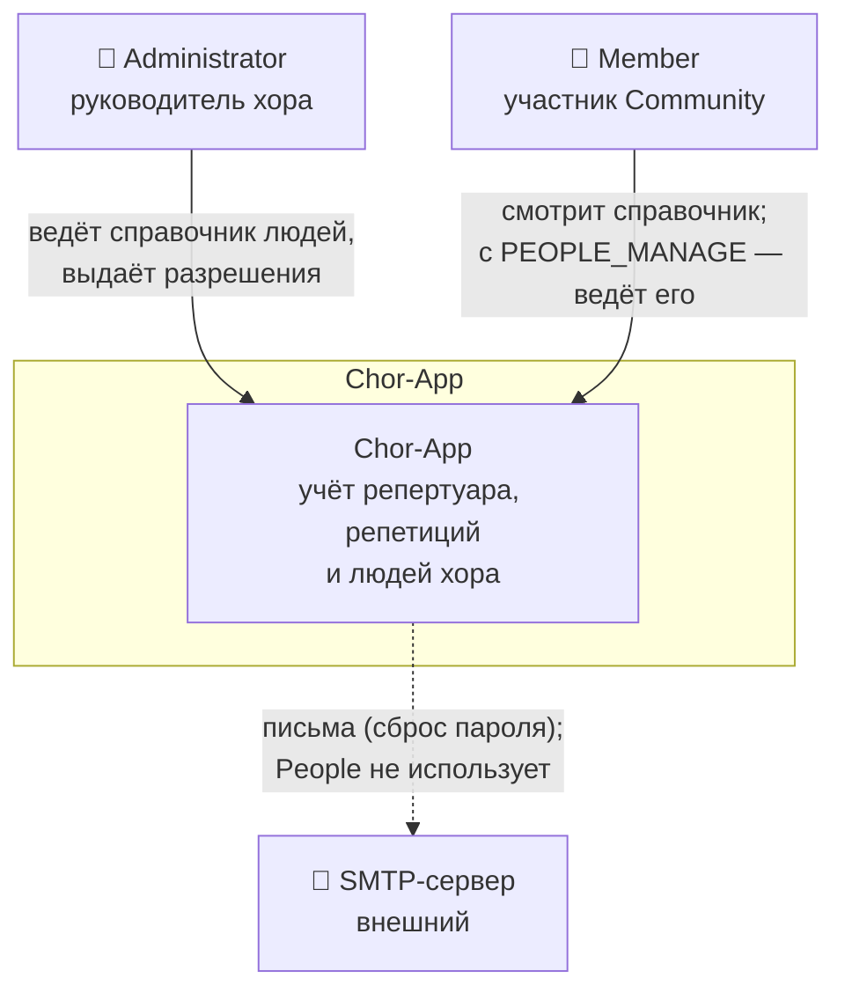

People не добавляет внешних систем и не отправляет писем.

## 4. C4 — уровень 2: контейнеры

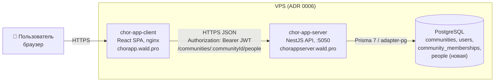

Изменения на уровне контейнеров: новая таблица `people`, новая колонка `community_memberships.permissions`, новые HTTP-маршруты. Новых контейнеров и переменных окружения нет.

## 5. C4 — уровень 3: компоненты API

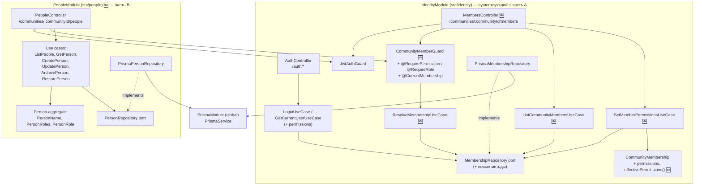

**Правила зависимостей:**
- `PeopleModule` импортирует `IdentityModule` **только** ради guard'ов и декораторов. К репозиториям и сущностям Identity он не обращается.
- `IdentityModule` начинает экспортировать `JwtAuthGuard`, `CommunityMemberGuard` и `ResolveMembershipUseCase` (сейчас экспортов нет, R§4.6).
- `domain/` обоих модулей не импортирует Nest и Prisma.
- `PeopleModule` пока ничего не экспортирует. Будущие модули получат доступ к людям через отдельный read-порт — это вне рамок.

### 5.1 Раскладка файлов

```
src/identity/
  domain/value-objects/community-permission.ts            🆕
  domain/entities/community-membership.entity.ts          ✏️ permissions, effectivePermissions(), hasPermission(), setPermissions()
  domain/errors/identity.errors.ts                        ✏️ + NotCommunityMemberError, MembershipNotFoundError, AdministratorPermissionsImmutableError
  domain/ports/membership-repository.port.ts              ✏️ + findByUserAndCommunity, findById, listByCommunity, savePermissions; view + permissions
  application/use-cases/resolve-membership.use-case.ts    🆕
  application/use-cases/list-community-members.use-case.ts 🆕
  application/use-cases/set-member-permissions.use-case.ts 🆕
  application/use-cases/login.use-case.ts, get-current-user.use-case.ts ✏️ (эффективные permissions во view)
  infrastructure/prisma/prisma-membership.repository.ts   ✏️
  interface/guards/community-member.guard.ts              🆕
  interface/decorators/require-permission.decorator.ts    🆕 (+ RequireRole)
  interface/decorators/current-membership.decorator.ts    🆕
  interface/controllers/members.controller.ts             🆕
  interface/dto/set-member-permissions.dto.ts             🆕
  identity.module.ts                                      ✏️ exports

src/people/                                               🆕
  people.module.ts
  domain/entities/person.entity.ts
  domain/value-objects/person-name.ts, person-roles.ts, person-role.ts
  domain/errors/people.errors.ts
  domain/ports/person-repository.port.ts
  application/use-cases/{list-people,get-person,create-person,update-person,archive-person,restore-person}.use-case.ts
  application/person.view.ts                              (результат use case)
  infrastructure/prisma/prisma-person.repository.ts
  interface/controllers/people.controller.ts
  interface/dto/{create-person,update-person,list-people-query}.dto.ts

src/app.module.ts                                         ✏️ + PeopleModule
prisma/schema.prisma                                      ✏️ + 2 миграции
```

---

## 6. Доменная модель

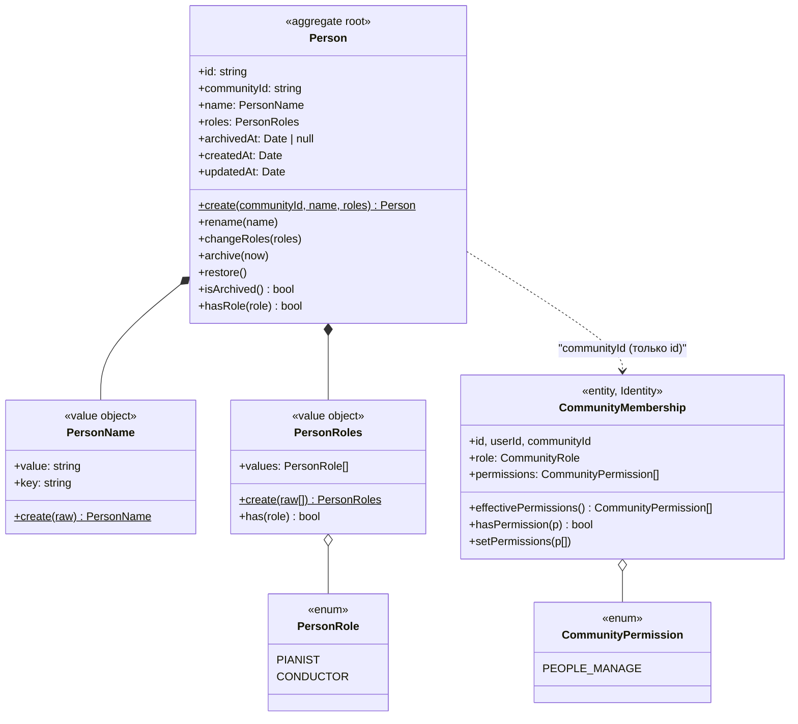

### 6.1 Инварианты и правила

| Правило | Где проверяется |
|---|---|
| Имя: trim, длина 1–100 после trim | `PersonName.create` (+ DTO: строка, максимум 100) |
| `key` = trim + `toLowerCase()` — основа уникальности | `PersonName` |
| Роли: не пусто, только значения enum, дубликаты схлопываются, порядок детерминирован (`PIANIST`, `CONDUCTOR`) | `PersonRoles.create` (+ DTO `IsEnum` each) |
| Архивного человека нельзя переименовать или сменить роли | `Person.rename` / `changeRoles` → `PersonArchivedError` |
| `archive` у архивного и `restore` у активного ничего не меняют (идемпотентны) | `Person` |
| Имя уникально внутри Community, включая архивных | use case (предпроверка) + unique-constraint в БД |
| `ADMINISTRATOR` обладает всеми разрешениями; хранимый набор игнорируется | `CommunityMembership.effectivePermissions` |
| Набор разрешений задаётся только у `MEMBER` | `CommunityMembership.setPermissions` → `AdministratorPermissionsImmutableError` |

**Отличие от текущего кода:** сущности Identity анемичны: только getters, без поведения и валидации (R§4.2). `Person` и расширенный `CommunityMembership` содержат поведение и инварианты. Причина: у People есть правила (роли, архивация), которые иначе расползутся по use cases. Стиль конструктора (`Props` + getters) сохраняется.

**Нормализация:** в Identity trim/lowercase делаются в use case (R§4.3). Для `Person` это делается в value object. Use case только передаёт сырые данные.

---

## 7. Модель данных

### 7.1 Изменения Prisma-схемы

```prisma
enum CommunityPermission {
  PEOPLE_MANAGE
}

model CommunityMembership {
  // … существующие поля
  permissions CommunityPermission[] @default([])
}

enum PersonRole {
  PIANIST
  CONDUCTOR
}

model Person {
  id          String       @id @default(uuid())
  name        String
  nameKey     String
  roles       PersonRole[]
  archivedAt  DateTime?
  createdAt   DateTime     @default(now())
  updatedAt   DateTime     @updatedAt

  communityId String
  community   Community    @relation(fields: [communityId], references: [id], onDelete: Cascade)

  @@unique([communityId, nameKey])
  @@index([communityId, archivedAt])
  @@map("people")
}

model Community {
  // … существующие поля
  people Person[]
}
```

Соглашения схемы соблюдены (R§3): uuid-id, `createdAt`/`updatedAt`, `@@map` snake_case, `onDelete: Cascade` от Community.

### 7.2 ER-диаграмма (затронутая часть)

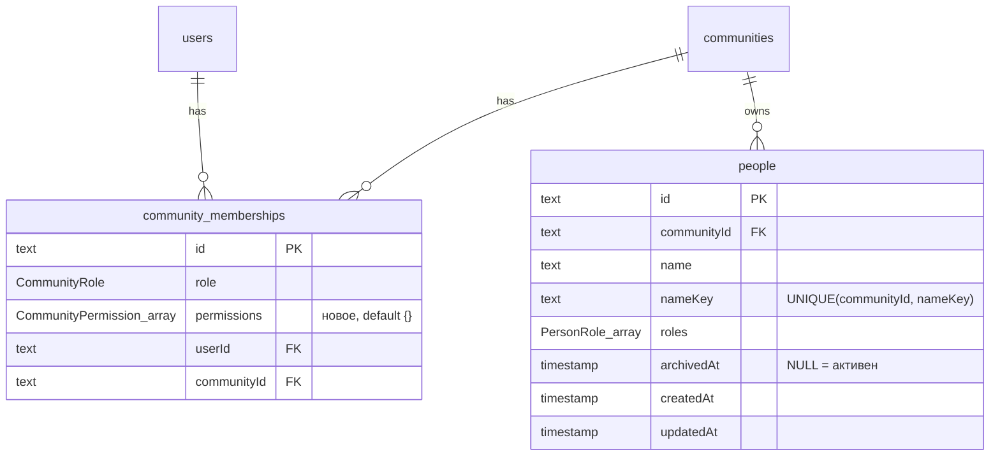

### 7.3 Миграции

| # | Миграция | Содержимое | Совместимость со старым релизом |
|---|---|---|---|
| 1 | `community_permissions` | `CREATE TYPE "CommunityPermission"`, `ALTER TABLE community_memberships ADD COLUMN permissions ... NOT NULL DEFAULT '{}'` | Старый код колонку не читает; default заполняет существующие строки |
| 2 | `people` | `CREATE TYPE "PersonRole"`, `CREATE TABLE people`, unique + index + FK | Новая таблица, старый код её не знает |

Обе миграции только добавляют объекты, удалений нет (NFR-3).

---

## 8. HTTP API

Все маршруты требуют `Authorization: Bearer <JWT>` (ADR 0004). Guard'ы: `JwtAuthGuard` → `CommunityMemberGuard`.

### 8.1 People — `/communities/:communityId/people`

| Метод | Путь | Доступ | Тело / параметры | Успех |
|---|---|---|---|---|
| GET | `/` | участник | query `role?: PIANIST\|CONDUCTOR`, `includeArchived?: boolean` (default `false`) | 200 `PersonView[]` |
| GET | `/:personId` | участник | — | 200 `PersonView` |
| POST | `/` | `PEOPLE_MANAGE` | `{ "name": string, "roles": PersonRole[] }` | 201 `PersonView` |
| PATCH | `/:personId` | `PEOPLE_MANAGE` | `{ "name"?: string, "roles"?: PersonRole[] }`, хотя бы одно поле | 200 `PersonView` |
| POST | `/:personId/archive` | `PEOPLE_MANAGE` | — | 200 `PersonView` |
| POST | `/:personId/restore` | `PEOPLE_MANAGE` | — | 200 `PersonView` |

```json
// PersonView
{
  "id": "0d8f…",
  "name": "Lorina",
  "roles": ["PIANIST", "CONDUCTOR"],
  "archived": false,
  "archivedAt": null,
  "createdAt": "2026-09-16T10:00:00.000Z",
  "updatedAt": "2026-09-16T10:00:00.000Z"
}
```

`communityId` в ответ не входит: он уже есть в URL.

### 8.2 Members — `/communities/:communityId/members`

| Метод | Путь | Доступ | Тело | Успех |
|---|---|---|---|---|
| GET | `/` | роль `ADMINISTRATOR` | — | 200 `MemberView[]` |
| PUT | `/:membershipId/permissions` | роль `ADMINISTRATOR` | `{ "permissions": CommunityPermission[] }` (полная замена) | 200 `MemberView` |

```json
// MemberView
{ "membershipId": "…", "userId": "…", "name": "Anna", "email": "anna@example.org",
  "role": "MEMBER", "permissions": ["PEOPLE_MANAGE"] }
```

### 8.3 Изменения существующих ответов (аддитивно)

`POST /auth/login` и `GET /auth/me`: к каждому элементу `memberships[]` добавляется `permissions: CommunityPermission[]` (эффективные). Существующие поля не меняются.

### 8.4 Ошибки

Формат — стандартное тело Nest-исключения плюс поле `code`:
`{ "statusCode": 409, "error": "Conflict", "message": "…", "code": "PERSON_NAME_TAKEN", … }`.
Маппинг делается в контроллерах, как в `AuthController` (R§4.5). Глобальный filter не вводится.

| Доменная ошибка / ситуация | HTTP | `code` | Доп. поля |
|---|---|---|---|
| нет/невалиден JWT | 401 | — (стандарт Passport) | — |
| DTO не прошёл валидацию | 400 | — (стандарт ValidationPipe) | `message[]` |
| `PersonRolesEmptyError`, `InvalidPersonNameError` (защита домена за DTO) | 400 | `PERSON_ROLES_EMPTY`, `PERSON_NAME_INVALID` | — |
| `NotCommunityMemberError` (нет membership или Community не существует) | 403 | `NOT_COMMUNITY_MEMBER` | — |
| нет разрешения / роли | 403 | `PERMISSION_DENIED` | `required` |
| `PersonNotFoundError` (в т. ч. человек из другой Community) | 404 | `PERSON_NOT_FOUND` | — |
| `MembershipNotFoundError` | 404 | `MEMBERSHIP_NOT_FOUND` | — |
| `PersonNameTakenError` | 409 | `PERSON_NAME_TAKEN` | `existingPersonId`, `existingArchived` |
| `PersonArchivedError` | 409 | `PERSON_ARCHIVED` | — |
| `AdministratorPermissionsImmutableError` | 409 | `ADMINISTRATOR_PERMISSIONS_IMMUTABLE` | — |

---

## 9. DFD — потоки данных

### 9.1 Уровень 0

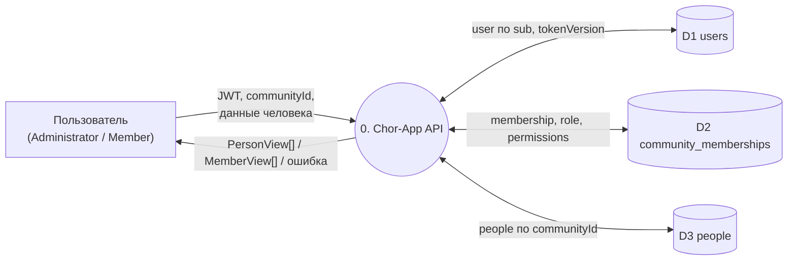

### 9.2 Уровень 1 — запрос к People

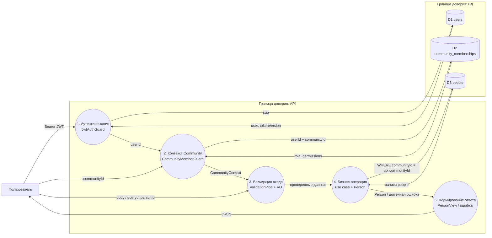

**Ключевое свойство потока:** `communityId` для запроса к D3 берётся **только** из `CommunityContext`, который построил guard после проверки membership. Из тела запроса или из записи он не берётся. `personId` без совпадения `communityId` даёт «не найдено» (NFR-1).

---

## 10. Sequence-диаграммы

### 10.1 Разрешение контекста Community (любой маршрут внутри Community)

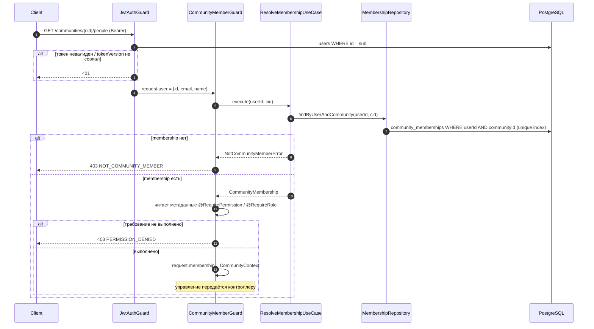

### 10.2 Создание человека

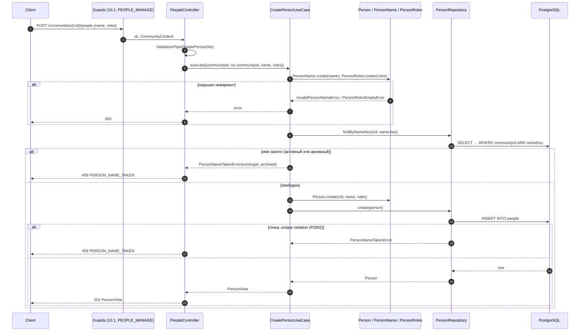

### 10.3 Изменение ролей / имени

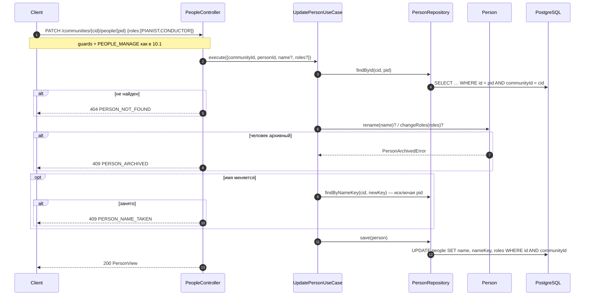

### 10.4 Архивация и восстановление

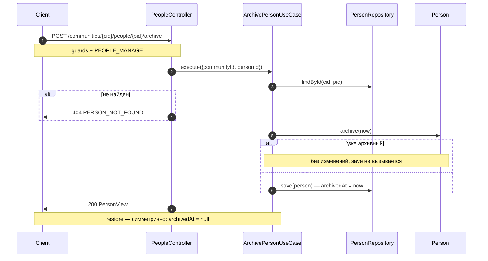

### 10.5 Список людей для выпадающего списка пианистов

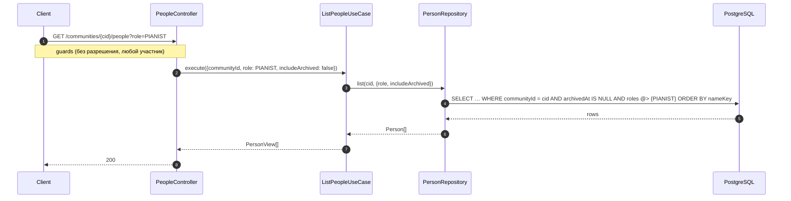

### 10.6 Выдача разрешения участнику

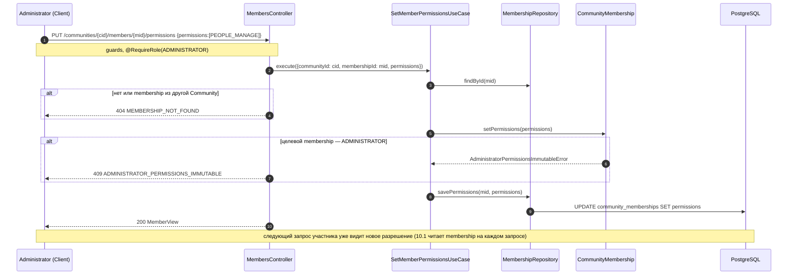

---

## 11. Сквозные аспекты

### 11.1 Матрица доступа

| Действие | Не участник | MEMBER | MEMBER + PEOPLE_MANAGE | ADMINISTRATOR |
|---|---|---|---|---|
| Список / просмотр людей | 403 | ✅ | ✅ | ✅ |
| Создать / изменить / архивировать / восстановить | 403 | 403 | ✅ | ✅ |
| Список участников | 403 | 403 | 403 | ✅ |
| Изменить разрешения участника | 403 | 403 | 403 | ✅ (кроме Administrator) |

### 11.2 Безопасность

| Угроза | Мера |
|---|---|
| IDOR / доступ к чужой Community | `communityId` берётся только из guard-контекста; каждый запрос репозитория People содержит `communityId` в `WHERE`; чужой `personId` → 404 |
| Эскалация прав | разрешения задаёт только роль ADMINISTRATOR; делегирования управления разрешениями нет; разрешения проверяются на сервере на каждом запросе, в JWT не кладутся |
| Устаревшие права после отзыва | membership читается на каждом запросе (10.1) — отзыв действует сразу |
| Mass assignment | `ValidationPipe({ whitelist: true })` (R§2); DTO не содержат `communityId`, `archivedAt`, `id` |
| SQL-инъекции | только параметризованные запросы Prisma; raw SQL не используется |
| Невалидные enum-значения | `IsEnum` в DTO + Postgres enum |
| Перебор существования Community | единый ответ 403 и для «нет Community», и для «не участник» |
| Утечка данных в ответах | `MemberView` с email видит только Administrator; `PersonView` не содержит персональных данных кроме имени |
| Логи | имена и email не логируются |

### 11.3 Согласованность и конкуренция

- Уникальность имени: предпроверка в use case нужна для понятной ошибки с `existingPersonId`. Гарантию даёт unique-индекс `(communityId, nameKey)`: `P2002` маппится в `PersonNameTakenError` (сейчас такого маппинга нет, R§4.4).
- Одновременное редактирование одного человека — last write wins. Для справочника на десятки записей это приемлемо, версионирования нет.
- Архивация/восстановление идемпотентны — повторный клик безопасен.

### 11.4 Производительность

Проверка membership — один запрос по unique-индексу `(userId, communityId)`. Список людей — индекс `(communityId, archivedAt)`, фильтр по роли `roles @> ARRAY[...]` по нескольким десяткам строк. Пагинации нет (NFR-6).

### 11.5 Тестируемость

- Value objects и `Person` — чистый TypeScript, unit-тесты без Nest.
- Use cases тестируются с in-memory фейками портов.
- Guard тестируется с фейковым `ResolveMembershipUseCase`.
- E2E (изоляция арендаторов, матрица 11.1) требует БД, а сейчас e2e в CI не запускается (R§5). Как это закрыть — решается в фазе планирования.

---

## 12. Проектные решения и альтернативы

| # | Решение | Отклонённые альтернативы | Причина |
|---|---|---|---|
| D1 | Community в пути URL + guard | заголовок `X-Community-Id`; активная Community в JWT | ADR 0007: явность, нет скрытого состояния, переключение без перевыпуска токена |
| D2 | Разрешения — захардкоженный enum, массив в membership; ADMINISTRATOR имеет все | фиксированные доп. роли; таблица разрешений | решение владельца; MVP; одна колонка |
| D3 | Один `Person` с набором ролей | отдельные `Pianist`/`Conductor`; флаги `isPianist`/`isConductor` | роли совмещаются; новая роль = значение enum, форма API не меняется |
| D4 | Роли — массив Postgres enum | join-таблица `person_roles` | набор маленький и фиксированный, у роли нет атрибутов |
| D5 | Архивация через `archivedAt` | физическое удаление; удаление, если нет ссылок | будущие журналы ссылаются на `personId`; решение владельца |
| D6 | Уникальность имени включает архивных | уникальность только среди активных | вернувшегося человека восстанавливают, дубликат не создаётся; ответ 409 указывает на архивного |
| D7 | `nameKey` — хранимая колонка | функциональный индекс `lower(trim(name))` | Prisma выражает `@@unique` по колонке; функциональный индекс требует raw SQL в миграции |
| D8 | Сущности с поведением (Person, CommunityMembership) | анемичные сущности как в Identity | инварианты ролей и архивации должны жить в домене |
| D9 | Маппинг ошибок в контроллерах + `code` | глобальный exception filter | следование существующему паттерну (R§4.5); filter — отдельное сквозное решение |
| D10 | PATCH для name/roles, отдельные POST для archive/restore | PATCH с `archived: true` | архивация — отдельная бизнес-операция со своим разрешением и семантикой |

## 13. Соответствие старому приложению

| Старое поведение (R§8) | В новом дизайне |
|---|---|
| Два списка `pianisten` / `dirigenten` | один `Person` + `roles` |
| Одно имя в обоих списках допустимо | тот же человек с двумя ролями |
| Дубликат без учёта регистра в пределах списка отклоняется | в пределах Community для всех людей (FR-8) |
| Удаление вырезает имя, история хранит текст | архивация, история будет хранить `personId` |
| Переименования нет | есть (FR-6) |
| Dropdown Einsingen берётся из дирижёров | `GET …/people?role=CONDUCTOR` (использует будущий Rehearsal Log) |
| Статистика показывает удалённые имена | архивные люди доступны по id и через `includeArchived` |

## 14. Вопросы к ревью

1. **Лимит длины имени — 100 символов.** Подходит?
2. **Архивный человек занимает имя.** Корректно ли, что создать нового с тем же именем нельзя, пока архивный не восстановлен или не переименован? Второе недоступно: архивного редактировать нельзя.
3. **Уровень `MemberView`.** Нужен ли участникам с `PEOPLE_MANAGE` доступ к списку участников, или хватит Administrator?
4. **Порядок реализации.** Часть A и часть B — одним релизом или A отдельно раньше?
5. **Отличия от существующих паттернов.** Устраивают ли D8 (сущности с поведением) и D9 (поле `code` в ошибках), учитывая, что Identity написан иначе?
