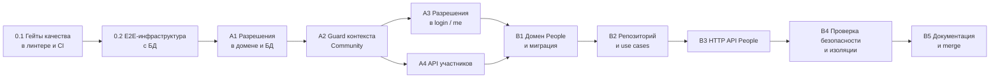

# People — план реализации (фаза 3)

**Дата:** 2026-09-16
**Статус:** черновик на ревью (гейт качества 2 по `../chor-app-docs/development-process.md`)
**Входные данные:** `PEOPLE_RESEARCH.md` (R§…), `PEOPLE_DESIGN.md` (D§…).

---

## 1. Принятые допущения

Вопросы из D§14 на ревью не обсуждались, поэтому план исходит из вариантов, заложенных в дизайн. Если какой-то ответ другой, меняются только перечисленные фазы.

| Вопрос D§14 | Допущение в плане | Затронутые фазы |
|---|---|---|
| 1. Лимит имени | 100 символов | B1 |
| 2. Архивный человек занимает имя | да | B1, B2 |
| 3. Кто видит список участников | только Administrator | A4 |
| 4. Порядок A и B | A целиком раньше B, одна ветка, один merge в `main` после B5 | все |
| 5. Отличия от паттернов Identity (D8, D9) | принимаются | A1, B1, B3 |

## 2. Правила выполнения

- **Ветка.** Вся работа идёт в `feature/people`. Push в `main` запускает деплой (R§5), поэтому в `main` попадает только проверенный результат. Каждая фаза — отдельный коммит (или несколько) в ветке.
- **Фаза завершена**, только если выполнены её критерии готовности и общие проверки из раздела 3.
- **Миграции** только добавляют объекты (D§7.3). Одну и ту же миграцию после коммита не редактируют, исправления делаются новой миграцией.
- **Один агент, строго последовательно** (решение владельца, 2026-09-16). Мультиагентный подход из `development-process.md` в этой фиче не используется: нет субагентов, параллельных веток работы и разделения ролей между агентами. Фазы выполняются по одной в порядке раздела 4; следующая начинается только после завершения предыдущей.
- **Шаги внутри каждой фазы** выполняет тот же агент по очереди:
  1. реализация кода и тестов фазы;
  2. самопроверка тестов: покрыты ли все критерии готовности, дописать недостающие;
  3. сверка кода с `PEOPLE_DESIGN.md` и слоями ADR 0002 по чек-листу фазы;
  4. для фаз с 🔒 — проверка безопасности по чек-листу B4;
  5. прогон гейтов G1–G8, коммит.
- **Отклонение от дизайна** не делается молча: сначала правится `PEOPLE_DESIGN.md` (с пометкой, что изменилось), потом код.

## 3. Общие проверки для каждой фазы (quality gates)

| # | Проверка | Команда / способ |
|---|---|---|
| G1 | Сборка | `npm run build` |
| G2 | Unit-тесты | `npm test` |
| G3 | E2E-тесты (начиная с фазы 0.2) | `npm run test:e2e` на тестовой БД |
| G4 | Линтер и форматирование, без предупреждений в новых файлах | `npm run lint:check` |
| G5 | Метрики сложности (начиная с фазы 0.1) | правила eslint из фазы 0.1, входят в `lint:check` |
| G6 | Зависимости без high/critical уязвимостей (начиная с фазы 0.1) | `npm audit --audit-level=high` |
| G7 | Слои: `domain/` не импортирует `@nestjs/*` и `@prisma/*`; `interface/` не импортирует Prisma | правило `no-restricted-imports` из фазы 0.1 |
| G8 | Соответствие дизайну | ревью по чек-листу фазы |

---

## 4. Карта фаз

A3 и A4 не зависят друг от друга, но выполняются последовательно: сначала A3, потом A4.

| Фаза | Результат | Оценка |
|---|---|---|
| 0.1 | Гейты G5–G7 работают локально и в CI | S |
| 0.2 | E2E с реальной Postgres локально и в CI | M |
| A1 | `CommunityPermission` в схеме и в `CommunityMembership` | S |
| A2 | `CommunityMemberGuard` + декораторы, экспорт из `IdentityModule` | M |
| A3 | `permissions` в ответах login / me | S |
| A4 | `GET/PUT /communities/:communityId/members…` | M |
| B1 | `Person`, value objects, миграция `people` | M |
| B2 | `PrismaPersonRepository`, 6 use cases | M |
| B3 | `PeopleController`, `PeopleModule` | M |
| B4 | E2E матрицы доступа и изоляции, ревью безопасности | S |
| B5 | `AGENTS.md`, OpenSpec, merge в `main` | S |

S — до половины дня, M — до дня.

---

## 5. Фазы

### Фаза 0.1 — гейты качества в линтере и CI

**Зачем:** методика требует метрики сложности, проверку безопасности и соответствие архитектуре, а сейчас в проекте этого нет (R§5).

**Изменения:**
- `eslint.config.mjs`:
  - `complexity: ['error', 10]`, `max-depth: ['error', 3]`, `max-lines-per-function: ['error', 60]` (без тестов), `max-params: ['error', 5]` (конструкторы с DI исключаются через override для `*.use-case.ts`, `*.repository.ts`);
  - `no-restricted-imports` для `src/**/domain/**`: запрет `@nestjs/*`, `@prisma/*`; для `src/**/interface/**`: запрет `@prisma/*`.
- `.github/workflows/docker-image.yml`, job `checks`: шаг `npm audit --audit-level=high --omit=dev` после `npm ci`.
- Существующий код, который нарушает новые правила, чинится в этой же фазе. Если починка выходит за рамки S, правило для конкретного файла отключается с комментарием `// TODO(people-plan 0.1)` и списком в описании коммита.

**Критерии готовности:**
- [ ] `npm run lint:check` зелёный на текущем коде.
- [ ] Намеренный импорт `@nestjs/common` в файл `domain/` даёт ошибку линтера (проверить руками и откатить).
- [ ] `npm audit --audit-level=high --omit=dev` проходит или найденные уязвимости задокументированы.
- [ ] CI job `checks` зелёный в ветке.

**Коммит:** `chore: add complexity, layering and audit quality gates`

---

### Фаза 0.2 — E2E-инфраструктура с базой данных

**Зачем:** правила изоляции и доступа (D§11.1–11.2) проверяются только через HTTP с реальной БД. Сейчас e2e — только scaffold и в CI не запускается (R§5).

**Изменения:**
- `docker-compose.test.yml`: Postgres 16 на порту `5433`, tmpfs.
- `.env.test.example`: `DATABASE_URL` на тестовую БД, `JWT_SECRET`, `MAIL_*` с заглушками.
- `test/utils/`:
  - `create-test-app.ts` — поднимает `AppModule` с тем же `ValidationPipe`, что в `main.ts`; `EMAIL_SENDER` подменяется фейком;
  - `reset-db.ts` — `TRUNCATE … CASCADE` всех таблиц перед каждым файлом тестов;
  - `factories.ts` — регистрация пользователя через API, создание `MEMBER`-membership напрямую через Prisma (приглашений ещё нет, D§11.5), получение токена.
- `test/identity/auth.e2e-spec.ts` — базовые сценарии регистрации и логина как проверка инфраструктуры.
- Удалить scaffold `test/app.e2e-spec.ts` (он проверяет «Hello World», а не поведение).
- `test/jest-e2e.json`: `runInBand`, `globalSetup` с `prisma migrate deploy`.
- `package.json`: `test:e2e` работает с `.env.test`.
- CI: новый job `e2e` (`services: postgres:16`), `needs` у `build` расширяется до `[checks, e2e]`.

**Критерии готовности:**
- [ ] `docker compose -f docker-compose.test.yml up -d && npm run test:e2e` проходит локально с чистой БД.
- [ ] Повторный запуск проходит без ручной очистки.
- [ ] Job `e2e` зелёный в CI; деплой зависит от него.
- [ ] Реальные письма не отправляются (фейк `EMAIL_SENDER`).

**Коммит:** `test: add database-backed e2e setup and run it in CI`

---

### Фаза A1 — разрешения в домене и БД 🔒

**Дизайн:** D§6, D§6.1 (две последние строки), D§7.1, D§7.3 миграция 1.

**Изменения:**
- `prisma/schema.prisma`: enum `CommunityPermission { PEOPLE_MANAGE }`, `CommunityMembership.permissions CommunityPermission[] @default([])`.
- Миграция `community_permissions` (`npx prisma migrate dev --name community_permissions`).
- `src/identity/domain/value-objects/community-permission.ts`: enum + `ALL_COMMUNITY_PERMISSIONS`.
- `community-membership.entity.ts`: `permissions`, `effectivePermissions()`, `hasPermission()`, `setPermissions()`; дубликаты схлопываются.
- `identity.errors.ts`: `AdministratorPermissionsImmutableError`.
- Существующие места, создающие `CommunityMembership` (`prisma-registration.repository.ts`), передают `permissions`.

**Тесты (unit):** `community-membership.entity.spec.ts`
- ADMINISTRATOR: `effectivePermissions()` = все; `hasPermission(PEOPLE_MANAGE)` = true при пустом хранимом наборе.
- MEMBER: по умолчанию пусто; после `setPermissions([PEOPLE_MANAGE, PEOPLE_MANAGE])` = один элемент.
- `setPermissions` у ADMINISTRATOR бросает ошибку.

**Критерии готовности:**
- [ ] Миграция содержит только `CREATE TYPE` и `ADD COLUMN … DEFAULT '{}'`.
- [ ] Существующие memberships после миграции имеют `permissions = {}`.
- [ ] Регистрация и логин работают как раньше (e2e из 0.2 зелёные).

**Коммит:** `feat(identity): add community permissions to memberships`

---

### Фаза A2 — guard контекста Community 🔒

**Дизайн:** D§5, D§5.1, D§10.1, D§8.4 (403), D§11.2.

**Изменения:**
- `membership-repository.port.ts`: `findByUserAndCommunity(userId, communityId): Promise<CommunityMembership | null>`.
- `prisma-membership.repository.ts`: реализация через unique `(userId, communityId)`.
- `identity.errors.ts`: `NotCommunityMemberError`.
- `resolve-membership.use-case.ts`.
- `interface/decorators/require-permission.decorator.ts` (`RequirePermission`, `RequireRole`), `current-membership.decorator.ts`.
- `interface/guards/community-member.guard.ts`:
  - читает `request.params.communityId`; если параметра нет — ошибка конфигурации (500), а не пропуск проверки;
  - нет membership → 403 `NOT_COMMUNITY_MEMBER`; невыполненное требование → 403 `PERMISSION_DENIED` с `required`;
  - кладёт в `request.membership` контекст `{ membershipId, communityId, role, permissions }`.
- `identity.module.ts`: `exports: [JwtAuthGuard, CommunityMemberGuard, ResolveMembershipUseCase]` (+ то, что нужно для их DI).
- Временный тестовый контроллер только в e2e-модуле (`test/utils/`), в `src/` не попадает.

**Тесты:**
- Unit `community-member.guard.spec.ts` с фейковым use case: нет параметра; не участник; участник без требований; `RequirePermission` у MEMBER без/с разрешением; ADMINISTRATOR; `RequireRole`.
- E2E на тестовом контроллере: без токена 401; чужая Community 403; несуществующая Community 403 с тем же телом; своя 200.

**Критерии готовности:**
- [ ] Ответы для «не участник» и «Community нет» не различаются.
- [ ] `communityId` в контексте берётся только из membership, найденного в БД.
- [ ] `PeopleModule` (будущий) сможет использовать guard, импортируя только `IdentityModule`: проверено тестовым модулем.

**Коммит:** `feat(identity): add community member guard and permission decorators`

---

### Фаза A3 — разрешения в ответах login и me

**Дизайн:** D§8.3, FR-11.

**Изменения:**
- `CommunityMembershipView` + `permissions: CommunityPermission[]` (эффективные).
- `PrismaMembershipRepository.findByUserId` маппит через сущность и `effectivePermissions()`.
- `login.use-case.ts`, `get-current-user.use-case.ts` — типы без изменений логики.

**Тесты (e2e):** Administrator после регистрации: login и me содержат `permissions: ["PEOPLE_MANAGE"]`; MEMBER с пустым набором: `[]`; остальные поля ответа не изменились.

**Критерии готовности:**
- [ ] Изменение аддитивное: ни одно существующее поле не удалено и не переименовано.

**Коммит:** `feat(identity): return effective permissions in login and me`

---

### Фаза A4 — API участников 🔒

**Дизайн:** D§8.2, D§10.6, FR-9, FR-10.

**Изменения:**
- Порт: `findById(membershipId)`, `listByCommunity(communityId)` (с именем и email пользователя), `savePermissions(membershipId, permissions)`.
- Ошибка `MembershipNotFoundError`.
- `list-community-members.use-case.ts`, `set-member-permissions.use-case.ts` (membership из другой Community = не найден).
- `set-member-permissions.dto.ts`: `@IsArray()`, `@IsEnum(CommunityPermission, { each: true })`.
- `members.controller.ts` с `@RequireRole(ADMINISTRATOR)`; маппинг ошибок с `code` (D§8.4).

**Тесты:**
- Unit: оба use case с фейковым репозиторием.
- E2E: список у Administrator; MEMBER получает 403; выдача и отзыв `PEOPLE_MANAGE` (следующий запрос MEMBER видит изменение); цель — Administrator → 409; membership из другой Community → 404; неизвестное значение → 400.

**Критерии готовности:**
- [ ] Email участников не виден никому, кроме Administrator этой Community.
- [ ] Отзыв разрешения действует со следующего запроса без перелогина.

**Коммит:** `feat(identity): let administrators manage member permissions`

---

### Фаза B1 — домен People и миграция

**Дизайн:** D§6, D§6.1, D§7.1, D§7.3 миграция 2, D12 (D3–D7).

**Изменения:**
- `prisma/schema.prisma`: enum `PersonRole`, модель `Person`, relation `Community.people`; миграция `people`.
- `src/people/domain/`:
  - `value-objects/person-role.ts`, `person-name.ts` (trim, 1–100, `key`), `person-roles.ts` (не пусто, дедупликация, порядок `PIANIST`, `CONDUCTOR`);
  - `entities/person.entity.ts`: `create`, `rename`, `changeRoles`, `archive(now)`, `restore`, `isArchived`, `hasRole`; архивного нельзя менять;
  - `errors/people.errors.ts`: `InvalidPersonNameError`, `PersonRolesEmptyError`, `PersonArchivedError`, `PersonNotFoundError`, `PersonNameTakenError(existingPersonId, existingArchived)`;
  - `ports/person-repository.port.ts`: `findById(communityId, id)`, `findByNameKey(communityId, key)`, `list(communityId, { role?, includeArchived })`, `create(person)`, `save(person)`.

**Тесты (unit):** `person-name.spec.ts`, `person-roles.spec.ts`, `person.entity.spec.ts`:
- имя: `"  Anna "` → `"Anna"`, key `"anna"`; пустое, из пробелов, 101 символ — ошибка; ровно 100 — ок;
- роли: пусто — ошибка; `[CONDUCTOR, PIANIST, PIANIST]` → `[PIANIST, CONDUCTOR]`;
- архивация: повторная ничего не меняет; `rename`/`changeRoles` у архивного — ошибка; `restore` возвращает прежние имя и роли.

**Критерии готовности:**
- [ ] `src/people/domain` без импортов Nest и Prisma (G7).
- [ ] Миграция создаёт только новый тип, таблицу, unique `(communityId, nameKey)`, индекс `(communityId, archivedAt)`, FK с cascade.

**Коммит:** `feat(people): add person domain model and schema`

---

### Фаза B2 — репозиторий и use cases

**Дизайн:** D§5.1, D§10.2–10.5, D§11.3.

**Изменения:**
- `infrastructure/prisma/prisma-person.repository.ts`: маппер `toDomain`; каждый запрос содержит `communityId` в `where`; `P2002` на `(communityId, nameKey)` → `PersonNameTakenError` с дочитыванием существующей записи; `list`: `archivedAt: null` без `includeArchived`, `roles: { has: role }`, `orderBy: nameKey`.
- `application/person.view.ts` + функция `toPersonView(person)`.
- Use cases: `list-people`, `get-person`, `create-person`, `update-person` (проверка имени исключает самого человека; PATCH без полей — ошибка валидации в DTO), `archive-person`, `restore-person` (без `save`, если состояние не изменилось).

**Тесты:**
- Unit каждого use case с in-memory `PersonRepository`: создание; дубликат активного и архивного (409 с `existingArchived`); переименование в своё же имя с другим регистром разрешено; изменение архивного; архивация/восстановление идемпотентны; `get` из другой Community → не найден.
- Интеграционный тест репозитория на тестовой БД (`test/people/prisma-person.repository.e2e-spec.ts`): гонка — две параллельные вставки одного имени дают одну запись и `PersonNameTakenError`; фильтр по роли включает человека с двумя ролями; сортировка без учёта регистра.

**Критерии готовности:**
- [ ] Нет метода репозитория без `communityId` в сигнатуре (кроме `create`/`save`, где он внутри агрегата).

**Коммит:** `feat(people): add person repository and use cases`

---

### Фаза B3 — HTTP API People

**Дизайн:** D§8.1, D§8.4, D§11.1.

**Изменения:**
- DTO: `create-person.dto.ts` (`@IsString`, `@MaxLength(100)`, `@IsArray`, `@ArrayNotEmpty`, `@IsEnum(PersonRole, { each: true })`), `update-person.dto.ts` (оба поля необязательны, минимум одно), `list-people-query.dto.ts` (`role?`, `includeArchived?` с преобразованием строки `"true"`).
- `people.controller.ts`: guards `JwtAuthGuard`, `CommunityMemberGuard`; `@RequirePermission(PEOPLE_MANAGE)` на POST/PATCH/archive/restore; `communityId` из `@CurrentMembership()`, а не из `@Param`; `ParseUUIDPipe` для `:personId`; маппинг ошибок с `code`.
- `people.module.ts` (imports `IdentityModule`), подключение в `app.module.ts`.

**Тесты (e2e `test/people/people.e2e-spec.ts`):** все эндпоинты D§8.1 по успешному пути; коды ошибок из D§8.4 для каждого эндпоинта; `includeArchived=false` по умолчанию; `role=PIANIST` возвращает человека с двумя ролями; невалидный `personId` → 400; PATCH с пустым телом → 400; лишние поля (`communityId`, `archivedAt`) в теле отбрасываются.

**Критерии готовности:**
- [ ] Коды статусов и тела ответов совпадают с D§8.1 и D§8.4.
- [ ] Ни один обработчик не читает `communityId` из `@Param` или тела.

**Коммит:** `feat(people): expose people API`

---

### Фаза B4 — проверка безопасности и изоляции 🔒

**Дизайн:** D§11.1, D§11.2, NFR-1.

**Изменения:** только тесты и исправления найденного.
- `test/people/access-matrix.e2e-spec.ts`: таблица D§11.1 как параметризованный тест (4 субъекта × все эндпоинты People и Members), ожидаемые статусы из матрицы.
- `test/people/tenant-isolation.e2e-spec.ts`: две Community A и B; участник A с `PEOPLE_MANAGE` пытается через `/communities/A/people/{id из B}` сделать get / patch / archive / restore → 404, данные B не изменились; `/communities/B/...` → 403.
- Проверка безопасности по чек-листу (тем же агентом, отдельным шагом после тестов):
  - все `where` в `PrismaPersonRepository` и новых методах membership содержат ограничение по Community или по id, найденному через Community;
  - нет `$queryRaw` / `$executeRaw`;
  - DTO не принимают `id`, `communityId`, `archivedAt`, `permissions` у People;
  - ответы не содержат `passwordHash`, `tokenVersion`, email вне `MemberView`;
  - в логах нет имён и email;
  - `npm audit` (G6).

**Критерии готовности:**
- [ ] Матрица доступа проходит полностью.
- [ ] Тесты изоляции проходят.
- [ ] Отчёт проверки безопасности приложен к описанию PR (найденное исправлено или вынесено в задачи с обоснованием).

**Коммит:** `test(people): cover access matrix and tenant isolation`

---

### Фаза B5 — документация и merge

**Изменения:**
- `chor-app-server/AGENTS.md`: раздел «Implemented so far» (Community Access, People), убрать из «Open questions» решённые пункты (role granularity, active Community guard), поправить ссылку на архивный change Identity (R§7), описать новые гейты (0.1) и e2e (0.2).
- `chor-app-docs`: сверить `openspec/changes/add-community-access-control` и `add-people` с реализацией, архивировать в `openspec/specs/identity/community-access/` и `openspec/specs/people/person-management/`; обновить `domain-model.md`, `capability-breakdown.md`, ADR 0007 (если что-то поменялось).
- `PEOPLE_DESIGN.md`: статус «реализован», список отклонений от дизайна (если были).
- PR `feature/people` → `main`: описание со ссылками на три документа, отчётом B4 и чек-листом гейтов.

**Критерии готовности:**
- [ ] Все гейты G1–G8 зелёные в CI на PR.
- [ ] После merge деплой зелёный; `prisma migrate deploy` применил обе миграции.
- [ ] Smoke на проде: `GET /auth/me` содержит `permissions`; `GET /communities/{своя}/people` → `[]`.

**Коммиты:** `docs: document community access and people` (server), `docs: archive people and community access changes` (docs repo).

---

## 6. Чек-лист гейта 2 (ревью плана)

- [ ] Каждое требование FR-1…FR-11 и NFR-1…NFR-6 из D§2 закрыто хотя бы одной фазой (таблица ниже).
- [ ] Каждая фаза проверяется отдельно и коммитится без поломки предыдущих.
- [ ] Порядок фаз не нарушает зависимостей D§5.
- [ ] Допущения из раздела 1 подтверждены или исправлены.
- [ ] Гейты 0.1 и 0.2 устраивают как обязательная часть этой фичи.

| Требование | Фазы |
|---|---|
| FR-1, FR-2, FR-3, FR-4 | B2, B3 |
| FR-5, FR-6, FR-7 | B1, B2, B3 |
| FR-8 | B1, B2 |
| FR-9, FR-10 | A1, A4 |
| FR-11 | A3 |
| NFR-1 | A2, B2, B4 |
| NFR-2 | 0.1 (G7), все фазы |
| NFR-3 | A1, B1, B5 |
| NFR-4 | A2, A4, B3 |
| NFR-5 | 0.2, все фазы |
| NFR-6 | A2, B2 |

## 7. Риски плана

| Риск | Что делаем |
|---|---|
| Новые правила линтера (0.1) ломают существующий код больше, чем ожидается | локальные отключения с TODO и списком, отдельная задача на исправление |
| Postgres-service в GitHub Actions замедляет CI | e2e — отдельный job CI (параллельность CI-джобов не связана с работой агента) |
| Без отдельных ревьюера и агента безопасности один агент пропустит свои же ошибки | обязательные шаги самопроверки по чек-листам в каждой фазе; ревью человеком на гейте перед merge (B5) |
| В MVP нет приглашений: у Community реально только Administrator | ветки MEMBER проверяются через фабрику тестов (0.2); функционально фича полезна Administrator уже сейчас |
| Долгоживущая ветка расходится с `main` | `main` сейчас меняется редко; rebase перед B5 |
