# Repertoire — дизайн (фаза 2)

**Дата:** 2026-09-16
**Статус:** черновик на ревью (гейт качества 1 по `../chor-app-docs/development-process.md`)
**Входные данные:**
- `REPERTOIRE_RESEARCH.md` — факты (ссылки «R§…»);
- `../people/PEOPLE_DESIGN.md` — механизм Community Access, общий для всех фич внутри Community (ссылки «PD§…»);
- решения владельца продукта от 2026-09-16 (раздел 2.3);
- `chor-app-docs/decisions/0007-community-scoped-requests-and-permissions.md`.

Диаграммы в формате Mermaid.

---

## 1. Цель

Дать каждой Community собственный каталог песен и собственный список тем. Песни можно искать по книге, номеру, названию и теме. На `songId` будут ссылаться будущие Rehearsal Log, Performance Log и Reporting.

Заменяет в старом приложении встроенный каталог, «Lieder verwalten» и «Themensuche» (R§4–6).

**Предусловие:** механизм Community Access (маршруты `/communities/:communityId/...`, `CommunityMemberGuard`, `CommunityPermission`) из PD§5 и фаз A1–A4 `PEOPLE_PLAN.md`. Repertoire его использует и добавляет только своё значение разрешения.

## 2. Требования

### 2.1 Функциональные

| ID | Требование |
|---|---|
| FR-1 | Участник видит песни своей Community; фильтры: книга, тема, флаг «новая песня», поиск по подстроке в названии или номере |
| FR-2 | Архивные песни по умолчанию скрыты, их можно запросить явно; песня доступна по id и в архиве |
| FR-3 | Участник находит песню по точной паре «книга + номер» (для будущей записи исполнения) |
| FR-4 | С разрешением `REPERTOIRE_MANAGE` можно создать песню: книга, номер, название, автор, аранжировщик, флаг «новая песня», темы |
| FR-5 | С `REPERTOIRE_MANAGE` можно изменить название, автора, аранжировщика, флаг «новая песня» и темы активной песни; книга и номер не меняются |
| FR-6 | С `REPERTOIRE_MANAGE` можно архивировать и восстановить песню; физического удаления нет |
| FR-7 | Номер — строка (`22`, `22a`, `22b`); уникален в пределах книги внутри Community, включая архивные песни |
| FR-8 | Флаг «новая песня» (UI: *Neue Lieder*) можно установить только у песни из книги Mappe или Andere |
| FR-9 | Участник видит список тем Community |
| FR-10 | С `REPERTOIRE_MANAGE` можно создать, переименовать, архивировать и восстановить тему; имя уникально в Community без учёта регистра |
| FR-11 | С `REPERTOIRE_MANAGE` одним действием создаётся стандартный список тем (30 тем прототипа) с последующим редактированием |
| FR-12 | Песне можно назначить любые активные темы Community, у песни может быть несколько тем; поиск по теме работает во всех книгах |
| FR-13 | С `REPERTOIRE_MANAGE` в пустую или частично заполненную Community можно по запросу загрузить встроенный каталог прототипа (727 + 115 песен с темами) |

### 2.2 Нефункциональные

| ID | Требование |
|---|---|
| NFR-1 | Изоляция арендаторов, как PD NFR-1: песни и темы одной Community недоступны другой ни при каком id |
| NFR-2 | Слои DDD по ADR 0002; `domain/` без Nest и Prisma (гейт G7) |
| NFR-3 | Миграции только добавляют объекты (деплой применяет их при работающем старом контейнере) |
| NFR-4 | Ошибки с машиночитаемым `code`, как PD§8.4 |
| NFR-5 | Масштаб: до ~2000 песен и ~100 тем на Community. Список всех песен одним ответом ≤ 300 мс на сервере; поиск идёт по индексам `communityId` |
| NFR-6 | Загрузка каталога атомарна: либо весь каталог, либо ничего; повторный запуск не создаёт дубликатов |

### 2.3 Решения владельца продукта (входные ограничения)

- Новая Community создаётся пустой, встроенный каталог загружается по запросу.
- Любая песня редактируема, удаление — архивация; номер и книга неизменны.
- Номер песни — строка (`22`, `22a`, `22b`).
- Книга — текстовое поле песни. Значение выбирается на клиенте из захардкоженного списка (`Bücher`, `Mappe`, `Andere`, …), который меняют разработчики. **Будет ли книга отдельной сущностью — открытый вопрос** (OQ-1).
- «Neue Lieder» — не коллекция, а флаг песни: через год песня уже не новая. Новая песня обязательно принадлежит книге Mappe или Andere.
- Сущность называется `Theme` (UI: *Thema*). У Community свой редактируемый список тем, стандартный список создаётся одним действием. У песни список тем, темы можно создавать самим и привязывать к песням любой книги.

### 2.4 Вне рамок

Сущность «Книга» (OQ-1), журнал исполнений и статистика, импорт пользовательских данных старого приложения (`custom_songs`, `extra_themen` из бэкапа), клиентский UI, пагинация.

---

## 3. Изменения модели по сравнению с прототипом и доменной моделью

| Было (R§4–6, `domain-model.md`) | Становится | Причина |
|---|---|---|
| `SongCollectionType` enum `Books \| Folder \| NewSongs` с разными правилами | текстовое поле `book` у песни; правил на уровне коллекций нет | решение владельца (2.3) |
| Neue Lieder — отдельная коллекция со своей нумерацией | флаг `isNew` у песни из Mappe / Andere | решение владельца (2.3) |
| Номер — целое число | строка + ключ уникальности + ключ сортировки | решение владельца (2.3) |
| Встроенный каталог неизменяемый, общий для всех | каталог загружается в Community по запросу, после загрузки полностью редактируемый | решение владельца (2.3) |
| Встроенные песни нельзя удалить, свои — удаляются физически | любая песня архивируется | решение владельца (2.3) |
| Тема — строка; 30 встроенных нередактируемых + пользовательские, существующие пока есть привязка | `Theme` — сущность Community со своим жизненным циклом | решение владельца (2.3) |
| Поиск по темам только в Books | во всех книгах | коллекции с отдельными правилами больше нет |
| Раздел книги (`thema_buch_original`) и источники тем (`quellen`) | не переносятся | решение владельца (2.3) |
| `author`, `arranger` отсутствуют | новые необязательные поля | решение владельца |

После принятия дизайна нужно обновить `chor-app-docs/domain-model.md` (раздел Repertoire) и `glossary.md` (Neue Lieder → `isNew`, NewSongs и `SongCollectionType` удаляются). Это входит в план.

---

## 4. C4 — уровень 1: контекст системы

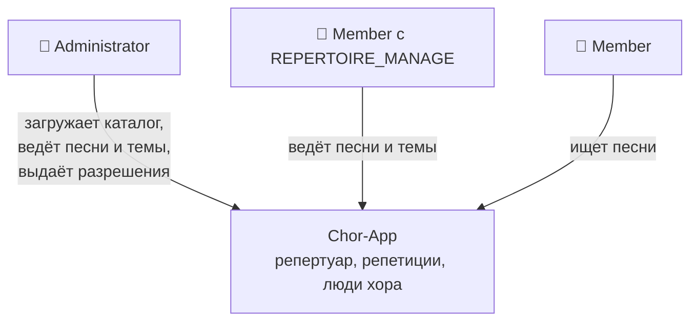

Внешних систем Repertoire не добавляет. Встроенный каталог прототипа поставляется вместе с сервером как файл данных (раздел 9), а не загружается из внешнего источника.

## 5. C4 — уровень 2: контейнеры

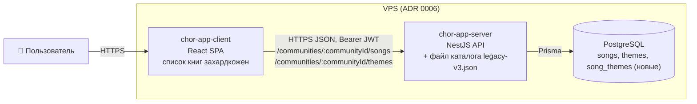

Новых контейнеров и переменных окружения нет.

## 6. C4 — уровень 3: компоненты API

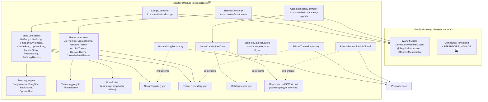

**Правила зависимостей:**
- `RepertoireModule` импортирует `IdentityModule` только ради guard'ов и декораторов, как `PeopleModule`.
- `Song` ссылается на темы только по `themeId`. Проверку, что темы существуют, активны и принадлежат той же Community, делает use case через `ThemeRepository`.
- Модуль ничего не экспортирует. Будущий Rehearsal Log получит read-порт `SongLookup` — вне рамок.
- Songs и Themes в одном модуле: это один bounded context, темы без песен не имеют смысла.

### 6.1 Раскладка файлов

```
src/repertoire/
  repertoire.module.ts
  domain/
    entities/song.entity.ts, theme.entity.ts
    value-objects/song-number.ts, song-title.ts, book-name.ts, theme-name.ts, optional-text.ts
    policies/book-rules.ts                  // константа книг, где разрешён isNew (OQ-1)
    errors/repertoire.errors.ts
    ports/song-repository.port.ts, theme-repository.port.ts,
          catalog-source.port.ts, repertoire-unit-of-work.port.ts
  application/
    views/song.view.ts, theme.view.ts
    use-cases/songs/*.use-case.ts (8)
    use-cases/themes/*.use-case.ts (6)
    use-cases/catalog/import-catalog.use-case.ts
    default-themes.ts                       // 30 названий тем
  infrastructure/
    prisma/prisma-song.repository.ts, prisma-theme.repository.ts, prisma-repertoire-unit-of-work.ts
    catalog/json-file-catalog-source.ts
  interface/
    controllers/songs.controller.ts, themes.controller.ts, catalog-imports.controller.ts
    dto/*.dto.ts

data/catalogs/legacy-v3.json                // извлечён из chor-app_v3.html (раздел 9)
src/identity/domain/value-objects/community-permission.ts  ✏️ + REPERTOIRE_MANAGE
prisma/schema.prisma                                        ✏️ + миграции
src/app.module.ts                                           ✏️ + RepertoireModule
```

---

## 7. Доменная модель

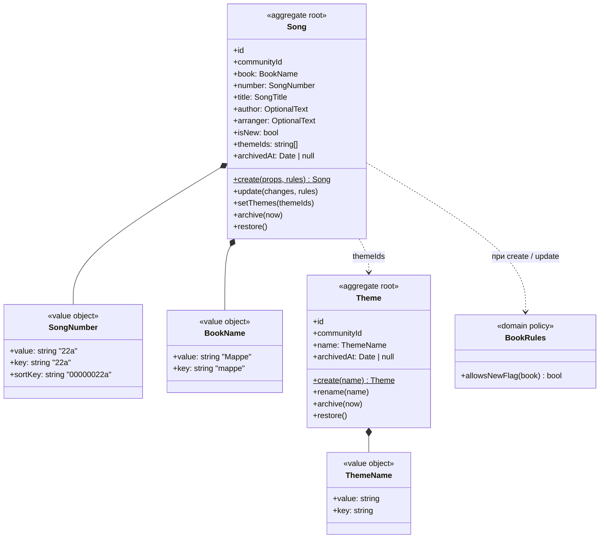

### 7.1 Value objects

| VO | Правила |
|---|---|
| `SongNumber` | trim; удаление внутренних пробелов; `key` = нижний регистр; формат `key`: `^[0-9]{1,6}[a-z]{0,3}$` (OQ-2); `sortKey` = числовая часть с ведущими нулями до 8 знаков + буквенный суффикс (`22` → `00000022`, `22b` → `00000022b`, `100` → `00000100`); `value` хранит введённое написание после trim |
| `BookName` | trim; длина 1–50; `key` = нижний регистр. Список допустимых значений сервер не проверяет (OQ-1) |
| `SongTitle` | trim; длина 1–200 |
| `OptionalText` (author, arranger) | trim; пустая строка → `null`; длина ≤ 200 |
| `ThemeName` | trim; длина 1–100; `key` = нижний регистр |

### 7.2 Инварианты

| Правило | Где |
|---|---|
| `isNew = true` только если `BookRules.allowsNewFlag(book)`; сейчас это книги с ключами `mappe`, `andere` | `Song.create` / `update` → `NewFlagNotAllowedError` |
| Книга и номер после создания не меняются | у `Song` нет методов для их изменения; DTO обновления их не содержат |
| Архивную песню нельзя менять (включая темы) | `Song` → `SongArchivedError` |
| Архивную тему нельзя переименовать | `Theme` → `ThemeArchivedError` |
| Темы песни без дубликатов | `Song.setThemes` |
| Архивация и восстановление идемпотентны | `Song`, `Theme` |
| Номер уникален в `(communityId, bookKey)`, включая архивные | use case (предпроверка) + unique-индекс |
| Имя темы уникально в `communityId`, включая архивные | use case + unique-индекс |
| Назначаемые темы существуют, принадлежат Community песни и активны | use case `CreateSong` / `SetSongThemes` → `ThemeNotFoundError` / `ThemeArchivedError` |
| Архивная тема **остаётся** у песен, к которым уже привязана; новые привязки к ней запрещены | use case |

`BookRules` — это единственное место, где сервер знает конкретные названия книг. Оно захардкожено и меняется вместе со списком на клиенте. Разрешение OQ-1 его заменит.

---

## 8. Модель данных

### 8.1 Prisma

```prisma
enum CommunityPermission {
  PEOPLE_MANAGE
  REPERTOIRE_MANAGE
}

model Song {
  id         String    @id @default(uuid())
  book       String
  bookKey    String
  number     String
  numberKey  String
  sortKey    String
  title      String
  author     String?
  arranger   String?
  isNew      Boolean   @default(false)
  archivedAt DateTime?
  createdAt  DateTime  @default(now())
  updatedAt  DateTime  @updatedAt

  communityId String
  community   Community   @relation(fields: [communityId], references: [id], onDelete: Cascade)
  themes      SongTheme[]

  @@unique([communityId, bookKey, numberKey])
  @@index([communityId, archivedAt, bookKey, sortKey])
  @@map("songs")
}

model Theme {
  id         String    @id @default(uuid())
  name       String
  nameKey    String
  archivedAt DateTime?
  createdAt  DateTime  @default(now())
  updatedAt  DateTime  @updatedAt

  communityId String
  community   Community   @relation(fields: [communityId], references: [id], onDelete: Cascade)
  songs       SongTheme[]

  @@unique([communityId, nameKey])
  @@map("themes")
}

model SongTheme {
  songId  String
  themeId String
  song    Song  @relation(fields: [songId], references: [id], onDelete: Cascade)
  theme   Theme @relation(fields: [themeId], references: [id], onDelete: Cascade)

  @@id([songId, themeId])
  @@index([themeId])
  @@map("song_themes")
}

model Community {
  // … существующие поля
  songs  Song[]
  themes Theme[]
}
```

`onDelete: Cascade` у `SongTheme` срабатывает только при удалении Community, так как песни и темы не удаляются физически.

### 8.2 ER

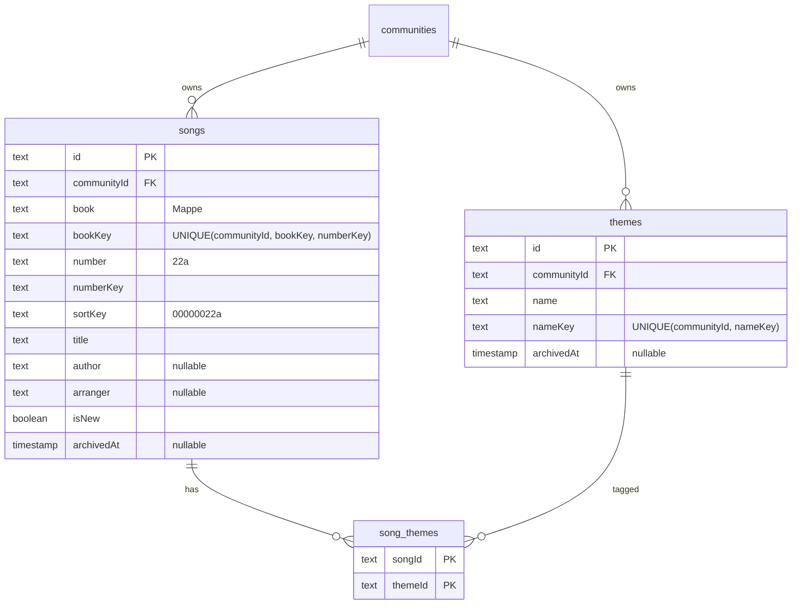

### 8.3 Миграции

| # | Миграция | Содержимое |
|---|---|---|
| 1 | `repertoire_permission` | `ALTER TYPE "CommunityPermission" ADD VALUE 'REPERTOIRE_MANAGE'` |
| 2 | `repertoire` | таблицы `songs`, `themes`, `song_themes`, индексы, FK |

Обе только добавляют объекты. `ALTER TYPE … ADD VALUE` нельзя выполнять в одной транзакции с использованием нового значения, поэтому это отдельная миграция.

**Зависимость от People:** enum `CommunityPermission` создаёт People (фаза A1). Если Repertoire сливается в `main` вторым, его миграцию 1 нужно пересоздать после rebase (см. обсуждение параллельной разработки).

---

## 9. Встроенный каталог (FR-13)

### 9.1 Источник

Файл `data/catalogs/legacy-v3.json` в репозитории сервера. Он извлекается **один раз** скриптом из `<script id="song-data">` файла `chor-app_v3.html` (R§4.1) и коммитится. Сервер HTML не парсит.

```json
{
  "id": "legacy-v3",
  "themes": ["Abendmahl", "Advent", "…"],
  "songs": [
    { "book": "…", "number": "1", "title": "O großer Gott", "themes": ["Lob und Dank"] },
    { "book": "Mappe", "number": "1", "title": "Führe Du, Herr", "themes": [] }
  ]
}
```

Скрипт извлечения лежит в `scripts/extract-legacy-catalog.ts` и проверяет инварианты R§4: 727 + 115 песен, номера без дубликатов, 30 тем, каждая тема песни есть в списке тем.

### 9.2 Сопоставление полей

| Прототип | Каталог | Замечание |
|---|---|---|
| `songs[].buch` (`Buch 1`…`Buch 4`) | `book` | **зависит от OQ-1**: `Bücher` (одна книга, номера 1–727 уникальны) или `Buch 1`…`Buch 4` (4 книги) — оба варианта не нарушают уникальность `(book, number)` |
| `mappe[]` | `book = "Mappe"` | |
| `nummer` (число) | `number` (строка) | `String(nummer)` |
| `titel` | `title` | |
| `themen[]` | `themes[]` (по имени) | |
| `themen_kanonisch[].thema` | `themes` каталога | `quellen` не переносятся |
| `thema_buch_original`, `thema`, `meta` | — | не переносятся |
| — | `author`, `arranger` = `null`, `isNew = false` | |

### 9.3 Правила загрузки

- Одна транзакция (NFR-6).
- Темы каталога сопоставляются с существующими темами Community по `nameKey`. Недостающие создаются, архивные используются как есть (привязываются, но не восстанавливаются).
- Песня пропускается, если в Community уже есть песня с тем же `(bookKey, numberKey)`, даже архивная. Существующие песни не изменяются.
- Результат: `{ catalogId, songsCreated, songsSkipped, themesCreated, themesReused }`.
- Повторный запуск создаёт 0 песен и 0 тем.
- Вставка пачками (`createMany`), не по одной строке.

### 9.4 Стандартный список тем (FR-11)

`POST /communities/:cid/themes/defaults` создаёт недостающие темы из тех же 30 названий (`application/default-themes.ts`, согласован с `legacy-v3.json` тестом). Без песен. Идемпотентен.

---

## 10. HTTP API

Все маршруты: Bearer JWT → `CommunityMemberGuard` (PD§10.1). Ошибки — формат PD§8.4.

### 10.1 Songs — `/communities/:communityId/songs`

| Метод | Путь | Доступ | Параметры / тело | Успех |
|---|---|---|---|---|
| GET | `/` | участник | query: `book?`, `themeId?`, `isNew?`, `q?` (подстрока в названии или номере, 1–100), `includeArchived?` | 200 `SongView[]`, сортировка `bookKey`, `sortKey` |
| GET | `/lookup` | участник | query: `book`, `number` (обязательные) | 200 `SongView` / 404 |
| GET | `/:songId` | участник | — | 200 `SongView` |
| POST | `/` | `REPERTOIRE_MANAGE` | `{ book, number, title, author?, arranger?, isNew?, themeIds? }` | 201 `SongView` |
| PATCH | `/:songId` | `REPERTOIRE_MANAGE` | `{ title?, author?, arranger?, isNew? }` (минимум одно; `null` очищает author/arranger) | 200 |
| PUT | `/:songId/themes` | `REPERTOIRE_MANAGE` | `{ themeIds: string[] }` — полная замена | 200 |
| POST | `/:songId/archive` | `REPERTOIRE_MANAGE` | — | 200 |
| POST | `/:songId/restore` | `REPERTOIRE_MANAGE` | — | 200 |

`/lookup` объявляется в контроллере до `/:songId`. Архивная песня тоже находится через `/lookup`: будущая запись исполнения сама решает, что с ней делать.

```json
// SongView
{
  "id": "…",
  "book": "Mappe",
  "number": "22a",
  "title": "Führe Du, Herr",
  "author": null,
  "arranger": null,
  "isNew": true,
  "themes": [{ "id": "…", "name": "Gebet", "archived": false }],
  "archived": false,
  "archivedAt": null,
  "createdAt": "…",
  "updatedAt": "…"
}
```

### 10.2 Themes — `/communities/:communityId/themes`

| Метод | Путь | Доступ | Тело / параметры | Успех |
|---|---|---|---|---|
| GET | `/` | участник | `includeArchived?`, `withSongCount?` | 200 `ThemeView[]`, сортировка по `name` (collation `de`) |
| POST | `/` | `REPERTOIRE_MANAGE` | `{ name }` | 201 |
| PATCH | `/:themeId` | `REPERTOIRE_MANAGE` | `{ name }` | 200 |
| POST | `/:themeId/archive` | `REPERTOIRE_MANAGE` | — | 200 |
| POST | `/:themeId/restore` | `REPERTOIRE_MANAGE` | — | 200 |
| POST | `/defaults` | `REPERTOIRE_MANAGE` | — | 200 `{ created: number, existing: number }` |

`ThemeView`: `{ id, name, archived, archivedAt, songCount? }`.

### 10.3 Catalog imports — `/communities/:communityId/catalog-imports`

| Метод | Путь | Доступ | Тело | Успех |
|---|---|---|---|---|
| POST | `/` | `REPERTOIRE_MANAGE` | `{ "catalogId": "legacy-v3" }` | 200 `{ catalogId, songsCreated, songsSkipped, themesCreated, themesReused }` |

### 10.4 Ошибки

| Ситуация | HTTP | `code` | Доп. поля |
|---|---|---|---|
| DTO не прошёл валидацию | 400 | — | `message[]` |
| Неверный формат номера | 400 | `SONG_NUMBER_INVALID` | — |
| `isNew` для книги, где он не разрешён | 400 | `SONG_NEW_FLAG_NOT_ALLOWED` | `allowedBooks` |
| Неизвестный `catalogId` | 400 | `CATALOG_NOT_FOUND` | — |
| Не участник / нет разрешения | 403 | `NOT_COMMUNITY_MEMBER` / `PERMISSION_DENIED` | — |
| Песня не найдена (в т. ч. в чужой Community) | 404 | `SONG_NOT_FOUND` | — |
| Тема не найдена (в т. ч. чужая) | 404 | `THEME_NOT_FOUND` | `themeId` |
| Номер занят в книге | 409 | `SONG_NUMBER_TAKEN` | `existingSongId`, `existingArchived` |
| Изменение архивной песни | 409 | `SONG_ARCHIVED` | — |
| Имя темы занято | 409 | `THEME_NAME_TAKEN` | `existingThemeId`, `existingArchived` |
| Параллельная загрузка каталога в ту же Community | 409 | `CATALOG_IMPORT_CONFLICT` | — |
| Изменение архивной темы / привязка архивной темы | 409 | `THEME_ARCHIVED` | `themeId` |

---

## 11. DFD — уровень 1

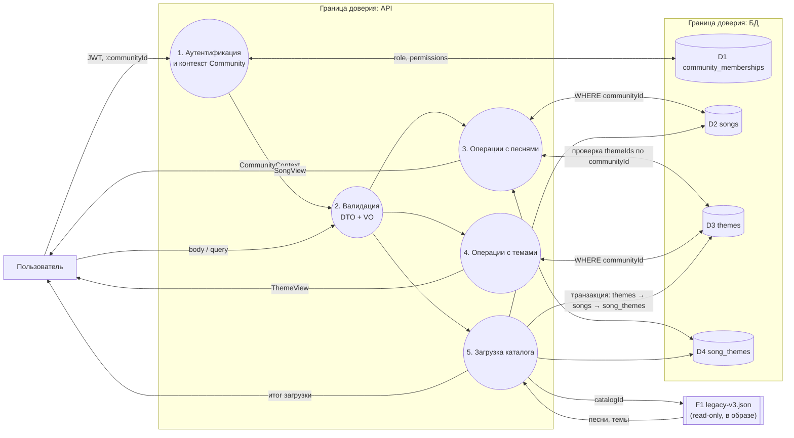

**Ключевые свойства:**
- `communityId` берётся только из `CommunityContext` (PD§9.2).
- Связь `song_themes` создаётся только между песней и темой одной Community. `themeIds` из запроса предварительно загружаются через `ThemeRepository` с фильтром `communityId`; чужой id даёт `THEME_NOT_FOUND`.
- Источник каталога F1 — файл внутри образа, пользовательский ввод выбирает его только по `catalogId` из белого списка; путь к файлу из запроса не строится.

---

## 12. Sequence-диаграммы

### 12.1 Создание песни с темами

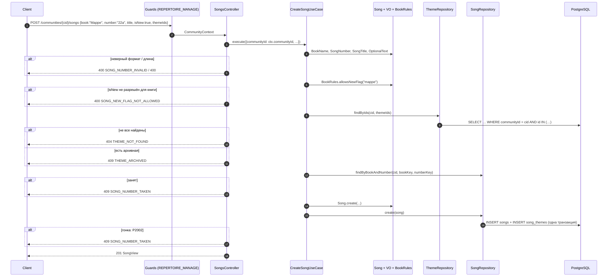

### 12.2 Поиск песен по теме во всех книгах

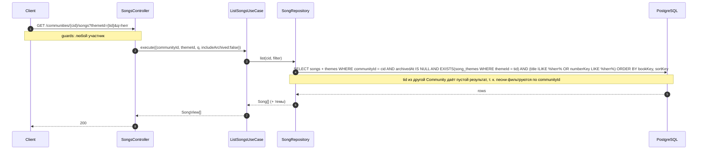

### 12.3 Поиск по книге и номеру (для будущей записи исполнения)

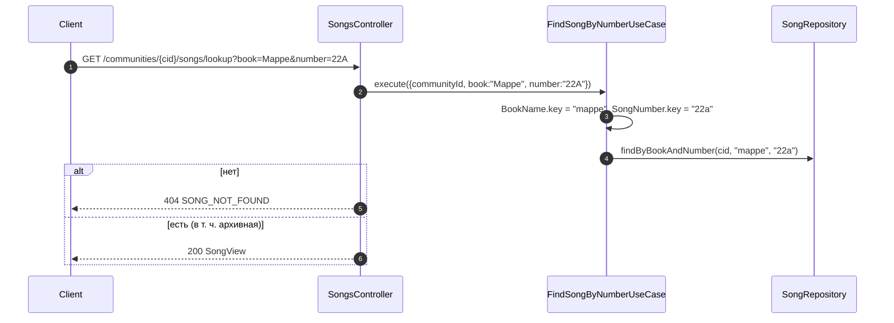

### 12.4 Замена тем песни

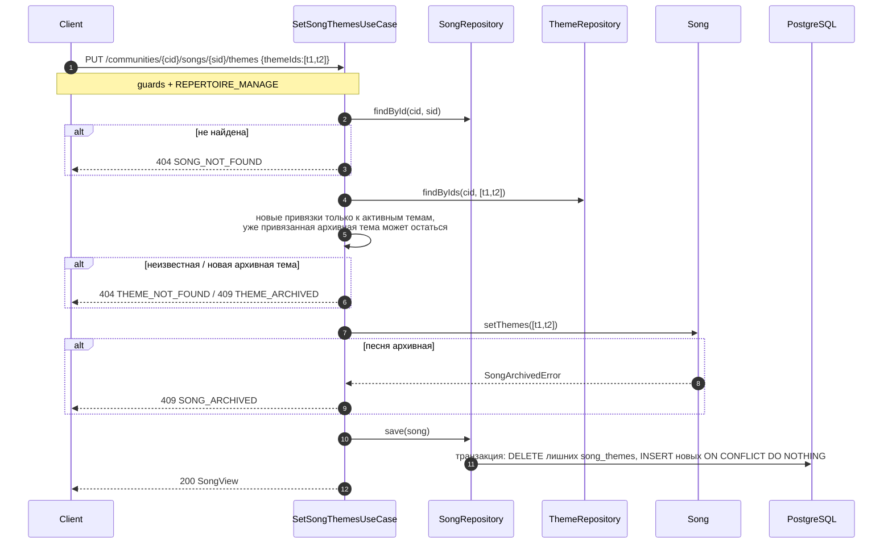

### 12.5 Стандартный список тем

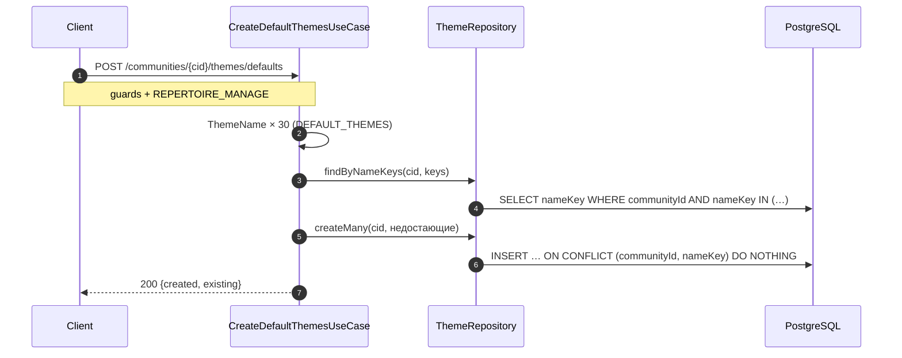

### 12.6 Загрузка встроенного каталога

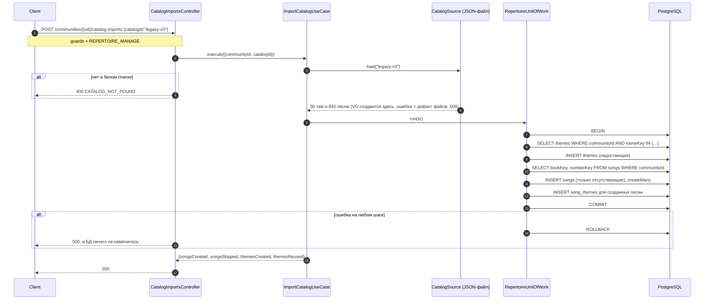

---

## 13. Сквозные аспекты

### 13.1 Матрица доступа

| Действие | Не участник | MEMBER | MEMBER + REPERTOIRE_MANAGE | ADMINISTRATOR |
|---|---|---|---|---|
| Список / поиск / lookup / просмотр песен и тем | 403 | ✅ | ✅ | ✅ |
| Создание / изменение / архивация песен и тем, темы песни | 403 | 403 | ✅ | ✅ |
| Стандартный список тем, загрузка каталога | 403 | 403 | ✅ | ✅ |

`PEOPLE_MANAGE` и `REPERTOIRE_MANAGE` независимы.

### 13.2 Безопасность

| Угроза | Мера |
|---|---|
| IDOR (песня, тема, привязка к чужой теме) | `communityId` из контекста в каждом `where`; `themeIds` проверяются с фильтром Community до записи |
| Path traversal через `catalogId` | белый список id в `JsonFileCatalogSource`; путь фиксирован в коде |
| Инъекции в поиске (`q`) | Prisma `contains` с `mode: 'insensitive'` (параметризовано); символы `%`/`_` в `q` трактуются как литералы (в реализации проверить тестом, что Prisma их экранирует, иначе экранировать самим); длина `q` ≤ 100 |
| DoS тяжёлыми запросами | длина `q` ограничена; загрузка каталога — одна транзакция на ~900 строк пачками; повторный запуск ничего не пишет |
| Mass assignment | `whitelist: true`; DTO не содержат `communityId`, `archivedAt`, `id`, `numberKey`, `sortKey`; `book` и `number` отсутствуют в DTO обновления |
| XSS через названия | сервер хранит текст как есть, экранирование — ответственность клиента (React экранирует по умолчанию) |

### 13.3 Согласованность

- Уникальность номера и имени темы гарантируют unique-индексы. Предпроверка в use case нужна только для понятного ответа 409, `P2002` маппится в те же ошибки.
- Запись песни с темами и замена тем выполняются в одной транзакции.
- Параллельные изменения одной песни: last write wins.
- Параллельный запуск загрузки каталога в одной Community: второй запуск получит `P2002` на песне и откатится целиком. Клиенту возвращается 409 `CATALOG_IMPORT_CONFLICT` с предложением повторить (повтор ничего не задублирует).

### 13.4 Производительность

- Список всех песен (~850 после загрузки каталога) — один запрос с `include` тем, индекс `(communityId, archivedAt, bookKey, sortKey)`. Ответ ~150 КБ JSON без пагинации; допустимо для MVP (NFR-5), при росте добавляется `limit/offset` без изменения остального API.
- `q` по `ILIKE '%…%'` — полный проход по песням Community. При ~2000 строк это единицы миллисекунд; `pg_trgm` не нужен.
- Фильтр по теме — `EXISTS` по `song_themes (themeId)` + PK.

### 13.5 Тестируемость

- Value objects (особенно `SongNumber.sortKey`) и `BookRules` — unit-тесты на таблицах примеров.
- Use cases — in-memory репозитории.
- Загрузка каталога — e2e на тестовой БД: итоговые количества (842 песни, 30 тем, привязки у всех песен Books), идемпотентность, откат при искусственной ошибке.
- Тест согласованности: `DEFAULT_THEMES` совпадает со списком тем в `legacy-v3.json`.

---

## 14. Проектные решения и альтернативы

| # | Решение | Отклонённые альтернативы | Причина |
|---|---|---|---|
| D1 | Книга — текстовое поле песни с нормализованным ключом | сущность `Book`; enum на сервере | решение владельца; сущность — OQ-1; enum требовал бы миграцию на каждую книгу |
| D2 | Номер — строка + `numberKey` + `sortKey` | целое число; строка без ключей | `22a`; естественная сортировка `22 < 22a < 100` и уникальность без учёта регистра |
| D3 | `isNew` — флаг с правилом по книге в `BookRules` | коллекция NewSongs; флаг без правила | решение владельца; правило держится в одном месте домена до разрешения OQ-1 |
| D4 | `Theme` — сущность Community, M:N через `song_themes` | строки у песни; массив тем в песне | переименование в одном месте; фильтр по теме через индекс; архивация темы |
| D5 | Songs и Themes в одном модуле | отдельный модуль Themes | один bounded context |
| D6 | Архивная тема остаётся у песен | снимать привязки при архивации | архивация обратима и не должна терять данные |
| D7 | Каталог — JSON-файл в репозитории + эндпоинт загрузки | seed при регистрации; Prisma seed; data-миграция | решение владельца (пустая Community); data-миграция вставила бы данные во все Community |
| D8 | Загрузка пропускает существующие номера, ничего не перезаписывает | перезапись; ошибка при любом совпадении | безопасный повтор; пользовательские правки не теряются |
| D9 | `/lookup` по книге и номеру отдельным маршрутом | фильтр `number=` в списке | однозначный ответ 200/404 для будущего журнала |
| D10 | PUT для полной замены тем | POST/DELETE отдельных привязок | идемпотентно, соответствует UI с чекбоксами |

## 15. Соответствие прототипу

| Прототип (R§) | В дизайне |
|---|---|
| Встроенный каталог в HTML, одинаковый у всех (R§4.1) | загрузка по запросу в конкретную Community (FR-13) |
| Выбор коллекции `Bücher / Mappe / Neue Lieder` (R§6) | выбор книги из списка на клиенте (`Bücher / Mappe / Andere`) + флаг «новая» |
| Номер уникален внутри коллекции, Bücher — по всем 4 томам (R§5.1) | уникален в `(community, book)`; вариант с томами — OQ-1 |
| Номер не проверяется на диапазон тома (R§5.1) | диапазонов нет (OQ-1) |
| Свои песни удаляются, встроенные нельзя изменить (R§5.1) | всё редактируемо, удаление = архив |
| Тема привязывается вводом нового текста (R§5.2) | тема сначала создаётся в списке, затем назначается |
| Повторная привязка той же темы игнорируется (R§5.2) | `setThemes` без дубликатов |
| Удаление привязки только для дополнительных тем (R§5.2) | любые темы песни заменяются через PUT |
| Поиск по темам только в Bücher (R§6) | во всех книгах |
| Поиск по подстроке названия или номера (R§6) | `q` |
| `(kein Thema zugeordnet)` как значение темы (R§5.1) | пустой список тем |
| `thema_buch_original`, `quellen`, `meta` (R§4) | не переносятся |

## 16. Открытые вопросы

| # | Вопрос | Что от него зависит | Временное решение в дизайне |
|---|---|---|---|
| OQ-1 | **Книга: текстовое поле или сущность `Book` (название, том, диапазон номеров)?** Какие значения в списке: `Bücher` одной книгой или `Buch 1`…`Buch 4`? Проверяет ли сервер список книг? | уникальность номера, отображение тома, сопоставление `buch` при загрузке каталога (9.2), `BookRules` для `isNew` | текстовое поле; сервер список не проверяет; `BookRules` знает только `mappe`, `andere`; **загрузка каталога (FR-13) не реализуется до решения OQ-1** |
| OQ-2 | Формат номера: только цифры + латинский суффикс (`22a`)? Бывают ли `22-1`, `II`, умлауты? `22A` = `22a`? | `SongNumber`, `sortKey` | `^[0-9]{1,6}[a-z]{0,3}$` без учёта регистра |
| OQ-3 | Можно ли поставить `isNew` существующей песне позже (не только при создании)? | `UpdateSong` | да, при книге из `BookRules` |
| OQ-4 | Автор и аранжировщик — свободный текст или ссылка на справочник (не `Person` — там пианисты и дирижёры)? | модель `Song` | свободный текст |
| OQ-5 | Нужен ли в каталоге прототипа список тем без песен отдельно от «стандартного списка» (FR-11), или это одно и то же? | `DEFAULT_THEMES`, `legacy-v3.json` | одно и то же: 30 тем |
| OQ-6 | Нужна ли пагинация списка песен уже в MVP? | API списка | нет |
