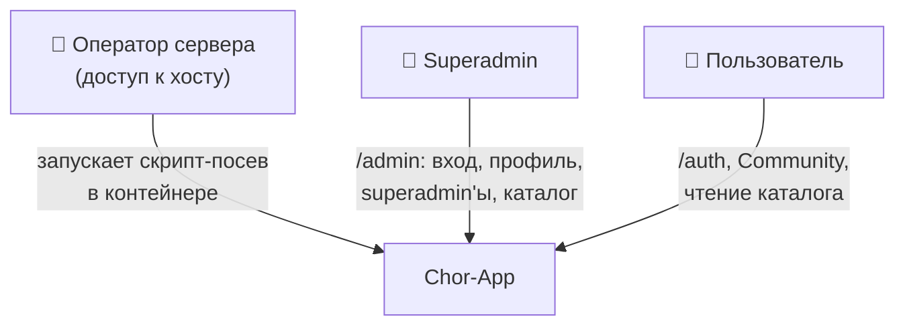
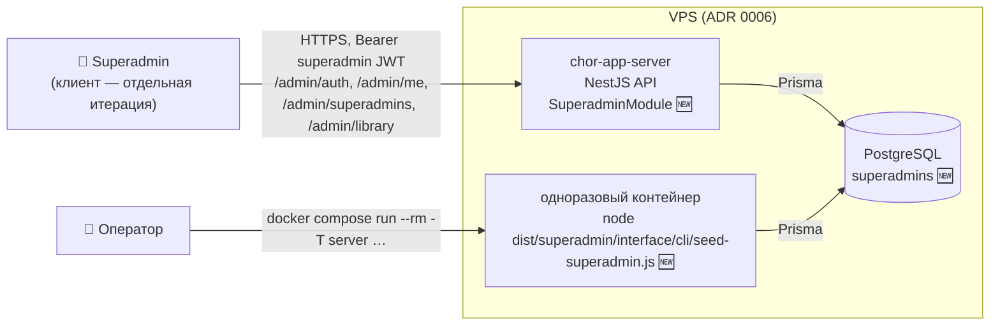
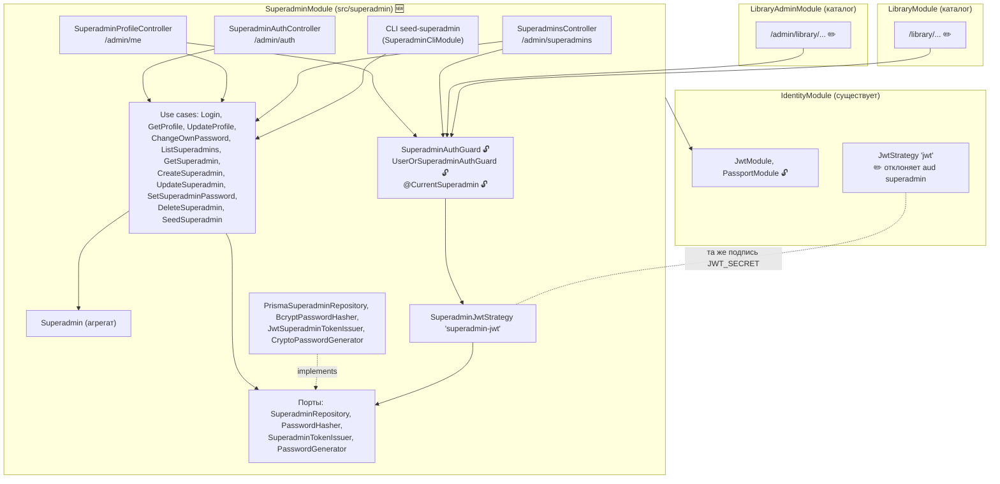
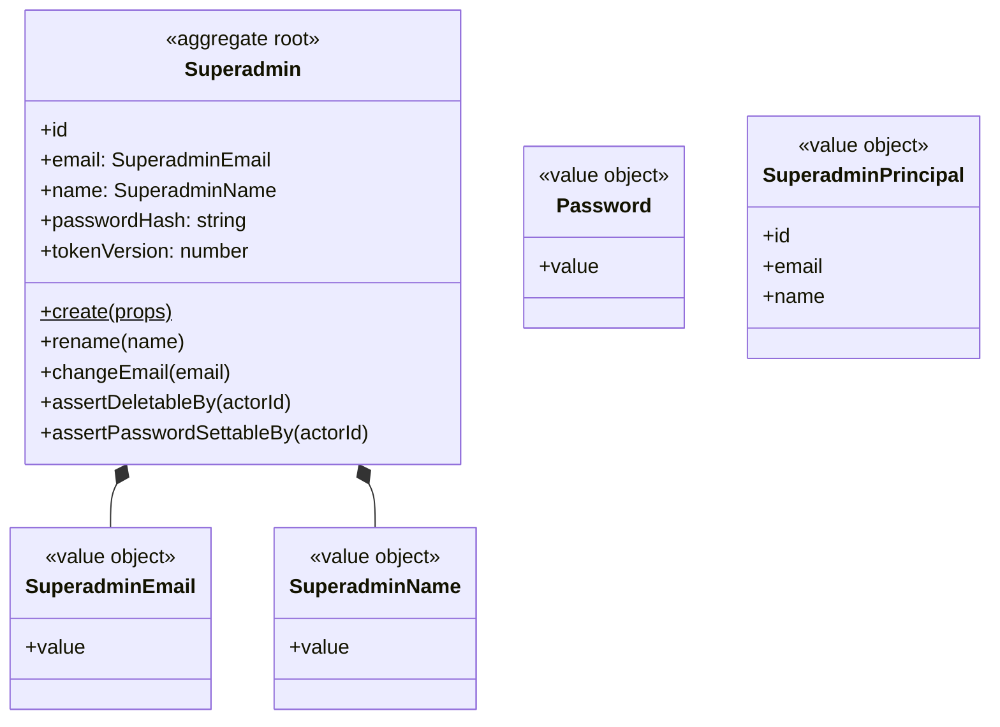
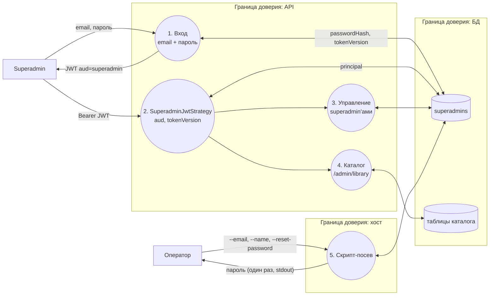
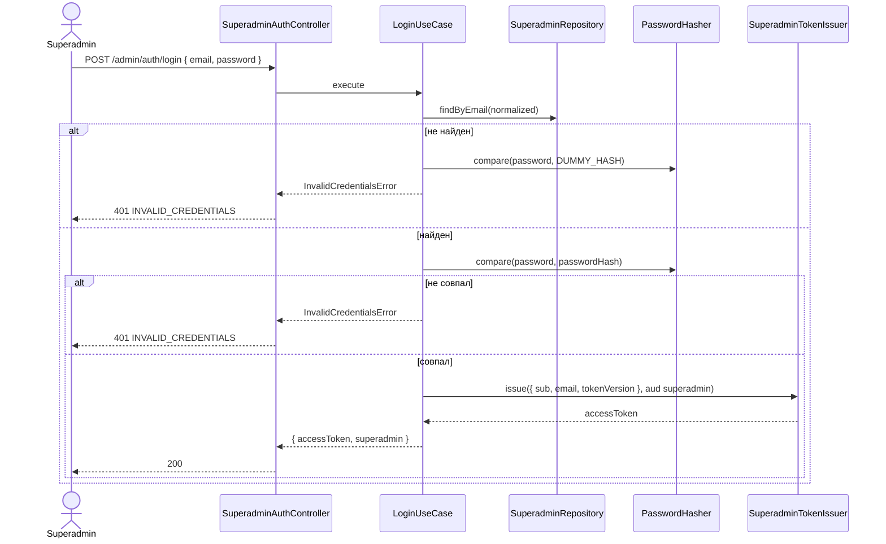
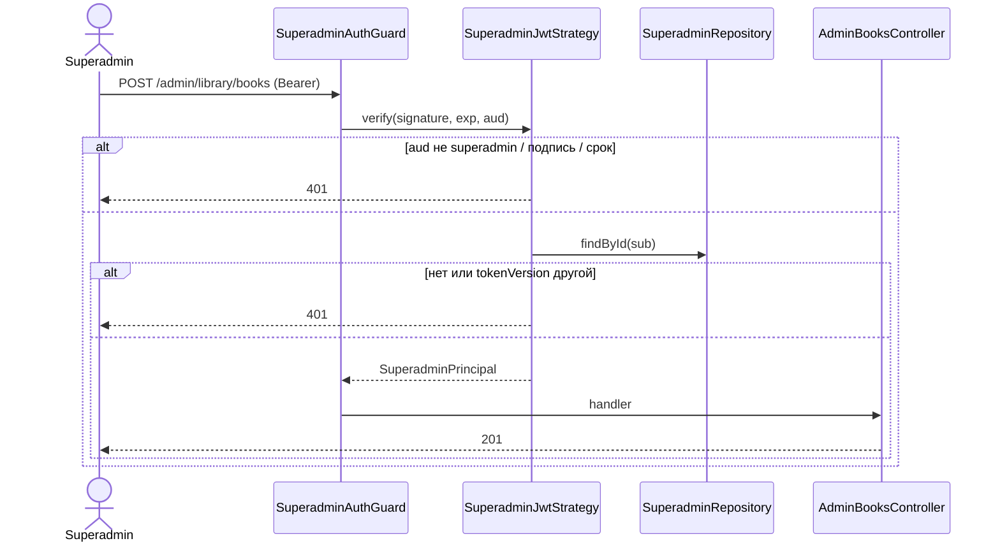
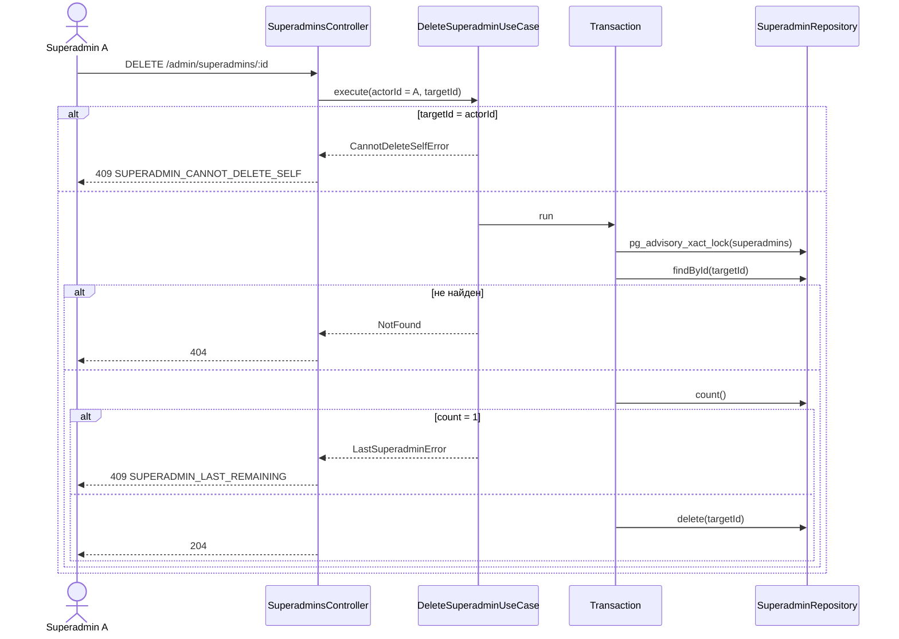
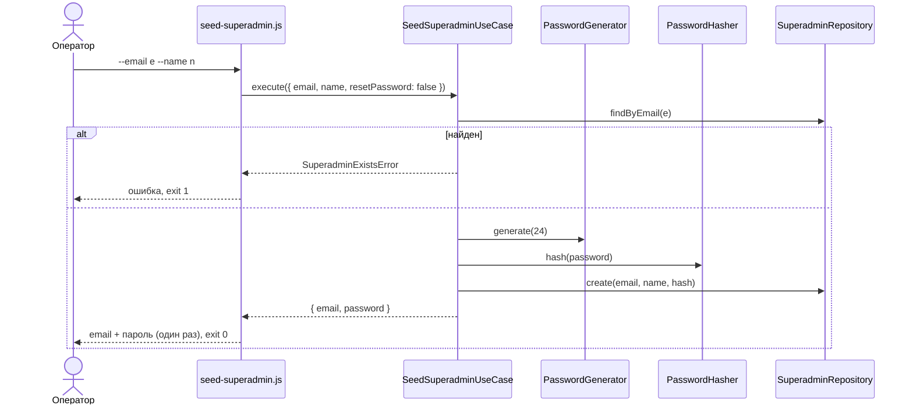

# Superadmin — дизайн (фаза 2)

**Дата:** 2026-09-17
**Статус:** реализован (2026-09-17), фазы S0–S8 по `SUPERADMIN_PLANNING.md`; сервер, без клиента (раздел 11).
Ревизия 3 (2026-09-17): каталог реализуется первым, Superadmin — после, стыковка отдельной фазой.
Ревизия 2 (2026-09-17): все superadmin'ы равны — модели разрешений нет; принудительной смены пароля нет;
забытый пароль восстанавливают только другой superadmin или скрипт; клиент проектируется отдельной итерацией.
**Входные данные:**
- `SUPERADMIN_RESEARCH.md` — факты о текущем коде и решения владельца (ссылки «SR§…»);
- `../catalog/CATALOG_DESIGN.md` — потребитель (ссылки «CD§…»);
- `../people/PEOPLE_DESIGN.md` — соглашения API и ошибок (ссылки «PD§…»);
- `chor-app-docs/decisions/0004-auth-mechanism.md`, `0007-community-scoped-requests-and-permissions.md`,
  `0008-modular-monolith-boundaries.md`, `0010-public-book-library.md`.

Диаграммы в формате Mermaid. Документ описывает только сервер; клиентская часть (admin panel) — отдельная итерация (раздел 11).

---

## 1. Цель

Ввести платформенного администратора — superadmin: отдельную учётную запись с собственным входом и профилем.
Все superadmin'ы равны и обладают всеми полномочиями платформы. В MVP реализуются: управление superadmin'ами
и доступ к записи каталога — вместо guard-заглушки `/admin/library` (CD§5, D3). Полномочия над пользователями
и Community (поддержка, блокировка, сброс пароля, бан) — будущие функции того же superadmin'а, в этой итерации не реализуются.

**Предусловия:** нет. Использует готовые `JwtModule`/`PassportModule` из `IdentityModule` (SR§3).

## 2. Требования

### 2.1 Функциональные

| ID | Требование |
|---|---|
| FR-1 | Первый superadmin создаётся скриптом-посевом на сервере; скрипт также задаёт новый пароль существующему superadmin'у |
| FR-2 | Superadmin входит по email и паролю через `POST /admin/auth/login` и получает токен, который не принимается маршрутами пользователей |
| FR-3 | Superadmin видит свой профиль (имя, email), меняет имя, email и пароль |
| FR-4 | Superadmin видит список superadmin'ов и карточку каждого |
| FR-5 | Superadmin создаёт superadmin'а: email, имя, начальный пароль |
| FR-6 | Superadmin изменяет другого superadmin'а (имя, email) и задаёт ему новый пароль |
| FR-7 | Superadmin удаляет другого superadmin'а; удалить себя нельзя; в системе всегда остаётся хотя бы один superadmin |
| FR-8 | Маршруты `/admin/library/...` доступны только superadmin'у |
| FR-9 | Маршруты чтения каталога `/library/...` принимают токен пользователя или superadmin'а |
| FR-10 | Смена пароля или удаление superadmin'а действует на его следующем запросе |

### 2.2 Нефункциональные

| ID | Требование |
|---|---|
| NFR-1 | Токены пользователя и superadmin'а не взаимозаменяемы ни в одну сторону |
| NFR-2 | Слои ADR 0002, границы ADR 0008; `superadmin` в ESLint `moduleBoundaries` |
| NFR-3 | Миграции только добавляют объекты |
| NFR-4 | Ошибки с `code` (PD§8.4) |
| NFR-5 | Защита на уровне пользователей (SR§2): bcrypt, JWT с `JWT_EXPIRES_IN`, `tokenVersion`, пароль ≥ 8; без rate limiting и 2FA |
| NFR-6 | Новых переменных окружения нет |
| NFR-7 | Масштаб: до 20 superadmin'ов |
| NFR-8 | Пароль и его хеш не попадают в ответы и логи; пароль посева выводится один раз только в stdout скрипта |
| NFR-9 | Существующее поведение аутентификации пользователей не меняется (e2e Identity проходят без правок) |

### 2.3 Входные решения владельца (SR§2, 2026-09-17)

- Отдельная сущность и таблица, не роль `User`.
- CRUD других superadmin'ов; себя удалить нельзя.
- Первый superadmin — скрипт-посев.
- **Все superadmin'ы равны**: индивидуальных наборов разрешений нет.
- Полномочия над пользователями и Community — будущие функции; сейчас реализуется только каталог.
- Защита — как у пользователей.
- **Принудительной смены пароля нет** (ни после посева, ни после задания пароля другим superadmin'ом).
- **Забытый пароль** восстанавливают только другой superadmin (FR-6) или скрипт (FR-1); сброса по email нет.
- Профиль и admin panel — маршруты того же React-клиента; **клиент проектируется отдельной итерацией**.

### 2.4 Вне рамок

Эндпоинты и логика пользователей, Community, блокировки и бана; модель разрешений superadmin'ов; сброс пароля по email;
принудительная смена пароля; 2FA, rate limiting, блокировка после неудачных входов; журнал действий superadmin'ов;
клиент (admin panel, страницы каталога); вход superadmin'а в Community как пользователя.

---

## 3. C4 — уровень 1: контекст системы



## 4. C4 — уровень 2: контейнеры



## 5. C4 — уровень 3: компоненты API



**Правила зависимостей:**
- `SuperadminModule` импортирует `IdentityModule` только ради экспортированных `JwtModule` и `PassportModule` (SR§3). Доменные классы и порты Identity не используются: `PasswordHasher` и выпуск токена — свои адаптеры (D5).
- `SuperadminModule` экспортирует через barrel `src/superadmin/index.ts`: `SuperadminAuthGuard`, `UserOrSuperadminAuthGuard`, `@CurrentSuperadmin`, тип `SuperadminPrincipal`. Больше ничего.
- `LibraryAdminModule` и `LibraryModule` импортируют `SuperadminModule`. `SuperadminModule` о каталоге не знает.
- `UserOrSuperadminAuthGuard` (`AuthGuard(['jwt', 'superadmin-jwt'])`) живёт в `SuperadminModule`, так как знает обе стратегии. Identity о Superadmin не знает, кроме одной проверки `aud` в `JwtStrategy` (D2).

### 5.1 Раскладка файлов

```
src/superadmin/
  index.ts
  superadmin.module.ts
  domain/
    entities/superadmin.entity.ts
    value-objects/superadmin-email.ts, superadmin-name.ts, password.ts
    errors/superadmin.errors.ts
    ports/superadmin-repository.port.ts, password-hasher.port.ts,
          superadmin-token-issuer.port.ts, password-generator.port.ts
  application/
    views/superadmin.view.ts
    use-cases/auth/login.use-case.ts
    use-cases/profile/get-profile.use-case.ts, update-profile.use-case.ts, change-own-password.use-case.ts
    use-cases/superadmins/list-, get-, create-, update-, set-password-, delete-superadmin.use-case.ts
    use-cases/seed/seed-superadmin.use-case.ts
  infrastructure/
    prisma/prisma-superadmin.repository.ts
    security/bcrypt-password-hasher.ts, jwt-superadmin-token-issuer.ts,
             superadmin-jwt.strategy.ts, crypto-password-generator.ts
  interface/
    controllers/superadmin-auth.controller.ts, superadmin-profile.controller.ts, superadmins.controller.ts
    guards/superadmin-auth.guard.ts, user-or-superadmin-auth.guard.ts
    decorators/current-superadmin.decorator.ts
    dto/*.dto.ts
    http/superadmin-error-mapper.ts
    cli/seed-superadmin.ts, superadmin-cli.module.ts   // ConfigModule + PrismaModule + SuperadminModule, без HTTP

src/identity/infrastructure/security/jwt.strategy.ts      ✏️ отклонять aud = chor-app-superadmin
prisma/schema.prisma                                      ✏️ модель Superadmin
src/app.module.ts                                         ✏️ + SuperadminModule
eslint.config.mjs                                         ✏️ + superadmin
package.json                                              ✏️ + скрипт superadmin:seed
```

Изменения каталога (`/library`, `/admin/library`, удаление заглушки `SuperAdminGuard`) делаются в фазе стыковки S8 плана Superadmin — после завершения реализации каталога (раздел 15).

---

## 6. Доменная модель



### 6.1 Value objects

| VO | Правила |
|---|---|
| `SuperadminEmail` | trim, нижний регистр (как у `User`, SR§3), формат email, длина ≤ 254 |
| `SuperadminName` | trim, длина 2–100 (минимум как у `RegisterDto.name`) |
| `Password` | длина 8–128 (минимум как у пользователей, SR§3; максимум защищает bcrypt от длинных строк) |

### 6.2 Полномочия

Все superadmin'ы равны (SR§2): любой superadmin может всё, что умеет платформа. Хранимых разрешений, ролей и проверок уровня прав нет;
достаточно быть аутентифицированным superadmin'ом (`SuperadminAuthGuard`).

| Полномочие | В этой итерации |
|---|---|
| Управление superadmin'ами (FR-4…FR-7) | ✅ |
| Запись каталога `/admin/library` (FR-8) | ✅ guard; эндпоинты — фазы каталога |
| Просмотр и поддержка пользователей, блокировка, сброс пароля пользователя | будущая функция |
| Бан пользователей | будущая функция |
| Просмотр и управление Community | будущая функция |

### 6.3 Инварианты

| Правило | Где |
|---|---|
| Email уникален среди superadmin'ов (без учёта регистра) | use case + unique-индекс |
| Email superadmin'а может совпадать с email пользователя: это разные учётные записи с разными входами | нет проверки (D7) |
| Superadmin не удаляет себя | `Superadmin.assertDeletableBy(actorId)` → `CannotDeleteSelfError` |
| Свой пароль меняется только с текущим паролем (`/admin/me/change-password`); задать пароль без текущего можно только другому | `Superadmin.assertPasswordSettableBy(actorId)` → `UseChangePasswordError` |
| После удаления остаётся ≥ 1 superadmin | `DeleteSuperadminUseCase` в транзакции с advisory lock (D8) → `LastSuperadminError` |
| Смена пароля (своего, чужого, через посев) увеличивает `tokenVersion` | репозиторий в той же записи (как у `User`, SR§3) |
| Смена email не меняет `tokenVersion` | email не участвует в проверке токена |
| Запись superadmin'а и `tokenVersion` читаются из БД на каждом запросе | `SuperadminJwtStrategy.validate` |

---

## 7. Модель данных

### 7.1 Prisma

```prisma
model Superadmin {
  id           String   @id @default(uuid())
  email        String   @unique
  name         String
  passwordHash String
  tokenVersion Int      @default(0)
  createdAt    DateTime @default(now())
  updatedAt    DateTime @updatedAt

  @@map("superadmins")
}
```

Связей с другими таблицами нет: удаление строки ничего не каскадирует (D9).

### 7.2 Миграции

| # | Миграция | Содержимое |
|---|---|---|
| 1 | `superadmin` | `CREATE TABLE "superadmins"`, unique-индекс `email` |

Данных миграция не вставляет: первый superadmin — только через скрипт (FR-1).

---

## 8. Токены и стратегии

| | Пользователь (существует) | Superadmin |
|---|---|---|
| Выпуск | `JwtService.sign({ sub, email, tokenVersion })` | `JwtService.sign({ sub, email, tokenVersion }, { audience: 'chor-app-superadmin' })` |
| Подпись и срок | `JWT_SECRET`, `JWT_EXPIRES_IN` | те же (NFR-5, NFR-6) |
| Стратегия | `'jwt'`: ✏️ если `payload.aud === 'chor-app-superadmin'` → 401; иначе как сейчас | `'superadmin-jwt'`: `audience: 'chor-app-superadmin'` проверяет passport-jwt; `validate` ищет `Superadmin` по `sub`, сравнивает `tokenVersion` |
| `request.user` | `{ id, email, name }` | `SuperadminPrincipal { kind: 'superadmin', id, email, name }` |
| Guard | `JwtAuthGuard` | `SuperadminAuthGuard` = `AuthGuard('superadmin-jwt')` |

- Токен superadmin'а на маршруте пользователя → 401 (стратегия `'jwt'` отклоняет `aud`).
- Токен пользователя на маршруте superadmin'а → 401 (нет нужного `aud`).
- `UserOrSuperadminAuthGuard` = `AuthGuard(['jwt', 'superadmin-jwt'])`: Passport пробует стратегии по очереди, достаточно одной.
- Существующие токены пользователей (без `aud`) продолжают работать (NFR-9).
- ADR 0004 («resolve the `User` it names») расширяется: токен называет `User` или `Superadmin`, тип задаёт `aud`. Нужен ADR 0011 (раздел 15).

---

## 9. HTTP API

Все маршруты Superadmin — под префиксом `/admin` (как `/admin/library`, CD§9.3). Ошибки — PD§8.4.

### 9.1 Вход — `/admin/auth`

| Метод | Путь | Guard | Тело | Успех |
|---|---|---|---|---|
| POST | `/admin/auth/login` | — | `{ email, password }` | 200 `{ accessToken, superadmin: SuperadminView }` |

### 9.2 Профиль — `/admin/me`

| Метод | Путь | Guard | Тело | Успех |
|---|---|---|---|---|
| GET | `/admin/me` | `SuperadminAuthGuard` | — | 200 `SuperadminView` |
| PATCH | `/admin/me` | `SuperadminAuthGuard` | `{ name?, email? }` (минимум одно) | 200 `SuperadminView` |
| POST | `/admin/me/change-password` | `SuperadminAuthGuard` | `{ currentPassword, newPassword }` | 200 `{ accessToken }` |

### 9.3 Superadmin'ы — `/admin/superadmins`

| Метод | Путь | Guard | Тело | Успех |
|---|---|---|---|---|
| GET | `/admin/superadmins` | `SuperadminAuthGuard` | — | 200 `SuperadminView[]`, сортировка по имени |
| GET | `/admin/superadmins/:id` | `SuperadminAuthGuard` | — | 200 `SuperadminView` |
| POST | `/admin/superadmins` | `SuperadminAuthGuard` | `{ email, name, password }` | 201 `SuperadminView` |
| PATCH | `/admin/superadmins/:id` | `SuperadminAuthGuard` | `{ name?, email? }` (минимум одно) | 200 `SuperadminView` |
| PUT | `/admin/superadmins/:id/password` | `SuperadminAuthGuard` | `{ newPassword }` | 204 |
| DELETE | `/admin/superadmins/:id` | `SuperadminAuthGuard` | — | 204 |

- `PATCH /admin/superadmins/:id` для себя разрешён (то же, что `PATCH /admin/me`).
- `PUT …/password` для себя → 409 `SUPERADMIN_USE_CHANGE_PASSWORD`.

```json
// SuperadminView
{
  "id": "…",
  "email": "alex@example.org",
  "name": "Alex",
  "isCurrent": true,
  "createdAt": "2026-09-17T10:00:00.000Z",
  "updatedAt": "2026-09-17T10:00:00.000Z"
}
```

`isCurrent` — признак записи текущего superadmin'а (клиенту: скрыть удаление и задание пароля у себя). `passwordHash` и `tokenVersion` не возвращаются.

### 9.4 Изменения API каталога

| Маршрут | Было (CD§9) | Становится |
|---|---|---|
| `GET /library/...` | `JwtAuthGuard` | `UserOrSuperadminAuthGuard` |
| `/admin/library/...` | `JwtAuthGuard` + `SuperAdminGuard` (заглушка) | `SuperadminAuthGuard` |

### 9.5 Ошибки

| Ситуация | HTTP | `code` | Доп. поля |
|---|---|---|---|
| Нет токена, токен пользователя на `/admin/...`, токен superadmin'а на маршруте пользователя, устаревший `tokenVersion`, superadmin удалён | 401 | — (стандарт Passport) | — |
| Неверный email или пароль при входе | 401 | `INVALID_CREDENTIALS` | — |
| DTO не прошёл валидацию | 400 | — | `message[]` |
| Неверный текущий пароль | 400 | `INCORRECT_CURRENT_PASSWORD` | — |
| Superadmin не найден | 404 | `SUPERADMIN_NOT_FOUND` | — |
| Email занят | 409 | `SUPERADMIN_EMAIL_TAKEN` | `existingId` |
| Удаление себя | 409 | `SUPERADMIN_CANNOT_DELETE_SELF` | — |
| Задать себе пароль без текущего | 409 | `SUPERADMIN_USE_CHANGE_PASSWORD` | — |
| Удаление последнего superadmin'а (гонка, D8) | 409 | `SUPERADMIN_LAST_REMAINING` | — |

Маппинг — функция `toSuperadminHttpException` в `interface/http/` (как CD D14).

---

## 10. Скрипт-посев (FR-1)

**Файл:** `src/superadmin/interface/cli/seed-superadmin.ts` — компилируется `nest build` в `dist/` (SR§6), в проде запускается без `ts-node`.

**Запуск на хосте:**

```bash
docker compose run --rm -T server node dist/superadmin/interface/cli/seed-superadmin.js \
  --email alex@example.org --name "Alex"
docker compose run --rm -T server node dist/superadmin/interface/cli/seed-superadmin.js \
  --email alex@example.org --reset-password
```

Локально: `npm run superadmin:seed -- --email … --name …` (`ts-node`).

**Поведение:**

| Ситуация | Результат |
|---|---|
| `--email`, `--name`, superadmin'а с email нет | создаётся; сгенерированный пароль (24 символа, `crypto.randomBytes`, base64url) печатается один раз; код выхода 0 |
| email уже есть, без `--reset-password` | ничего не меняется, сообщение об ошибке, код выхода 1 |
| email есть, `--reset-password` | новый сгенерированный пароль, `tokenVersion + 1` (все сессии завершаются), пароль печатается один раз |
| email нет, `--reset-password` | ошибка, код выхода 1 |
| неверные аргументы | подсказка по использованию, код выхода 2 |

- Пароль не принимается аргументом командной строки: он не попадает в историю shell и список процессов (D10).
- Скрипт поднимает `NestFactory.createApplicationContext(SuperadminCliModule)` и вызывает `SeedSuperadminUseCase` — те же VO и правила, что в API.
- В stdout — только email и пароль; в логах приложения ничего.
- Принудительной смены пароля после посева нет (решение владельца); сменить пароль можно через `/admin/me/change-password`.

---

## 11. Клиент — отдельная итерация

Admin panel в `chor-app-client` проектируется отдельно (решение владельца). Для той итерации из этой фиксируется:

- контракт API — разделы 8–9; тип сессии определяется отдельным токеном superadmin'а;
- клиенту понадобятся (SR§8): отдельный ключ хранения токена, отдельное состояние сессии, HTTP-клиент с `patch`/`put`/`delete`,
  `FormData` и чтением `code`, маршруты `/admin/...` (nginx уже отдаёт SPA на любые пути);
- до клиентской итерации сервер проверяется e2e-тестами и вручную (`curl`) — раздел 14.5.

---

## 12. DFD — потоки данных



**Ключевые свойства:**
- Идентичность действующего superadmin'а (`actorId`) берётся только из `SuperadminPrincipal`, не из тела и не из URL.
- Пароль в открытом виде существует только в теле запросов входа, создания и смены пароля и в stdout посева.

---

## 13. Sequence-диаграммы

### 13.1 Вход superadmin'а



Сравнение с фиктивным хешем при неизвестном email выравнивает время ответа (D11).

### 13.2 Запрос к каталогу



### 13.3 Удаление superadmin'а



Два superadmin'а, удаляющие друг друга одновременно: вторая транзакция ждёт блокировку, после первой видит `count = 1` → 409.

### 13.4 Посев



---

## 14. Сквозные аспекты

### 14.1 Матрица доступа

| Маршрут | Без токена | Токен пользователя | Токен superadmin'а |
|---|---|---|---|
| `/auth/me`, `/auth/change-password`, Community-маршруты | 401 | ✅ | 401 |
| `POST /admin/auth/login` | ✅ | ✅ (токен не нужен) | ✅ |
| `/admin/me`, `/admin/superadmins` | 401 | 401 | ✅ |
| `GET /library/...` | 401 | ✅ | ✅ |
| `/admin/library/...` | 401 | 401 | ✅ |

Отличие от CD§12.1: токен пользователя на `/admin/library` даёт 401, а не 403 — для маршрутов superadmin'а это недействительные учётные данные.

### 14.2 Безопасность

| Угроза | Мера |
|---|---|
| Подмена типа токена | `aud` проверяется в обеих стратегиях (раздел 8); тесты в обе стороны |
| Любой superadmin меняет других (пароль, удаление) | принято: все superadmin'ы равны (решение владельца); самоудаление и последний superadmin защищены |
| Потеря доступа ко всем superadmin'ам | нельзя удалить себя; последнего нельзя удалить (D8); восстановление — посев с `--reset-password` |
| Утечка пароля посева | генерация, вывод один раз в stdout, не аргумент CLI (D10) |
| Перебор пароля | как у пользователей: нет rate limiting (NFR-5, принятый риск) |
| Перечисление email на входе | одинаковый ответ и выравнивание времени (D11) |
| Mass assignment | `whitelist`; DTO без `id`, `tokenVersion`, `passwordHash` |
| Утечка в ответах | `SuperadminView` без хеша и `tokenVersion` |
| Логи | пароли, хеши, токены не логируются |
| Удалённый superadmin или сменённый пароль при живом токене | стратегия читает запись и `tokenVersion` на каждом запросе → 401 |
| Регрессия входа пользователей | e2e Identity без изменений (NFR-9); тест токена без `aud` |
| CSRF | не применимо: токен в заголовке (ADR 0004) |

### 14.3 Согласованность

- Уникальность email — unique-индекс; `P2002` → `SUPERADMIN_EMAIL_TAKEN`.
- Удаление — транзакция с `pg_advisory_xact_lock` и подсчётом (13.3).
- Параллельные правки одной записи — last write wins.
- Смена пароля и `tokenVersion` — одной записью.

### 14.4 Производительность

Один запрос по первичному ключу на каждый запрос superadmin'а (как у пользователей). Список — ≤ 20 строк.

### 14.5 Тестируемость

- Unit: VO, агрегат (самоудаление, задание своего пароля), use cases с in-memory репозиторием, генератор паролей (длина, алфавит).
- Unit стратегий: `'jwt'` отклоняет `aud` superadmin и принимает токен без `aud`; `'superadmin-jwt'` отклоняет токен без `aud`.
- E2E: матрица 14.1 — сначала через тестовые контроллеры (guards в изоляции), в фазе стыковки — на реальных маршрутах каталога; удаление последнего; параллельное взаимное удаление двух superadmin'ов (остаётся один); задание пароля другим → старый токен 401; удалённый superadmin → 401.
- E2E фабрика `createSuperadmin(app, prisma, overrides)` — через `SeedSuperadminUseCase` (регистрации через HTTP нет).
- CLI: интеграционный тест запуска скрипта на тестовой БД (создание, повтор → exit 1, `--reset-password` → старый токен 401).

---

## 15. Влияние на другие документы

| Документ | Изменение |
|---|---|
| `chor-app-docs/decisions/` | **ADR 0011** «Superadmin identity and session»: отдельная таблица, все равны, `aud` в JWT, две стратегии, посев, восстановление пароля; поправка к ADR 0004 |
| `chor-app-docs/decisions/0010-public-book-library.md` | §6: заглушка заменяется `SuperadminAuthGuard`; Q4 закрыт |
| `../catalog/CATALOG_DESIGN.md` | §5, §9, §12.1, D3, OQ-3: `SuperadminAuthGuard` для `/admin/library`, `UserOrSuperadminAuthGuard` для чтения, 401 для токена пользователя на `/admin/library` |
| `../catalog/CATALOG_PLANNING.md` | отметка о замене заглушки; код и e2e каталога (админ-контроллеры, `LibraryController`, матрица C11) правятся в фазе стыковки S8 после завершения каталога |
| `chor-app-docs/glossary.md` | Superadmin (UI-термины — в клиентской итерации) |
| `chor-app-docs/capability-breakdown.md` | #11 Superadmin — спроектирован |

---

## 16. Проектные решения и альтернативы

| # | Решение | Отклонённые альтернативы | Причина |
|---|---|---|---|
| D1 | Отдельный модуль `SuperadminModule` и таблица `superadmins` | роль или флаг на `User`; часть `IdentityModule` | решение владельца (SR§2); платформенная идентичность не смешивается с Community |
| D2 | Один `JWT_SECRET`, тип токена через `aud`; две стратегии | отдельный секрет `SUPERADMIN_JWT_SECRET`; claim `typ` | нет новых переменных окружения на хосте (NFR-6); `aud` — стандартный claim, passport-jwt проверяет его сам |
| D3 | Все superadmin'ы равны; модели разрешений нет | индивидуальные наборы разрешений (ревизия 1); роли superadmin'ов | решение владельца; при ≤ 20 доверенных администраторах уровни прав не нужны; если понадобятся — добавляются новой миграцией |
| D4 | Управление superadmin'ами доступно каждому superadmin'у | отдельное право | следует из D3 |
| D5 | Свои `PasswordHasher` и выпуск токена в `SuperadminModule` | импорт портов Identity (нет barrel, SR§3); вынос в `shared` | ADR 0008 без изменений Identity; адаптеры по 10–15 строк |
| D6 | Нет принудительной смены пароля | флаг `mustChangePassword` | решение владельца |
| D7 | Email superadmin'а независим от email пользователей | запрет совпадения | разные учётные записи и входы |
| D8 | Удаление в транзакции с advisory lock и проверкой `count > 1` | только запрет самоудаления | два superadmin'а, удаляющие друг друга одновременно, иначе оставят ноль |
| D9 | Удаление физическое | архивация | решение владельца (CRUD); на superadmin'ов ничего не ссылается |
| D10 | Посев генерирует пароль и печатает его один раз | пароль аргументом CLI или переменной окружения | не остаётся в истории shell и `ps` |
| D11 | Вход сравнивает с фиктивным хешем при неизвестном email | как у пользователей | не раскрывать email superadmin'ов временем ответа |
| D12 | CLI компилируется из `src/` и запускается из `dist/` | `scripts/` + `ts-node` в проде | не зависит от dev-зависимостей в образе (SR§6) |
| D13 | Единый префикс `/admin` | `/superadmin/...` | уже выбран для каталога (CD§9.3) |
| D14 | Восстановление забытого пароля — только другой superadmin или скрипт | сброс по email | решение владельца; не нужна таблица токенов сброса для superadmin'ов |

## 17. Открытые вопросы

| # | Вопрос | Что зависит | Временное решение в дизайне |
|---|---|---|---|
| OQ-2 | Значение `aud` — `chor-app-superadmin`? | токены | да |

Закрыты 2026-09-17: порядок — каталог реализуется первым, Superadmin после его завершения, стыковка отдельной фазой (решение владельца, ревизия 3);
равенство superadmin'ов (D3), принудительная смена пароля (D6), восстановление пароля (D14),
rate limiting / 2FA (NFR-5), клиент — отдельная итерация (раздел 11).
