# Superadmin — план реализации (фаза 3)

**Дата:** 2026-09-17
**Статус:** черновик на ревью (гейт качества 2 по `../chor-app-docs/development-process.md`)
**Входные данные:** `SUPERADMIN_RESEARCH.md` (SR§…), `SUPERADMIN_DESIGN.md` ревизия 3 (D§… — разделы, D1…D14 — решения, OQ-… — открытые вопросы).
**Охват:** только сервер (`chor-app-server`) и документы `chor-app-docs`. Клиент — отдельная итерация (D§11).

---

## 1. Принятые допущения

| Вопрос | Допущение в плане | Затронутые фазы |
|---|---|---|
| OQ-1 Порядок | **Решение владельца 2026-09-17:** каталог уже реализуется (на 2026-09-17 закоммичены C0–C3, идёт C4). Superadmin начинается **после завершения каталога (C12)**; стыковка — отдельная фаза S8, которая заменяет заглушку `SuperAdminGuard` в коде каталога и обновляет его документы. До S8 документы и код каталога не меняются | S0, S3, S7, S8 |
| OQ-2 `aud` | `chor-app-superadmin` (константа в одном месте модуля) | S3 |

Решения владельца 2026-09-17, уже внесённые в дизайн: все superadmin'ы равны, модели разрешений нет (D3);
принудительной смены пароля нет (D6); забытый пароль — только другой superadmin или скрипт (D14); клиент — отдельная итерация.

## 2. Правила выполнения

- **Один агент, строго последовательно** (`development-process.md`, фаза 4; решение владельца 2026-09-17): весь план — от S0 до S9 — выполняет один агент. Без субагентов, без параллельных задач, без разделения ролей между агентами. Фазы идут строго в порядке раздела 4; шаги внутри фазы — тоже по очереди. Следующая фаза начинается только после коммита, push и зелёного CI/деплоя предыдущей. «Параллельные» запросы в e2e-тестах (S2, S5) — это сценарии тестов, а не параллельная работа агента.
- **Ветка — `main`** (решение владельца). Отдельной ветки и PR нет. Каждая фаза — отдельный коммит (или несколько) прямо в `main`.
- **Push = деплой** (SR§6, CR§7):
  - коммит фазы — только после зелёных G1–G8 локально;
  - push после коммита фазы; следующая фаза — только после зелёного CI и деплоя;
  - красный CI или деплой — следующая фаза не начинается, исправление новым коммитом в той же фазе;
  - миграция `superadmin` (S2) уходит в прод с push S2; она только добавляет таблицу (NFR-3);
  - изменение стратегии пользователей (S3) уходит в прод с push S3 — поэтому в S3 обязательны регрессионные тесты входа пользователей (NFR-9);
  - **ручной шаг после деплоя S6:** оператор создаёт первого superadmin'а на хосте скриптом (D§10). До этого в проде superadmin'ов нет, маршруты `/admin/me` и `/admin/superadmins` отвечают 401. Первый superadmin нужен до push S8: после S8 `/admin/library` принимает только токен superadmin'а.
- **Порядок с каталогом:** S0 начинается только после коммита, push и зелёного деплоя фазы C12 каталога. Фазы S0–S7 не трогают код и документы каталога; до S8 `/admin/library` в проде защищён только заглушкой — это принятый риск каталога (его OQ-3). S8 — единственная фаза, меняющая каталог.
- **People** не пересекается (другие таблицы и модули); перед каждым коммитом — `git pull --rebase`.
- **Шаги внутри каждой фазы:**
  1. реализация кода и тестов фазы;
  2. самопроверка: каждый критерий готовности покрыт тестом или ручной проверкой, недостающие тесты дописаны;
  3. сверка с `SUPERADMIN_DESIGN.md`, ADR 0002 (слои), ADR 0008 (границы) по чек-листу фазы;
  4. для фаз с 🔒 — проверка безопасности по чек-листу S7;
  5. прогон гейтов G1–G8, коммит, push, ожидание зелёного CI и деплоя.
- **Отклонение от дизайна** не делается молча: сначала правится `SUPERADMIN_DESIGN.md` с пометкой, что и почему изменилось, потом код.
- **Лимиты линтера** (`complexity` 10, `max-lines-per-function` 60, CR§6) в новом коде не отключаются.

## 3. Общие проверки для каждой фазы (quality gates)

| # | Проверка | Команда / способ |
|---|---|---|
| G1 | Сборка | `npm run build` |
| G2 | Unit-тесты | `npm test` |
| G3 | E2E-тесты | `docker compose -f docker-compose.test.yml up -d && npm run test:e2e` |
| G4 | Линтер и форматирование | `npm run lint:check` |
| G5 | Метрики сложности | правила `complexity`, `max-depth`, `max-lines-per-function`, `max-params` (входят в G4) |
| G6 | Зависимости без high/critical | `npm audit --audit-level=high --omit=dev` |
| G7 | Слои и границы модулей | `no-restricted-imports` (входит в G4) + `superadmin` в `moduleBoundaries` (с S1) |
| G8 | Соответствие дизайну | ревью по чек-листу фазы |

Для S0 (только документы) применяются G8 и проверка ссылок между документами; кодовые гейты не затронуты.

---

## 4. Карта фаз

```mermaid
flowchart LR
  CAT["Каталог C12<br/>завершён"] --> S0["S0 ADR 0011"]
  S0 --> S1["S1 Домен<br/>Superadmin"]
  S1 --> S2["S2 Схема, миграция,<br/>репозиторий, адаптеры"]
  S2 --> S3["S3 Токен, стратегии,<br/>guards 🔒"]
  S3 --> S4["S4 Вход и профиль"]
  S4 --> S5["S5 Управление<br/>superadmin'ами 🔒"]
  S5 --> S6["S6 Скрипт-посев"]
  S6 --> S7["S7 Безопасность<br/>и матрица доступа 🔒"]
  S7 --> S8["S8 Стыковка<br/>с каталогом 🔒"]
  S8 --> S9["S9 Документация<br/>и проверка в проде"]
```

| Фаза | Результат | Оценка |
|---|---|---|
| S0 | ADR 0011; ADR 0004, глоссарий, capability-breakdown | S |
| S1 | VO, агрегат, ошибки, порты; модуль зарегистрирован; ESLint-граница | S |
| S2 | Модель Prisma, миграция `superadmin`, репозиторий с удалением под блокировкой, bcrypt, генератор паролей | M |
| S3 | Выпуск токена с `aud`, `SuperadminJwtStrategy`, правка `JwtStrategy`, `SuperadminAuthGuard`, `UserOrSuperadminAuthGuard`, `@CurrentSuperadmin`, barrel | M |
| S4 | `POST /admin/auth/login`, `GET/PATCH /admin/me`, `POST /admin/me/change-password`, маппер ошибок | M |
| S5 | `/admin/superadmins` — список, карточка, создание, изменение, задание пароля, удаление | M |
| S6 | `SeedSuperadminUseCase`, CLI, `SuperadminCliModule`, npm-скрипт | S |
| S7 | E2E матрицы доступа и подмены токенов (тестовые контроллеры), отчёт безопасности | S |
| S8 | Заглушка каталога заменена guards Superadmin; e2e и документы каталога обновлены | M |
| S9 | `AGENTS.md`, статусы документов, smoke в проде | S |

S — до половины дня, M — до дня.

---

## 5. Фазы

### Фаза S0 — ADR 0011

**Дизайн:** D§8, D§9.4, D§14.1, D§15.
**Предусловие:** фаза C12 каталога закоммичена, запушена, деплой зелёный.

**Изменения (только документы, каталог не трогается):**
- `chor-app-docs/decisions/0011-superadmin-identity-and-session.md` (Accepted): отдельная сущность и таблица; все superadmin'ы равны; тип токена через `aud: chor-app-superadmin`, две стратегии, `UserOrSuperadminAuthGuard`; посев скриптом; восстановление пароля только superadmin'ом или скриптом; префикс `/admin`; замена заглушки каталога в фазе стыковки; блок «TL;DR for agents» как в ADR 0009/0010.
- `chor-app-docs/decisions/0004-auth-mechanism.md`: пометка «Amended by ADR 0011» у пункта «resolve the `User` it names».
- `chor-app-docs/decisions/README.md`, `openspec/config.yaml`: запись об ADR 0011.
- `chor-app-docs/capability-breakdown.md`: #11 Superadmin — спроектирован, реализуется после #10, стыковка с #10 — фаза S8.
- `chor-app-docs/glossary.md`: `Superadmin` (UI-термины — в клиентской итерации).

**Критерии готовности:**
- [ ] ADR 0011 ссылается на дизайн, research и этот план; README и `config.yaml` ссылаются на ADR 0011.
- [ ] Документы каталога (`CATALOG_DESIGN.md`, `CATALOG_PLANNING.md`, ADR 0010) не изменены — они меняются в S8.

**Коммит:** `docs: add ADR 0011 superadmin identity and session` (docs repo).

---

### Фаза S1 — домен Superadmin

**Дизайн:** D§5.1, D§6, D§6.1, D§6.3, D5.

**Изменения:**
- `src/superadmin/superadmin.module.ts` (imports `IdentityModule`), `src/superadmin/index.ts` (пока только модуль); `src/app.module.ts` — `SuperadminModule`.
- `eslint.config.mjs`: `superadmin` в `moduleBoundaries`.
- `src/superadmin/domain/`:
  - `value-objects/superadmin-email.ts` (trim, lower, формат, ≤ 254), `superadmin-name.ts` (trim, 2–100), `password.ts` (8–128);
  - `entities/superadmin.entity.ts`: `create`, `rename`, `changeEmail`, `assertDeletableBy(actorId)`, `assertPasswordSettableBy(actorId)`; геттеры без сеттеров для `passwordHash`, `tokenVersion`;
  - `errors/superadmin.errors.ts`: `InvalidSuperadminValueError(field)`, `SuperadminNotFoundError`, `SuperadminEmailTakenError(existingId)`, `CannotDeleteSelfError`, `UseChangePasswordError`, `LastSuperadminError`, `InvalidCredentialsError`, `IncorrectCurrentPasswordError`, `SuperadminExistsError`;
  - `ports/superadmin-repository.port.ts`: `findById`, `findByEmail`, `list`, `create`, `save`, `updatePasswordHash(id, hash) → newTokenVersion`, `deleteKeepingAtLeastOne(id)`; `password-hasher.port.ts`; `superadmin-token-issuer.port.ts`; `password-generator.port.ts`.

**Тесты (unit):**
- `SuperadminEmail`: `"  Alex@Example.ORG "` → `alex@example.org`; без `@`, 255 символов — ошибка.
- `SuperadminName`: 1 символ — ошибка, 2 и 100 — ок, 101 — ошибка.
- `Password`: 7 — ошибка, 8 и 128 — ок, 129 — ошибка.
- `Superadmin.assertDeletableBy(selfId)` → `CannotDeleteSelfError`; чужой id — ок. То же для `assertPasswordSettableBy`.

**Критерии готовности:**
- [ ] `src/superadmin/domain` без импортов Nest и Prisma (G7).
- [ ] `AppModule` поднимается, существующие e2e зелёные.
- [ ] Намеренный импорт `src/superadmin/domain/...` из другого модуля даёт ошибку линтера (проверить руками и откатить).

**Коммит:** `feat(superadmin): add superadmin domain model`

---

### Фаза S2 — схема, миграция, репозиторий, адаптеры 🔒

**Дизайн:** D§7, D§6.3, D§13.3, D§14.3, D8, D9.

**Изменения:**
- `prisma/schema.prisma`: модель `Superadmin` (D§7.1); миграция `superadmin` (`npx prisma migrate dev --name superadmin`).
- `src/superadmin/infrastructure/prisma/prisma-superadmin.repository.ts`:
  - маппер `toDomain`; `findByEmail` принимает уже нормализованный email;
  - `create` / `save`: `P2002` по `email` → `SuperadminEmailTakenError` с дочитыванием существующего id;
  - `updatePasswordHash`: `passwordHash` + `tokenVersion: { increment: 1 }` одной записью, возвращает новое значение (как `PrismaUserRepository`, SR§3);
  - `deleteKeepingAtLeastOne(id)`: `$transaction` → `SELECT pg_advisory_xact_lock(<константа>)` → `findUnique` (нет → `SuperadminNotFoundError`) → `count()` (= 1 → `LastSuperadminError`) → `delete`;
  - `list`: сортировка по `name` (затем `email`).
- `src/superadmin/infrastructure/security/bcrypt-password-hasher.ts` (`SALT_ROUNDS = 10`, как у пользователей) и `DUMMY_HASH` — заранее вычисленный bcrypt-хеш случайной строки (константа, D11).
- `src/superadmin/infrastructure/security/crypto-password-generator.ts`: `randomBytes(18).toString('base64url')` → 24 символа.
- Провайдеры портов в `superadmin.module.ts`.

**Тесты:**
- Unit генератора: длина 24, только `[A-Za-z0-9_-]`, 1 000 вызовов без повторов.
- Интеграционные `test/superadmin/prisma-superadmin.repository.e2e-spec.ts` (тестовая БД):
  - email в другом регистре после нормализации → `SuperadminEmailTakenError`;
  - `updatePasswordHash` увеличивает `tokenVersion` на 1;
  - удаление при двух записях → остаётся одна; при одной → `LastSuperadminError`, запись на месте;
  - **гонка:** две записи A и B, параллельно `deleteKeepingAtLeastOne(A)` и `deleteKeepingAtLeastOne(B)` → ровно одна удалена, вторая операция → `LastSuperadminError`;
  - удаление несуществующего id → `SuperadminNotFoundError`.
- `resetDb` очищает `superadmins` (проверено тестом).

**Критерии готовности:**
- [ ] Миграция содержит только `CREATE TABLE "superadmins"` и unique-индекс `email`.
- [ ] Единственный raw-запрос — `pg_advisory_xact_lock` с константой.

**Коммит:** `feat(superadmin): add superadmin schema and repository`

---

### Фаза S3 — токен, стратегии, guards 🔒

**Дизайн:** D§8, D§5 (правила зависимостей), D2, NFR-1, NFR-9.

**Изменения:**
- `src/superadmin/infrastructure/security/jwt-superadmin-token-issuer.ts`: `JwtService.sign(payload, { audience: SUPERADMIN_TOKEN_AUDIENCE })`; константа `SUPERADMIN_TOKEN_AUDIENCE = 'chor-app-superadmin'` в `src/superadmin/domain/` (без зависимостей) и экспорт через barrel.
- `src/superadmin/infrastructure/security/superadmin-jwt.strategy.ts`: `PassportStrategy(Strategy, 'superadmin-jwt')`, `jwtFromRequest` Bearer, `secretOrKey` из `JWT_SECRET`, `audience` = константа; `validate`: `findById(sub)`, сверка `tokenVersion`, результат `SuperadminPrincipal { kind: 'superadmin', id, email, name }`.
- `src/superadmin/interface/guards/superadmin-auth.guard.ts` = `AuthGuard('superadmin-jwt')`; `user-or-superadmin-auth.guard.ts` = `AuthGuard(['jwt', 'superadmin-jwt'])`.
- `src/superadmin/interface/decorators/current-superadmin.decorator.ts`: возвращает `request.user`, если `kind === 'superadmin'`, иначе бросает 401 (защита от использования без нужного guard).
- `src/identity/infrastructure/security/jwt.strategy.ts` ✏️: если `payload.aud` совпадает с `'chor-app-superadmin'` (строка или элемент массива) → `UnauthorizedException`. Константа дублируется строкой в Identity с комментарием-ссылкой на ADR 0011 (Identity не импортирует Superadmin, ADR 0008).
- `index.ts`: экспорт `SuperadminModule`, `SuperadminAuthGuard`, `UserOrSuperadminAuthGuard`, `CurrentSuperadmin`, `SuperadminPrincipal`, `SUPERADMIN_TOKEN_AUDIENCE`; `superadmin.module.ts` `exports` — guards и стратегия.

**Тесты:**
- Unit `jwt.strategy.spec.ts` (Identity): payload без `aud` → пользователь; с `aud` superadmin → 401; `tokenVersion` не совпадает → 401 (регрессия).
- Unit `superadmin-jwt.strategy.spec.ts`: нет записи → 401; `tokenVersion` другой → 401; успех → principal без `passwordHash`.
- E2E `test/superadmin/token-separation.e2e-spec.ts` с тестовыми контроллерами в `test/utils/` (`/test-superadmin` под `SuperadminAuthGuard`, `/test-any` под `UserOrSuperadminAuthGuard`); superadmin создаётся через репозиторий, токен — через `SuperadminTokenIssuer`:
  - токен superadmin'а: `/auth/me` → 401, `/test-superadmin` → 200, `/test-any` → 200;
  - токен пользователя: `/test-superadmin` → 401, `/test-any` → 200, `/auth/me` → 200;
  - токен, подписанный тем же секретом без `aud`, но с `sub` superadmin'а, на `/test-superadmin` → 401;
  - истёкший токен superadmin'а → 401.
- Все существующие e2e Identity проходят без изменений (NFR-9).

**Критерии готовности:**
- [ ] Матрица «тип токена × guard» из D§14.1 для `/auth/*` и тестовых контроллеров проходит полностью.
- [ ] Правка Identity — одна проверка в `validate`, без импорта из `src/superadmin`.

**Коммит:** `feat(superadmin): add superadmin token strategy and guards`

---

### Фаза S4 — вход и профиль

**Дизайн:** D§9.1, D§9.2, D§9.5, D§13.1, D11.

**Изменения:**
- `application/views/superadmin.view.ts` + `toSuperadminView(superadmin, actorId)` (`isCurrent`).
- Use cases: `auth/login` (нормализация email, `DUMMY_HASH` при неизвестном email, одинаковая ошибка), `profile/get-profile`, `profile/update-profile` (имя и/или email; проверка занятости email, исключая себя), `profile/change-own-password` (сверка текущего пароля, `Password` VO, `updatePasswordHash`, новый токен).
- DTO: `login.dto.ts` (`IsEmail`, `IsString`, `MinLength(8)`, `MaxLength(128)`), `update-profile.dto.ts` (минимум одно поле), `change-password.dto.ts`.
- `interface/http/superadmin-error-mapper.ts` — `toSuperadminHttpException` для всех строк D§9.5.
- `superadmin-auth.controller.ts` (`/admin/auth`), `superadmin-profile.controller.ts` (`/admin/me`, `SuperadminAuthGuard`, `@CurrentSuperadmin()`).

**Тесты:**
- Unit use cases с in-memory репозиторием и фейковыми hasher/issuer: неизвестный email → hasher вызван с `DUMMY_HASH`, ошибка та же, что при неверном пароле; смена email на занятый → ошибка; на свой в другом регистре → ок; смена пароля с неверным текущим → ошибка, `tokenVersion` не изменён.
- Unit маппера: каждая строка D§9.5 → статус и `code`.
- E2E `test/superadmin/auth-and-profile.e2e-spec.ts`: вход (200, ответ без `passwordHash`/`tokenVersion`); неверный пароль и неизвестный email → одинаковые 401 `INVALID_CREDENTIALS`; `GET/PATCH /admin/me`; `PATCH` с пустым телом → 400; смена пароля → новый токен работает, старый → 401; лишние поля в телах отбрасываются.

**Критерии готовности:**
- [ ] Ответы и коды совпадают с D§9.1, D§9.2, D§9.5.
- [ ] `actorId` берётся только из `@CurrentSuperadmin()`.

**Коммит:** `feat(superadmin): add superadmin login and profile API`

---

### Фаза S5 — управление superadmin'ами 🔒

**Дизайн:** D§9.3, D§9.5, D§13.3, D§6.3, D8.

**Изменения:**
- Use cases `superadmins/`: `list-superadmins`, `get-superadmin`, `create-superadmin` (VO, занятость email, hash), `update-superadmin` (имя и/или email), `set-superadmin-password` (`assertPasswordSettableBy(actorId)`, `updatePasswordHash`), `delete-superadmin` (`assertDeletableBy(actorId)`, `deleteKeepingAtLeastOne`).
- DTO: `create-superadmin.dto.ts` (`email`, `name`, `password`), `update-superadmin.dto.ts` (минимум одно поле), `set-password.dto.ts` (`newPassword`).
- `superadmins.controller.ts` (`/admin/superadmins`, `SuperadminAuthGuard`, `ParseUUIDPipe`, 204 для `PUT …/password` и `DELETE`).

**Тесты:**
- Unit use cases: создание с занятым email → ошибка; удаление себя → `CannotDeleteSelfError` без обращения к репозиторию удаления; задание пароля себе → `UseChangePasswordError`; задание пароля другому увеличивает его `tokenVersion`.
- E2E `test/superadmin/superadmins.e2e-spec.ts`:
  - все маршруты D§9.3 по успешному пути; `isCurrent` только у своей записи;
  - `DELETE` себя → 409 `SUPERADMIN_CANNOT_DELETE_SELF`; единственный superadmin → то же 409 (себя);
  - A и B параллельно удаляют друг друга → один 204, другой 409 `SUPERADMIN_LAST_REMAINING` (или 401, если его токен уже недействителен) — в БД ровно одна запись;
  - после `PUT /admin/superadmins/B/password` старый токен B → 401, вход B с новым паролем → 200;
  - после удаления B его токен → 401;
  - `PUT /admin/superadmins/{self}/password` → 409 `SUPERADMIN_USE_CHANGE_PASSWORD`;
  - несуществующий id → 404; не-UUID → 400.
- Фабрика `test/utils/superadmin-factories.ts`: `createSuperadmin(app, overrides)` через `SeedSuperadminUseCase`-подобную запись репозитория (S6 заменит на сам use case) + вход через API, возвращает `{ superadmin, token, password }`.

**Критерии готовности:**
- [ ] В БД никогда не остаётся ноль superadmin'ов в тестах гонки (повторить тест 20 раз в цикле внутри одного прогона).
- [ ] Ответы не содержат `passwordHash`, `tokenVersion`.

**Коммит:** `feat(superadmin): add superadmin management API`

---

### Фаза S6 — скрипт-посев

**Дизайн:** D§10, D§13.4, D10, D12.

**Изменения:**
- `application/use-cases/seed/seed-superadmin.use-case.ts`: `{ email, name?, resetPassword }` → создание или новый пароль по таблице D§10; результат `{ email, password, action: 'CREATED' | 'PASSWORD_RESET' }`.
- `interface/cli/superadmin-cli.module.ts`: `ConfigModule.forRoot({ isGlobal: true })`, `PrismaModule`, `SuperadminModule`.
- `interface/cli/seed-superadmin.ts`:
  - `parseSeedArgs(argv)` — чистая функция: `--email` обязателен; `--name` обязателен без `--reset-password`; неизвестные аргументы и `--password` → ошибка использования (код 2);
  - `runSeedSuperadmin(argv, { useCase, stdout, stderr }) → exitCode` — тестируемое ядро;
  - точка входа: `NestFactory.createApplicationContext(SuperadminCliModule, { logger: false })`, вызов ядра, `app.close()`, `process.exit(code)`.
- `package.json`: `"superadmin:seed": "ts-node src/superadmin/interface/cli/seed-superadmin.ts"`.
- Фабрика тестов S5 переводится на `SeedSuperadminUseCase`.

**Тесты:**
- Unit `parseSeedArgs`: все строки таблицы D§10 и `--password` → код 2.
- Unit `runSeedSuperadmin` с фейковым use case: вывод содержит email и пароль ровно один раз; ошибки идут в `stderr`, пароль в `stderr` не попадает.
- E2E `test/superadmin/seed-superadmin.e2e-spec.ts` (ядро с настоящим use case на тестовой БД): создание → вход с выданным паролем 200; повтор → код 1, запись не изменена; `--reset-password` → старый токен 401, новый пароль работает; `--reset-password` для неизвестного email → код 1.

**Критерии готовности:**
- [ ] После `npm run build` существует `dist/superadmin/interface/cli/seed-superadmin.js`; локальный запуск `node dist/superadmin/interface/cli/seed-superadmin.js --email … --name …` против тестовой БД создаёт запись (ручная проверка, результат в описании коммита без пароля).
- [ ] Логи Nest при запуске CLI не выводятся (`logger: false`).

**Коммит:** `feat(superadmin): add superadmin seed script`

---

### Фаза S7 — безопасность и матрица доступа 🔒

**Дизайн:** D§14.1, D§14.2; NFR-1, NFR-8, NFR-9.

**Изменения:** только тесты и исправления найденного.
- `test/superadmin/access-matrix.e2e-spec.ts`: D§14.1 как параметризованный тест: 3 субъекта (без токена, пользователь, superadmin) × маршруты `/auth/me`, `/auth/change-password`, `/communities/:id/test-access`, `POST /admin/auth/login`, `/admin/me`, `/admin/superadmins`, `/test-any` (заменитель `GET /library`), `/test-superadmin` (заменитель `/admin/library`).
- Чек-лист проверки безопасности (тем же агентом отдельным шагом):
  - все маршруты `SuperadminProfileController` и `SuperadminsController` под `SuperadminAuthGuard` на уровне класса;
  - `actorId` нигде не читается из тела, query или параметров;
  - DTO не принимают `id`, `tokenVersion`, `passwordHash`;
  - ответы и логи не содержат паролей, хешей, токенов (поиск по `console.`, `Logger` в `src/superadmin`);
  - единственный raw-запрос — advisory lock;
  - `JwtStrategy` пользователей отклоняет `aud` superadmin'а; `SuperadminJwtStrategy` требует его;
  - время ответа входа для неизвестного и известного email одного порядка (e2e: разница медиан < 50 % на 10 попытках — информативная проверка);
  - CLI не принимает пароль аргументом;
  - `npm audit` (G6).

**Критерии готовности:**
- [ ] Матрица проходит полностью.
- [ ] Отчёт проверки безопасности — в описании коммита; найденное исправлено или вынесено в задачи с обоснованием.

**Коммит:** `test(superadmin): cover access matrix and token separation`

---

### Фаза S8 — стыковка с каталогом 🔒

**Дизайн:** D§9.4, D§14.1, D§15; `../catalog/CATALOG_DESIGN.md` §5, §9, §12.1.
**Предусловия:** каталог C12 завершён (S0); S7 закоммичена и задеплоена; первый superadmin создан в проде (ручной шаг после S6).

**Шаг 0 — сверка с фактическим кодом каталога.** Каталог реализован до этого плана, поэтому перед изменениями агент
сверяет по коду (не по дизайну): где объявлен и где используется `SuperAdminGuard`, какие контроллеры под `JwtAuthGuard`,
какие e2e и фабрики каталога используют токен пользователя для `/admin/library`, как в C11 записана матрица доступа.
Найденные отличия от списка ниже записываются в описание коммита; если они меняют решение — сначала правится этот план и `SUPERADMIN_DESIGN.md`.

**Изменения (по состоянию дизайна каталога):**
- `src/library-admin/interface/guards/super-admin.guard.ts` и `super-admin.guard.spec.ts` — удалить.
- `src/library-admin/interface/controllers/*.controller.ts`: `@UseGuards(JwtAuthGuard, SuperAdminGuard)` → `@UseGuards(SuperadminAuthGuard)` (импорт из barrel `src/superadmin`); `@CurrentUser()` в админ-контроллерах, если есть → `@CurrentSuperadmin()`.
- `src/library-admin/library-admin.module.ts`: imports `SuperadminModule`.
- `src/library/interface/controllers/library.controller.ts`: `JwtAuthGuard` → `UserOrSuperadminAuthGuard`; `src/library/library.module.ts`: imports `SuperadminModule`.
- Тесты каталога:
  - e2e админки каталога (C5, C7–C10): токен для `/admin/library` — из фабрики `createSuperadmin`;
  - матрица доступа каталога (C11): токен пользователя на `/admin/library` → **401** (было 2xx); токен superadmin'а на `GET /library` → 200; без токена → 401;
  - тесты злоупотреблений загрузкой (C11) — с токеном superadmin'а;
  - тестовые контроллеры `/test-any`, `/test-superadmin` из S3/S7 остаются как проверка guards в изоляции.
- Документы каталога (пометка «Ревизия: стыковка с Superadmin, ADR 0011»):
  - `CATALOG_DESIGN.md`: §5 (без `SuperAdminGuard`, импорт `SuperadminModule`), §9.1 (`UserOrSuperadminAuthGuard`), §9.3 (`SuperadminAuthGuard`), §9.4 (401 для токена пользователя), §12.1 (матрица из D§14.1), D3 и OQ-3 — закрыты ссылкой на ADR 0011;
  - `CATALOG_PLANNING.md`: отметка «заглушка заменена в SUPERADMIN_PLANNING S8, дата»;
  - `chor-app-docs/decisions/0010-public-book-library.md` §6 и Q4: `/admin/library` защищён `SuperadminAuthGuard` (ADR 0011).

**Тесты:**
- Все e2e каталога зелёные с новыми токенами.
- Матрица D§14.1 на **реальных** маршрутах каталога: `GET /library/books`, `POST /admin/library/series`, `POST /admin/library/imports/preview` × (без токена, пользователь, superadmin).
- Токен superadmin'а на `/auth/me` и Community-маршрутах → 401 (регрессия S3).

**Критерии готовности:**
- [ ] В `src/` и `test/` нет упоминаний `SuperAdminGuard` (поиск).
- [ ] `src/library*` импортирует Superadmin только через barrel (G7).
- [ ] Smoke в проде после деплоя: токен superadmin'а — `POST /admin/library/imports/preview` отвечает (200/400, не 401); токен пользователя — 401; `GET /library/books` работает с обоими токенами.

**Коммиты:** `feat(library): protect catalog admin with superadmin guards` (server, `main`), `docs(catalog): switch catalog admin to superadmin guards` (server docs, тем же или отдельным коммитом), `docs: update ADR 0010 for superadmin guards` (docs repo).

---

### Фаза S9 — документация и проверка в проде

**Изменения:**
- `chor-app-server/AGENTS.md`: «Implemented so far» — Superadmin; как создать первого superadmin'а и сбросить пароль на хосте (команды D§10); напоминание: пароль из stdout не сохранять в файлах и чатах.
- `SUPERADMIN_DESIGN.md`: статус «реализован», список отклонений (если были).
- `chor-app-docs/capability-breakdown.md`: #11 — реализован (сервер), клиент — отдельная итерация.

**Ручной шаг после зелёного деплоя S6 (выполняется до S8):**
1. Оператор на хосте: `cd /opt/chor_app_serv && docker compose run --rm -T server node dist/superadmin/interface/cli/seed-superadmin.js --email <email> --name "<имя>"`; пароль сохраняется в менеджере паролей.

**Проверка в проде в S9:**
2. Smoke: `POST https://chorappserver.wald.pro/admin/auth/login` → 200; `GET /admin/me` с токеном → 200; тот же токен на `/auth/me` → 401; токен пользователя на `/admin/me` → 401.
3. `POST /admin/me/change-password` — по желанию владельца (не обязательно, D6).

**Критерии готовности:**
- [ ] G1–G8 зелёные локально и в CI после push.
- [ ] Первый superadmin создан в проде (после S6); smoke из шага 2 и smoke S8 пройдены, результат отмечен с датой в этом документе.

**Коммиты:** `docs: document superadmin` (server, `main`), `docs: mark superadmin implemented` (docs repo).

---

## 6. Чек-лист гейта 2 (ревью плана)

- [ ] Каждое требование FR-1…FR-10 и NFR-1…NFR-9 из D§2 закрыто фазой (таблица ниже).
- [ ] Каждая фаза проверяется отдельно, коммитится и пушится в `main` без поломки прода.
- [ ] Весь план выполняет один агент строго последовательно.
- [ ] Порядок «каталог C0–C12 → Superadmin S0–S9, стыковка в S8» устраивает (OQ-1).
- [ ] Ручной шаг создания первого superadmin'а в проде после S6 (до S8) устраивает.
- [ ] Шаг 0 фазы S8 (сверка с фактическим кодом каталога) устраивает как защита от расхождений дизайна и реализации каталога.

| Требование | Фазы |
|---|---|
| FR-1 | S6, S9 |
| FR-2 | S3, S4 |
| FR-3 | S4 |
| FR-4, FR-5, FR-6, FR-7 | S1, S2, S5 |
| FR-8, FR-9 | S3 (guards), S7 (изоляция), S8 (реальные маршруты каталога) |
| FR-10 | S2, S3, S5 |
| NFR-1 | S3, S7 |
| NFR-2 | S1 (граница), все фазы (G7) |
| NFR-3 | S2 |
| NFR-4 | S4, S5 |
| NFR-5 | S2, S3, S4 |
| NFR-6 | S3 |
| NFR-7 | S2 |
| NFR-8 | S4, S6, S7 |
| NFR-9 | S3, S7, S8 |

## 7. Риски плана

| Риск | Что делаем |
|---|---|
| Правка `JwtStrategy` ломает вход пользователей в проде | S3: регрессионные unit и e2e Identity до коммита; правка — одна проверка `aud` |
| Гонка удаления оставляет ноль superadmin'ов | advisory lock в репозитории (S2), многократный e2e гонки (S5) |
| Потерян пароль единственного superadmin'а | `--reset-password` скриптом на хосте (S6, описано в `AGENTS.md`) |
| Пароль посева остаётся в логах CI или терминала | посев запускается только вручную на хосте, не в CI; `logger: false`; пароль не аргумент |
| `AuthGuard(['jwt', 'superadmin-jwt'])` возвращает неожиданный статус при отказе обеих стратегий | e2e матрица S3/S7 фиксирует 401 для `/test-any` |
| Реализация каталога отличается от его дизайна (имена, guards, тесты) | шаг 0 фазы S8 — сверка по коду до изменений |
| После S8 `/admin/library` перестаёт принимать токены пользователей — ломаются ручные сценарии и тесты, опиравшиеся на заглушку | e2e каталога переводятся в S8; первый superadmin создаётся до push S8 |
| До S8 `/admin/library` открыт в проде любому пользователю с JWT | принятый риск каталога (его OQ-3); S0 начинается сразу после C12 |
| Один агент пропускает свои ошибки | шаги самопроверки и чек-лист S7; ручной smoke в проде (S8, S9) |
| Каждая фаза сразу уходит в прод | коммит только после зелёных гейтов; до S6 в проде нет superadmin'ов, `/admin/me` и `/admin/superadmins` отвечают 401 |
